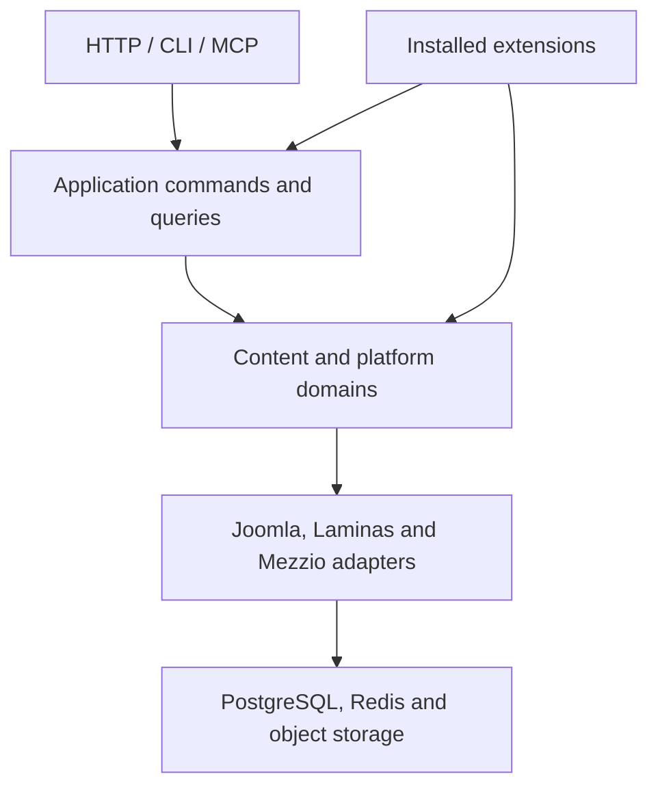

# Kumwe 2.0 architecture

## 1. Product boundary

Kumwe 2.0 is a clean CMS implementation. The 1.x repository history is retained
as evidence and reference, but 2.0 has no data migration, schema translation,
compatibility facade, or undocumented API compatibility requirement.

The system supports one site per installation. Multisite behavior is deliberately
outside the 2.0 contract so the security, caching and extension boundaries remain
unambiguous.

## 2. Architectural style

Kumwe uses ports and adapters around cohesive product domains:

Dependencies always point inward. Domain objects do not depend on HTTP requests,
database drivers, the service container, template engines, MCP attributes, or
extension package formats.

### Layers

| Layer | Responsibility | Forbidden concerns |
|---|---|---|
| Domain | Invariants, value objects, aggregates, domain events | HTTP, SQL, DI, templates |
| Application | Commands, queries, policies, transactions, ports | Driver-specific SQL, globals |
| Infrastructure | Persistence, cache, queue, mail, storage, package IO | Product policy decisions |
| Delivery | HTTP, administrator UI, REST, CLI, MCP | Direct table access |

## 3. Framework selection

Kumwe prefers maintained Joomla Framework components where they supply the
required contract. Laminas and Mezzio are the exclusive fallback ecosystem.

| Capability | Selected baseline |
|---|---|
| Dependency injection | `joomla/di` |
| Events | `joomla/event` |
| Database abstraction | `joomla/database` |
| Registry/config values | `joomla/registry` plus Kumwe environment loading |
| Input filtering | `joomla/filter` |
| Archive and filesystem primitives | `joomla/archive`, `joomla/filesystem` |
| Console primitives | `joomla/console` |
| HTTP message implementation | `laminas/laminas-diactoros` |
| Middleware application | `mezzio/mezzio` |
| Routing | `mezzio/mezzio-fastroute` |
| Middleware utilities | `mezzio/mezzio-helpers` |
| Middleware dispatch | `laminas/laminas-stratigility` through Mezzio |
| Session/cookie policy | Kumwe contracts over maintained Laminas/PSR primitives |
| Templates | Twig 3 behind a Kumwe renderer port |
| Schema lifecycle | Phinx with PostgreSQL migrations |
| Logging | Monolog through PSR-3 |
| Identifiers | Ramsey UUID v7 |
| MCP | Official `mcp/sdk`, isolated behind a Kumwe adapter |

Discontinued packages such as `joomla/renderer` and unmaintained application
integration packages are not carried into 2.0. Kumwe owns narrow interfaces for
those boundaries and implements them with maintained Laminas/Mezzio packages.

Symfony and Laravel packages are prohibited as direct production dependencies.
Transitive tooling dependencies are evaluated separately and may not be invoked
as application architecture.

## 4. Composition and lifecycle

There is one composition root and one service container per process. HTTP, CLI,
worker and MCP entry points all call the same container factory with an explicit
runtime mode.

- No static container or service locator is available to application code.
- Controllers, handlers and services receive constructor dependencies.
- Extension service providers are compiled into cached maps after installation.
- The request path never scans extension directories.
- Database transactions are owned by application command boundaries.
- Domain events are recorded during a transaction and dispatched after commit.

## 5. Domain map

| Domain | Responsibilities |
|---|---|
| Identity | Accounts, credentials, sessions, MFA, API tokens |
| Authorization | Roles, capabilities, policy decisions and resource scope |
| Content | Content types, entries, fields, taxonomies and relationships |
| Publishing | Drafts, revisions, workflow, schedules, preview and rollback |
| Navigation | Menus, routes, redirects and canonical paths |
| Media | Assets, metadata, variants, storage and usage references |
| Presentation | Templates, positions, modules, blocks and assets |
| Extensions | Catalog, manifests, dependencies, installation and lifecycle |
| Search | Index documents, query policy and reindexing |
| Automation | Jobs, schedules, locking, idempotency and retries |
| Audit | Immutable actor/action/resource records and security events |

Each domain has an application API. REST, administrator screens, CLI commands and
MCP tools invoke the same command/query handlers.

## 6. PostgreSQL persistence

PostgreSQL is the authoritative 2.0 database. All production identifiers are UUID
v7 values generated by the application. Timestamps use `timestamptz` in UTC.
Structured metadata uses `jsonb` only when the data does not require relational
integrity or independent querying.

Persistence rules:

- Every relationship has an explicit foreign key.
- Every tenant-independent unique constraint is represented in the schema.
- Optimistic concurrency uses integer aggregate versions.
- Published slugs and paths use case-insensitive uniqueness rules.
- Soft deletion is explicit and limited to recoverable editorial records.
- Audit records are append-only.
- Migrations are forward-only within the 2.x line and are tested from an empty
  database. They do not inspect or convert a 1.x schema.

## 7. Extension architecture

Kumwe supports component, plugin, module, template, package and language
extensions. Every extension contains `kumwe.json` and, for executable PHP code, a
service provider implementing the Kumwe extension contract.

The manifest declares identity, type, semantic version, compatibility, namespace,
provider, dependencies, conflicts, capabilities, routes, migrations, events,
configuration schema, blocks, module positions, assets and package digests.

Installation is a staged operation:

1. Stream the package into non-public temporary storage with strict byte limits.
2. Inspect archive entries before extraction; reject traversal, links, devices,
   duplicates, unsupported compression and excessive expansion.
3. Validate the manifest schema and compatibility.
4. Verify file digests and package signature according to site policy.
5. Resolve dependencies and conflicts.
6. Run extension preflight validation in an isolated staging directory.
7. Apply database changes and atomically activate the version.
8. Rebuild service, route, event, block and asset maps.
9. Commit the transaction and append the audit record.
10. Restore the previous maps, files and database state if activation fails.

Installed extension code is trusted server-side code. Signature verification and
administrator authorization establish provenance; they are not a PHP sandbox.

## 8. Delivery surfaces

### Web and administrator

Public and administrator routes share one PSR-15 application. Administrator
routes require explicit capabilities and hardened session policy. Mutations use
non-safe HTTP methods, CSRF protection, validation and transactions.

### REST

REST routes are versioned under `/api/v1`. OpenAPI documents the supported public
contract. Authentication uses scoped, hashed tokens initially; the authorization
port permits an OAuth 2.1 resource-server adapter without changing domains.

### CLI and workers

CLI commands install the system, create the initial administrator, manage
extensions, run migrations, rebuild caches, execute jobs, schedule tasks, inspect
health and perform backups. Workers claim durable jobs with PostgreSQL locking.
Redis supports caching, sessions, rate limiting and coordination without changing
queue semantics.

### MCP

The official PHP MCP SDK is confined to `Infrastructure/Mcp`. MCP tools call the
same application handlers as REST and CLI. Writes require scopes, capability
checks, idempotency, optimistic concurrency and audit. Publishing, deletion and
extension installation expose a plan/dry-run step and require explicit approval.

## 9. Security invariants

- The document root is `public/`; configuration, source, storage and vendor code
  are never web-addressable.
- Initial administrator creation is CLI-only or protected by a one-time installer
  secret that is consumed atomically.
- Public registration can never grant administrator capabilities.
- Safe HTTP methods never mutate state.
- All browser mutations require CSRF validation and same-origin enforcement.
- Cookies are `Secure`, `HttpOnly`, `SameSite=Lax` or stricter and rotated after
  authentication or privilege changes.
- Passwords use `PASSWORD_ARGON2ID` when available and the platform default as a
  guarded fallback.
- Login, reset, token and MCP endpoints are rate limited.
- Authorization is capability-based and deny-by-default.
- Uploaded media and extension archives are validated from content, not filename.
- Secrets come from the environment or mounted secret files and never enter logs.
- Production responses never expose stack traces, SQL, filesystem paths or secrets.
- Every privileged mutation produces an immutable audit record.

## 10. Quality contract

Every Kumwe-maintained class has focused unit tests unless it is a declarative data
object with no behavior. Repository adapters, migrations and HTTP behavior have
integration or functional tests. Security policies, extension packages and route
authorization receive adversarial tests.

The required gates are:

- Composer validation and security audit
- PHP syntax checks
- PHPUnit unit, integration and functional suites
- PHPStan at the strictest practical level with no ignored domain errors
- Coding-standard verification
- Infection mutation tests for policies and security-critical value objects
- PostgreSQL migration and repository integration tests
- REST contract and OpenAPI validation
- Browser smoke tests for installation, login, editing and publishing
- Malicious extension archive fixtures
- Container image vulnerability scanning, SBOM and provenance

## 11. Performance contract

- No service, route, event or extension discovery on the hot request path.
- Cached compiled maps are invalidated transactionally after configuration changes.
- Content listing and search queries are bounded and cursor-paginated.
- Cache keys include locale, authorization visibility and aggregate version.
- Expensive media, index, notification and extension work runs as jobs.
- Health endpoints do not perform destructive or unbounded checks.
- Database queries used by public rendering are observable and budgeted.

## 12. Upgrade contract

Kumwe 2.0 supports upgrades between 2.x releases through signed releases and
forward-only migrations. This is not a 1.x migration path. Upgrade execution uses
maintenance mode, preflight checks, backup verification, schema migration, cache
rebuild, health validation and an auditable completion record.
