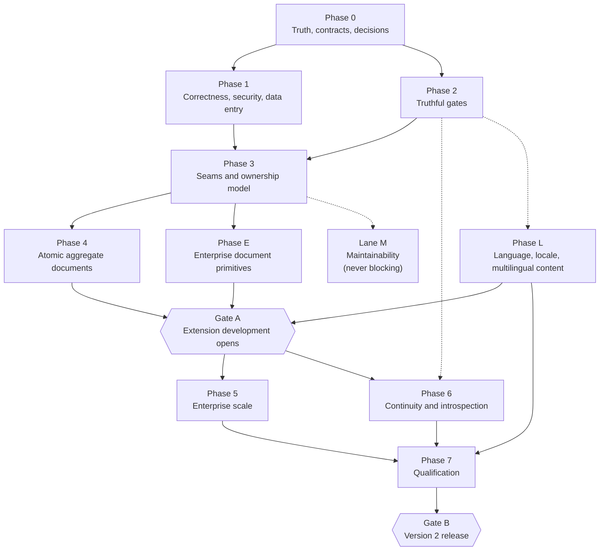

# Kumwe CMS consolidated roadmap

**Verified against** `26a7b3963c255064754f541dc8286e75dd566b1f`
**Machine-readable companions** [`findings.json`](findings.json), [`capacity-contract.json`](capacity-contract.json)
**Current position** [`STATUS.md`](STATUS.md)
**Work already finished** [`CHANGELOG.md`](../../CHANGELOG.md)

---

## How this document moves

> **This directory holds forward work only. Completed work leaves it and lands in
> [`CHANGELOG.md`](../../CHANGELOG.md).**
>
> There are exactly two places, and an agent must never confuse them:
>
> | | |
> |---|---|
> | **`docs/roadmap/`** | What is **still to do**. Objectives, gates, phases, work packages, and every open finding in [`findings.json`](findings.json). New ideas and new objectives are added **here** — this is where forward work lives, so nothing scatters into a sixth plan again. |
> | **[`CHANGELOG.md`](../../CHANGELOG.md)** | What is **done**. Every completed work package, written for a reader of the product, grouped under Added, Changed, Fixed, Security, Deprecated and Removed, citing the commits that carried it. |
>
> **The rule, and it has two halves, because not everything done to this project was planned.**
>
> 1. **Planned work.** It lives here while it is open. When it completes, its entry is **deleted from this
>    directory and written into `CHANGELOG.md` in the same pull request that completes it**. A finding is
>    never "closed here"; it is *removed from here and recorded there*.
> 2. **Unplanned work.** Things come up, get fixed, and never had a roadmap entry at all. That work is
>    written **straight into `CHANGELOG.md`** when it completes. There is nothing to remove from here,
>    because it was never here — and its absence from the roadmap is not a reason to leave it out of the
>    changelog.
>
> **Either way: the changelog is the single record of what has been done, and the roadmap is the single
> record of what has not.** Read that sentence once and the direction of every entry follows from it. The
> roadmap therefore shrinks as the programme advances and never accumulates a growing tail of finished
> items, and nothing that was ever done goes unrecorded because it happened not to be planned.
>
> Because presence in the roadmap *is* the open state, nothing here is ticked off. There are no completion
> markers to maintain and none are wanted: an item that is still written down is still outstanding, and an
> item that is done is somewhere else.
>
> **It is enforced, not merely stated.** `findings.json` no longer admits the `closed` state, and
> [`tools/verify-roadmap.php`](../../tools/verify-roadmap.php) — run as `composer roadmap:check`, inside
> `composer qa`, and again by `tests/Architecture/RoadmapLifecycleTest.php` — fails the build if an entry
> carries it, naming the entry and telling the author to move it to the changelog. This is deliberate: the
> gap matrix rotted into a forward plan precisely because nothing mechanical stopped it.
>
> The one exception is [`docs/qualification/gap-matrix.md`](../qualification/gap-matrix.md), retained
> unchanged as the historical evidence record of the executed qualification programme. Do not plan from it,
> and do not delete it.

---

## 1. Authority and what this supersedes

This directory is the single source of truth for programme sequencing. An agent that reads this document
and the repository has everything it needs to know what to build next, what not to touch, how to prove the
work, and when the work is finished.

It consolidates and supersedes, for sequencing purposes:

- the independent enterprise stabilization and scale review, pinned to `309db888`;
- the earlier independent runtime review and its validation follow-up;
- the seven-session runtime-readiness blueprint and its individual session contracts; and
- every scattered plan, progress note and next-steps list elsewhere in the repository.

It does **not** supersede [`docs/qualification/gap-matrix.md`](../qualification/gap-matrix.md), which is
retained unchanged as the executed evidence of the eight-wave production-qualification programme. Its
closed entries are proof of work already done, not a forward plan. Their substance is recorded in
[`CHANGELOG.md`](../../CHANGELOG.md) with the commits that closed them; the entries that are still
conditional or open are carried into [`findings.json`](findings.json), which holds open work only.

Nor does it supersede the normative rules. [`AGENTS.md`](../../AGENTS.md) and
[`docs/coding-standard.md`](../coding-standard.md) still govern how code is written; this document governs
what is written and in what order.

Where this roadmap and any historical document disagree about what is currently shipped, the runtime plus
executable evidence at the current revision wins. The mismatch is then corrected in the documentation and
in the ledger; it is never worked around silently.

---

## 2. Decisions already taken

These are settled. An agent implements them; it does not re-litigate them. Each carries an identifier so a
pull request can cite it.

### D1 — Scale target is 5,000,000 business documents per day

Five million logical business transactions per day, with the peak multipliers, latency objectives and
workload mix recorded in [`capacity-contract.json`](capacity-contract.json), is the Version 2 release
claim. Staging the release claim down to one million was proposed and rejected. The one-million profile
survives only as an early characterisation step and may never be published as the supported envelope.

Where the architecture prevents the target, the architecture changes. Where a legally constrained
mechanism — a single gapless statutory sequence, for instance — genuinely cannot reach it, the supported
envelope states that limit explicitly rather than weakening the guarantee.

### D2 — Two gates, not one

The programme has two release-shaped moments, and conflating them was the sequencing error in every
earlier plan.

**Gate A — extension development opens.** The extension contract is frozen, the atomic multi-line document
command exists, and data-entry integrity is fixed. After Gate A, extension authors build against a stable,
capable core while the remaining programme proceeds behind contracts that do not move under them.

**Gate B — Version 2 enterprise release.** Everything, including qualification at the five-million
envelope under load, contention, failure, restart, backup and restore, and extension lifecycle.

Gate A is not a release. Nothing is published at Gate A. It is the point at which building an extension
stops being a bet on unfinished contracts.

### D3 — Point-in-time recovery is adopted as platform-supported, operator-configured

The shipped position — recorded in `docs/operations/backup-restore.md` and closed as gap-matrix entry
`GM-BAK-01` — is that point-in-time recovery is a database-layer responsibility this repository does not
own. That position is reversed.

Kumwe owns: capture of the backup coordinate on every supported engine, restore-with-replay tooling,
per-engine operator documentation, the executed drill, and the media-versus-database ordering rule. The
operator and their database administrator own the archive destination and its retention.

**Restic is the documented reference off-site transport** — a single static binary, client-side
authenticated encryption, content-addressed deduplication, and an append-only repository mode that gives
ransomware resistance. Kumwe takes **no dependency** on it. It is named in the operator documentation as a
transport that satisfies the requirements, alongside the requirements themselves, so an operator using
something else knows what their choice must provide.

### D4 — The backup artifact is reshaped for deduplication

`tools/backup.sh` currently emits four gzip-compressed tarballs. Compression randomises the byte stream, so
a content-defined chunker sees almost entirely new chunks after any change, and an hourly off-site snapshot
re-stores nearly the whole payload every hour. Media, private, extension and extension-asset payloads
become plain directory trees; the PostgreSQL dump — currently `pg_dump --format=custom`, which compresses
by default — is taken uncompressed. The MySQL and MariaDB dumps are already plain SQL and need no change.
Compression and deduplication become the transport's job.

The same work fixes the coordinate problem: `--set-gtid-purged=OFF` on the MySQL leg strips the position
marker replay needs, and the MariaDB leg records no coordinate at all.

### D5 — The `BusinessRecordService` decomposition leaves the critical path

Only the seams the aggregate command and the scale work actually require are extracted, in phase 3. The
rest of the decomposition runs in a parallel maintainability lane, during or after the scale work, and
blocks no gate. It is maintainability, not correctness and not capacity, and the programme stopped
pretending otherwise.

### D6 — Runtime operational introspection is a distinct deliverable

Wave 7 shipped monitoring: is it up, is it slow, is it erroring, is a queue deep. What operators
additionally need is diagnostics: *where* is the system struggling. Lock waits and contention hotspots.
Queue depth and age by queue. Slow definitions and policies. Backlog build-up and its drain slope. Whether
retention is keeping pace. This is a separate deliverable from monitoring, bounded by the same cardinality
discipline wave 7 established.

### D7 — A business-group installation is supported, through ownership scopes

Several related businesses — on the order of four — run on one installation, sharing staff, clients,
products and payroll master data by explicit choice, with accounting isolated per business and reportable
in consolidated form. Multi-tenant service to unrelated tenants is **explicitly out of scope for Version
2** and sits at version 3 or 4.

The model is fixed and recorded in [ADR 0001](decisions/0001-resource-ownership-scope.md): every resource
keeps exactly one owner, and the owner may be a site, a named group of sites, or the installation. This is
a widening of the existing `resource_site_ownership` registry, not a parallel mechanism. Sharing is never
modelled as a per-row resource-to-site list; the ADR records why. Each resource category declares the
scopes it may be owned at, and accounting documents, ledgers and pay runs are site-owned only. Consolidated
reporting is a group-scoped read served by projections, never a hole in write isolation.

This is Gate A scope because it shapes the data model extension authors build against. Retrofitting it
after extensions exist would mean migrating live business records.

### D8 — The atomic aggregate contract is designed before it is built

The aggregate command's public shape is settled as an architecture decision record in phase 0, long before
the implementation lands in phase 4, so extension authors building after Gate A are building against the
real shape rather than a placeholder.

### D9 — Capabilities are described on their own merits

Repository documentation states what Kumwe does, in Kumwe's own terms, and lets the capability stand on
what it is. A requirement is written as the requirement; a primitive is written as the primitive; a limit
is written as the limit. Nothing is defined by comparison or contrast with another system, because a
capability that needs a comparison to be understood has not yet been described.

This applies to every document this programme produces. It is a standard for how things are written, not a
restriction on what may be mentioned: naming another platform is entirely appropriate where the subject is
interoperability, migration or a format both systems read — see
[section 5.2](#52-beyond-version-2-bridges-in-both-directions).

### D10 — Multi-currency is core

Core owns **money-with-currency as a type** and **the conversion contract**. Rate providers and rate
sourcing are extension and integration concerns: an external rate service plugs into a pipeline rather
than being wired into core. A product priced in one currency must be presentable in others, and the
platform owns the shape of that answer so two extensions converting the same amount do not produce two
incompatible ones.

**The non-negotiable rule: a converted amount is always marked as converted and carries its rate and its
as-at instant.** Everywhere it appears — screen, report, export, API response, event payload. A displayed
price that silently drifts from its stored value is an audit defect, not a formatting choice. An operator
must be able to tell, without asking anyone, whether they are looking at what was agreed or at what it is
worth today, and if the latter, at what rate and as at when.

Exact-value storage discipline is unchanged. Conversion is a presentation and reporting concern layered
**above** stored exact values and never a mutation of them; a converted figure is never written back into
the field it came from.

Verified at `26a7b39`: the exact half already exists and is right. `MoneyValue` binds an `ExactDecimal` to
an uppercase ISO 4217 code; `CanonicalDefinitionPhysicalSchemaCompiler` line 706 stores `core.money` as an
exact decimal `.amount` column beside a fixed three-character `.currency` column; `RecordValueCodec`
rebuilds the pair on read and refuses a denomination the field pinned against. Recorded in
[ADR 0004](decisions/0004-money-conversion-contract.md).

**Delivered for money.** The conversion half of this decision has shipped: the conversion request, the
converted result, the rate with its as-at instant and provider identity, the declared rounding step, the
rate-provider port and the pipeline it plugs into, and the provenance carried through report columns and
export artifacts. Core still ships no rate of any kind. See `CHANGELOG.md`. What the same decision shape
still owes is the identical treatment of quantities, which is `V2-ERP-004` under D13.5.

### D11 — The interface is multilingual, with a decided architecture

The implementation is chosen, not open. Recorded in
[ADR 0002](decisions/0002-interface-translation-architecture.md).

- **XLIFF 2.0** is the authored and interchange format. Every professional translation tool and platform
  reads it, so a translator never touches code, and external translation platforms and AI-assisted
  translation pipelines connect through a format they already speak rather than through bespoke tooling
  this repository would then own.
- **Compiled to plain PHP array catalogues at build time**, so a runtime lookup is an array access served
  from the opcode cache: no XML parsing, no file I/O per request.
- **ICU MessageFormat through `ext-intl`** — already a hard requirement, verified at `composer.json` line
  19 and currently used for exactly one call, `Normalizer::normalize()` in `RecordValueCodec` — for
  plurals, gender, ordinals, numbers and dates. The reason is arithmetic: the chosen languages span one
  plural category (`zh-Hans`), two (the European set), three (`he`) and six (`ar`), and the four-category
  Russian class is the next step outward. `sprintf` substitutes; it does not select.
- **`gettext` is explicitly rejected.** It depends on locales generated by the operating system, and
  `setlocale()` is process-global, which is unsafe in the long-running queue workers this platform runs by
  design: one job's locale would still be in effect when the next job begins. The ADR records the argument
  in full so it is not reopened without it.
- **Message identifiers are stable and semantic. The source text is never the lookup identifier.** If the
  identifier were the English string, correcting a typographical error would invalidate that message in
  every other language and translators would redo work for a change that altered no meaning. That is
  irreversible in practice once real translation exists, so it belongs in the Gate A contract.
- **A catalogue override chain: core → extension → site → organization, last wins**, with site- and
  organization-level overrides stored in the database so an operator changes wording without editing files
  or deploying. **The strategic consequence is deliberate**: this same mechanism is **terminology
  adaptation** — relabelling "Client" as "Patient", "Learner" or "Guest" for a vertical without forking
  core.
- **Enforcement.** A check fails the build when a new hardcoded user-facing string is introduced. A
  convention without a gate is a suggestion.

**What is built, and what the ledger still holds.** The foundation is in: the XLIFF source catalogue and
its deterministic compiled form, the ICU formatter, the frozen message-identifier grammar, the four-layer
resolver, per-request locale negotiation consuming `default_locale`, and the hardcoded-string gate over
`templates/`. The chain's two upper layers are now real rather than resolved-but-unreachable: site and
organization wording is stored, administered at `/administrator/wording` under
`localization.overrides.manage`, and an extension contributes its compiled catalogues through the ordinary
package path. It is described in [`docs/interface-translation.md`](../interface-translation.md). What
remains is recorded in `V2-LNG-001`, `V2-LNG-007`, `V2-LNG-008`, `V2-LNG-009` and `V2-LNG-010`: the bulk of
`en-GB` extraction across the record surfaces, the console and the error paths; widening the gate to console
output and error paths; the right-to-left screenshot baselines behind the matrix's new language axis; and
the eight translated catalogues.

**Right-to-left.** Hebrew and Arabic are both in scope and their layout work is the same work, so they were
done together. The conversion is complete: every inline-axis declaration across `assets/` is now logical —
96 of them, and none physical — the three layouts emit `dir` from the resolved locale, and
`composer assets:direction` fails the build on a new physical declaration. The browser matrix now carries a
language axis as well as a device axis, so `he` and `ar` file their baselines under their own projects
instead of sharing a left-to-right one. What remains under `V2-LNG-009` is the screenshots themselves and
the `P2-E` matrix leg that compares them.

**The Version 2 language set is nine**: `en-GB` (source), `en-US`, `af`, `de`, `he`, `ar`, `es`, `pt-BR`,
`zh-Hans`. The proof set is sequenced first — `en-GB`, `af`, `de`, `he` — because together they stress
every hard axis: source extraction at scale, a smaller language with a thin tooling ecosystem, a
layout-stressing language of long compounds, and a right-to-left script. After those four the remainder is
translation work rather than engineering work. Traditional Chinese (`zh-Hant`) is **not** in Version 2
scope.

### D12 — Content is multilingual too, including content contributed by extensions

Content translation is in Version 2. It is not deferred, and it must work for **content contributed by
extensions**, not only for core content.

The model is a **translation group**: one logical item, one entry per locale, with per-locale slugs,
**per-locale publication state** — English may be live while another language is still drafting — a
declared fallback when a translation is missing, automatic `hreflang`, and a front-end language selector
shipped by default rather than added later.

**Business definition labels carry locales too.** `EntityTypeDefinition`'s singular and plural labels and
`FieldDefinition`'s label, description and help text are single strings inside the document
`CanonicalDefinitionJson` checksums, and a published definition version is immutable. Adding a locale
dimension after extensions are published would mean migrating live definition documents, so the dimension
is in the Gate A contract.

Because extension-contributed content needs locale variants, the translation-group model belongs in the
**extension contribution contract**. That is the strongest reason none of this can wait for Gate B.

**The gate split.** The **contract, the machinery, the override chain, the right-to-left conversion, the
content model and the enforcement** are Gate A, plus **`en-GB` extracted** to prove extraction works at
scale. The **translated catalogues for the nine languages** and **per-locale visual qualification** are
Gate B.

### D13 — The seven enterprise-primitive boundary questions are decided

Each verdict below is settled. Every one of them must be **enforceable, not advisory**: the work package
that delivers it names the check that fails the build when the rule is violated.

1. **Aggregate invariants over owned lines — core, and urgent.** "Document total equals the sum of its
   lines" is currently inexpressible: `Expression::OPERATORS` holds 21 scalar operators and no aggregation,
   and `RecordRuleValidator` evaluates over the record's own field values with owned lines out of scope.
   Without it every extension reimplements the most fundamental document rule differently and none provably.
   It pairs with the atomic aggregate command and lands with it in Gate A.
2. **Immutable correction by linked reversal — core.** An approved document is corrected by a new linked
   reversing document, never by mutation. This is an audit property, not an accounting feature: a platform
   whose identity is auditability cannot allow an approved document to be edited. Recorded in
   [ADR 0003](decisions/0003-immutable-correction-by-reversal.md).
3. **Period close and posting lock — core mechanism, extension policy.** Core provides a temporal lock that
   refuses mutations to records in a closed period. The extension decides what a period is and when it
   closes. Core gains no fiscal calendar.
4. **Numbering scope and fiscal-period reset — core.** Widen the existing allocator's scope key to include
   document type and legal entity, and support fiscal-period reset. Small, because the allocator already
   exists: `NumberSequenceScope` is `Site` and `Organization` only and `NumberSequenceReset` is `Never`,
   `Yearly` and `Monthly` only, and both are enums feeding one counter identity.
5. **Unit-of-measure conversion — core owns the typed quantity-with-unit and the conversion contract;
   extensions own conversion tables.** The type exists and states its own limit: `QuantityValue`'s docblock
   records that nothing converts, so two quantities are comparable only when their units are identical. If
   core does not own the conversion contract, extensions invent incompatible ones and cannot exchange data
   — a stock extension and a sales extension would disagree about what a case of a product is.
6. **Currency conversion and rate history — the same shape as D10, and delivered.** Core owns the type and
   the contract; extensions own the rates. The money half has shipped; see `CHANGELOG.md`.
7. **Offline-tolerant point-of-sale capture — deferred beyond Version 2 as a product, but the platform must
   remain positioned to accommodate it.** See D14.

### D14 — Point of sale is deferred but not foreclosed

Offline point of sale will be a separate long-standing application talking to the platform over the API.
Version 2 does not build it. Version 2 must not design in a way that forecloses it, and the constraints
that follow are therefore live Gate A concerns even though the product is not.

- **Client-minted operation identity.** A terminal creating a document offline must be able to mint the
  operation identifier itself and submit later, with replay yielding one effect. Verified: it already
  can — `BusinessRecordIdempotency` records the `operationId` as "the idempotency key the caller supplied",
  and `RequireIdempotencyKeyMiddleware` takes it from an `Idempotency-Key` request header. Two assumptions
  in the current contract are the real constraint. The claim expires: `BusinessRecordService` lines 2212
  and 2325 construct it with `new DateInterval('P1D')`, and lines 2370 and 2431 treat an entry at or past
  `expiresAt` as absent — so a terminal reconnecting after 24 hours replays into a fresh claim and a second
  effect. And the claim's scope digest binds site, organization, **actor**, operation and identifier, with
  the request payload and the authorization context fingerprinted alongside, so a replay submitted under a
  different actor or a re-authenticated context is a different claim. Both must become declared, tested
  properties of the contract rather than incidental ones.
- **Numbering under disconnection is a genuine constraint on work already merged.**
  `DoctrineBusinessNumberSequenceAllocator` opens no transaction: it joins the one
  `BusinessRecordService` already has open, takes the counter row `FOR UPDATE`, and holds it until that
  transaction commits. A disconnected terminal cannot call it. Two shapes are viable — allocate the human
  document number at synchronisation time, with the terminal carrying its own client reference until then;
  or issue per-terminal reserved blocks, which forfeits gaplessness. **The choice is not made here.** It is
  recorded as `decision_required` and it **interacts directly with the gapless guarantee already
  documented** on `BusinessNumberSequenceAllocator`, which states that values handed to committed records
  are contiguous from one with no duplicates and no gaps.
- **Late and out-of-order arrival tolerance.** A document captured on Friday and submitted on Monday must
  be acceptable, and must not be ordered by when it arrived.
- **Untrusted client clocks.** A terminal's timestamps cannot be authoritative. Core already stamps its own
  instant from an injected `ClockInterface`; what is missing is a declared place for the client's asserted
  instant to live beside it without ever being mistaken for it.
- **Stock and pricing cannot be authoritative offline.** The design must accept a sale and reconcile,
  rather than assume live validation was possible at capture time.

---

## 3. Reconciliation with the independent review

The independent review was pinned to `309db888`. This roadmap is verified at `26a7b39`. Seven commits
separate them:

| Commit | Subject |
|---|---|
| `0aeca85` | composer: take PHPUnit 13 and PHP_CodeSniffer 4 |
| `15f48cf` | npm: take vite 8.2.1 and the @types/node 26.2 typings |
| `05fe279` | actions: repin every workflow action to a verified release commit |
| `687707c` | Make the restore drill prove the system works, not that the bytes came back |
| `3fdb4e9` | Hand the shared fixture database back on a key the next process still holds |
| `1726ee1` | Move the poison drill's delivery helper off a name PHPUnit 13 made final |
| `26a7b39` | Let the deployment drills load their own classes in the production image |

**Not one of them touches `src/`.** `git diff --stat 309db888..HEAD -- src/` is empty. Every runtime
finding in the review therefore holds verbatim at the current revision, and each has been re-resolved to a
live symbol in [`findings.json`](findings.json) rather than copied forward on trust.

Four things the review says nevertheless need correcting, because the world moved or because the review
was imprecise.

### 3.1 Recovery findings are further along than the review states

The review lists `V2-DR-001` and `V2-DR-002` — point-in-time recovery, recovery objectives, key
restoration order and post-restore proofs — as incomplete. Wave 8 landed in `687707c`, after the review's
pinned revision, and closed most of it: declared recovery objectives as numbers, a documented
key-restoration order with the consequence of each wrong key, an end-to-end envelope decryption through
the production cipher so a restore booted with the wrong `APP_SECRET` now fails the drill, sixteen
fail-closed tamper refusals, the signed-backup path exercised in CI, and the restored installation actually
executing work.

Two residuals remain, both named in the ledger: approval spent state, which needs an approval-rule
administration surface that does not exist yet, and an HTTP replay of one login and one idempotent mutation
against the restored container.

What wave 8 did *not* do is build point-in-time recovery; it declared PITR out of scope. Decision D3
reverses that declaration. `GM-BAK-01` remains correctly closed as executed — the objectives were declared
— and is marked superseded by `V2-DR-001`.

### 3.2 The mutation fence already has the seam the review asks for

The review describes `DoctrineBusinessRecordMutationFence` as taking an exclusive `FOR UPDATE` lock for the
full record transaction, which is exactly right for writes. It does not mention that a **shared** fence
already exists on the same class — `LOCK IN SHARE MODE` on MySQL and MariaDB, `FOR SHARE` on PostgreSQL —
and is already used by every read path. The generation-aware shared-and-exclusive protocol phase 5 has to
build is therefore an extension of an existing mechanism rather than a new one. This makes the work
smaller than the review implies and should be planned accordingly.

### 3.3 The data-entry defect is narrower and differently shaped than first stated

The pre-work brief for this roadmap claimed that a validation failure discards everything the operator
typed on the generated business surfaces, evidenced by a grep showing that `business-form.twig` contains no
reference to submitted input. That grep is accurate about the file and wrong about the behaviour.
Retention lives in the shared field macro `_business-fields.twig`, which binds `field.input_value`, and
`BusinessSurfaceService::form()` populates it from a `$retained` argument that
`GeneratedBusinessBrowserController::write()` supplies when it catches `BusinessRecordValidationFailed`.

What is actually broken, verified at the current revision:

- **A stale-version conflict discards everything, on every browser surface.**
  `GeneratedBusinessBrowserController::write()` catches `BusinessRecordValidationFailed` and nothing else.
  `BusinessRecordVersionConflict` is mapped only in `BusinessRecordApiResponder` for REST and
  `BusinessConsoleFailureMapper` for the console. On the administrator and portal surfaces it escapes as an
  unhandled exception.
- **The CMS content editor discards everything on both failure classes.**
  `AdministratorUpdateContentHandler::handle()` catches neither `InvalidContentData` nor `VersionConflict`
  — both are declared as escaping. `AdministratorContentEditorHandler` builds its field values from
  `$entry['data']` and has no retained-input parameter at all. `content-form.twig` binds
  `value="{{ entry.title|default('') }}"` and `value="{{ entry.slug|default('') }}"` — the persisted entry,
  never the submitted body.

The severity stands. On a hundred-line document, losing the work to a conflict the operator could not have
predicted is disqualifying for enterprise data entry, and because these are the generated surfaces, every
extension inherits it. Only the shape of the fix changes: extend an existing retention mechanism to the
conflict path, and give the CMS content editor the mechanism it never had.

### 3.4 The review's finding IDs are preserved, and the ledger holds open work only

The consolidation resolved 114 findings: 27 from the review, 62 from the executed gap matrix, and 25
discovered while verifying this roadmap, during the qualification programme, or from the business-group
decision. Fifty-six of them were already closed. Under the lifecycle rule above those left the ledger and
their substance is in [`CHANGELOG.md`](../../CHANGELOG.md) with the commits that closed them, so
[`findings.json`](findings.json) now carries **62 open entries**: 25 from the review, 12 from the gap
matrix and 21 discovered here. Review identifiers are unchanged, so a reference to `V2-SCL-001` resolves
the same way in both documents, and a reference to a completed identifier such as `GM-AUD-01` or
`V2-SCL-003` resolves in the changelog.

Decisions D10 through D14 added 22 further entries — `V2-CUR-001` to `V2-CUR-004` for multi-currency,
`V2-LNG-001` to `V2-LNG-010` for the interface language programme, `V2-MLC-001` to `V2-MLC-004` for
multilingual content, and `V2-POS-001` to `V2-POS-004` for the point-of-sale constraints — and moved six
of the seven `V2-ERP-` entries out of `decision_required` because D13 decided them.

The four `V2-CUR-` entries, the six `V2-GRP-` entries, the data-entry retention work, the interface
translation foundation and the administered override layers have since been delivered and have left the
ledger for `CHANGELOG.md`, which is where each of them is now recorded; `V2-CUR-005` was added for the
rendering half the money work did not cover. The ledger therefore carries **61 open entries**.

---

## 4. Verified current state

Everything in this section was resolved against the repository at `26a7b39`. Nothing is inherited on
trust.

### 4.1 What runs green today

`composer docs:api`, `composer architecture:policy`, `composer interface:programme`, `composer roadmap:check`,
`composer openapi:check`, `composer translation:check`, `composer translation:strings`,
`composer assets:direction`, `composer cs` and `composer analyse` all pass. The unit suite is **1,596 tests
and 22,565 assertions**; the architecture suite was 106 tests and 6,918 assertions at `26a7b39` and is
**124 tests and 7,146 assertions** now that `RoadmapLifecycleTest` and `InterfaceTranslationGateTest` have
joined it. Documentation-block completeness is 100% across 1,186 classes, 6,408 methods, 430 enum cases,
342 properties and 305 class constants. PHPStan reports no errors at level `max`.

### 4.2 Shape

1,186 PHP files under `src/`, 418 under `tests/`, 47 migrations, 47 console commands, 76 MCP tools, 26
built-in field types, 18 extension contribution registries. `ContainerFactory` is 5,409 lines and remains
the sole composition root. `BusinessRecordService` is 3,673 lines, unchanged since the review.

### 4.3 Controls that exist and must be preserved

Eight qualification waves are executed and evidenced. Tamper-evident audit with a digest chain, monotonic
positions, an anchor ledger, a verification command and job, a protected export, and append-only triggers
where the server grants the privilege. A record-encryption key ring with retired keys, dedicated key
material independent of `APP_SECRET`, an audited re-encryption pass and a key-provider port. A credential
lifecycle: password change and administrative reset, step-up revocation and recovery-code reissue, a
security epoch that retires tokens, portal sessions, administrator sessions and outstanding step-up proofs
in one advance, and a break-glass console path. A gapless-on-commit document number allocator. Contention
proven on real engines rather than in memory — outbox and inbox claims, competing approvers, deadlocks
built across two operating-system processes, scheduler occurrence races, idempotency first-claim races.
Real failure drills: Redis killed at the network path so reconnection is refused, a worker `SIGKILL`ed
mid-job with nothing unwound, database connection loss and session termination, hung-endpoint deadlines,
unwritable storage. Extension supply chain: production refusal of unsigned local packages, package bills of
material and provenance, an upstream revocation feed, admission-time code conformance. Structured
observability: one loaded contract, JSON logging with nested redaction, correlation and causation and W3C
trace context, a protected metrics endpoint with bounded labels, machine-readable alert rules with runbook
references. Backup and restore: quiesced signed backups, sixteen fail-closed refusals, an envelope
decrypted through the production cipher, a restored operator authenticated and denied, a restored TOTP
credential passing a live challenge and refused on replay, and the restored installation dispatching a
schedule and draining a job.

No phase may reopen or duplicate this work. Later phases load-test it, matrix-test it, and harden its named
residuals.

### 4.4 The blockers, verified

| Finding | Verified anchor | What is true at `26a7b39` |
|---|---|---|
| `V2-SEC-001` | `McpCapabilityCatalog` 518, 535, 552, 2057; `KumweMcpHandlers` 1439–1576 | `currentPassword` is in three published extension-lifecycle input schemas and thirteen handler positions. `writeOnly` is set, which describes an output property and prevents nothing inbound. |
| `V2-ARC-003` | `BusinessRecordService` 73 and three peers; `src/Application/Automation/Job/Doctrine*` | Application imports `Kumwe\CMS\Infrastructure\Persistence\TransactionManager`. Three Doctrine adapters live under `src/Application`. |
| `V2-SCL-001` | `DoctrineBusinessRecordMutationFence::lock()` 76; eight call sites in the service | Every write path takes the installation row `FOR UPDATE` for the whole transaction. A shared fence exists at line 110 and is used by reads only. |
| `V2-SCL-002` | `DoctrineOutboxStore` 140–181 | A locking read of `business_projection_event_head` `singleton_id = 1` and a guarded update of `last_sequence`, both inside the caller's authoritative transaction. |
| `V2-SCL-004` | `BusinessRecordIdempotencyRetentionMigration` 60, 65 | Seeded `43 * * * *` with `{"batch_size": 500, "maximum_batches": 10}`: 5,000 rows per hour, 120,000 per day, against an enterprise ingress of at least five million. |
| `V2-SCL-005` | `RuntimeMetricCollector` 208, 227, 270, 289 | Exact `COUNT(*)`, `MIN()` and `MAX()` on the primary at scrape time. The statement count is bounded; the work of an exact count is not bounded by it. |
| `V2-SCL-006` | `RuntimeIntegrationEventTransport::publish()` 91, 106, 132 | Consumers and webhooks iterate serially in the publishing path. |
| `V2-SCL-007` | `DoctrineJobQueue` 968, 985, 990 | A contributed queue with a declared ceiling locks its policy row `FOR UPDATE` and counts live leases before claiming. The ordinary claim at line 270 already uses `FOR UPDATE SKIP LOCKED`. |
| `V2-QA-001` | `docs/quality/coverage-contract.json` | The canonical measurement is now MariaDB and the changed-line ratchet is live. Forty-four test classes still exercise real behaviour and attribute none of it, each recorded with an owner and an expiry; the global ratchet arms on the first recorded baseline, and the branch floor cannot be measured while the canonical leg runs under `pcov`. |
| `V2-DB-001` | `ci.yml` browser matrix; `nightly.yml` | The journeys run on all three engines at merge, desktop and mobile Chromium, with first-attempt results separated from retries, and nightly adds desktop Firefox and WebKit. Nightly does not yet carry mobile on those engines, nor keyboard, touch, high contrast, zoom and reflow. |
| `V2-DB-003` | `ApplicationAuthorizationMigration` 106; `ApplicationAuthorizationMigrationRecovery` 443 | The primary migration names the constraint literally `fk_resource_site`; the recovery path already derives a hashed unique name. Foreign-key names are schema-global on MySQL and MariaDB. |
| `V2-DR-003` | `tools/backup.sh` 149, 161, 198–202 | Four gzip tarballs; `pg_dump --format=custom` compresses by default; `--set-gtid-purged=OFF` on MySQL; no coordinate at all on MariaDB. |
| Fence partitioning (positive) | `DoctrineBusinessRecordMutationFence::acquire()`; `BusinessTransactionalRuntimeMigration::installations()` 122–147 | The fence selects with `WHERE h.site_identifier = ?` on the site-scoped `business_definitions` table joined to `business_schema_installations`, and re-checks the installation's own site on the joined row. Four businesses running the same logical definition hold four definition rows and four installation rows, so a group **partitions** the `V2-SCL-001` hot spot rather than concentrating it. |

### 4.5 Currency, language and enterprise-primitive current state, verified

Decisions D10 through D14 rest on the state below. It was resolved against the repository at `26a7b39`;
the branch that carries this roadmap changes no file under `src/`, `assets/` or `templates/`, so every
anchor holds at the tip as well. Where something exists, this says so precisely. Where it does not, this
says so plainly.

**Money and exact values — the exact half is already provided.** `MoneyValue` binds an `ExactDecimal`
amount to an uppercase ISO 4217 alphabetic code and refuses anything that is not exactly three uppercase
letters. `QuantityValue` binds an `ExactDecimal` to a bounded portable unit identifier.
`CanonicalDefinitionPhysicalSchemaCompiler` line 706 emits `core.money` as an exact decimal `.amount`
column beside a fixed three-character ascii `.currency` column, and line 710 does the same for
`core.quantity` with a `.unit` column. `RecordValueCodec` splits the pair on write and rebuilds it on read,
refusing a denomination that differs from one pinned in the field configuration, and
`BusinessDefinitionValidator` line 977 compares a configured currency against a declared default with
`hash_equals()`. A `core.money` field configures `precision`, `scale` and `currency`; a `core.quantity`
field configures `precision`, `scale` and `unit`.

**Conversion — provided for money, absent for units.** Money now has the conversion contract: a conversion
request, a converted value that cannot exist without its rate, as-at instant, provider identity and
declared rounding, the rate-provider port an extension implements, the pipeline it plugs into, and the
provenance carried through report columns and export artifacts. Core still holds no rate table, no rate
row and no rate policy, and a `MoneyRateProvider` under `src/` fails an architecture test. Units have none
of it: `QuantityValue`'s own docblock states the limit — "nothing here converts between units, so two
quantities are only comparable when their units are identical" — and `Expression::OPERATORS` holds 21
scalar operators, none of which converts anything. **What must be added** is the same contract for
quantities, under `V2-ERP-004`. **What is already provided** is every part of exact storage, which this
work must not touch.

**Language — the foundation is built, the volume is not.** `src/Localization/` carries the translator port
and its catalogue implementation, the ICU formatter over `ext-intl`, the frozen message-identifier grammar,
the XLIFF reader and the deterministic catalogue compiler, per-request locale negotiation, and the Twig
extension that publishes `t`, `t_html`, `locale_tag` and `text_direction` on all three rendering
environments. `resources/localization/messages/en-GB.xlf` carries 117 messages and compiles to
`resources/localization/compiled/en-GB.php`. `composer translation:strings` enforces 28 of the 76 templates
and registers the other 48 in `tools/translation-extraction.json`, each with the reason it is not extracted
yet. Console output in the 47 commands under `src/Delivery/Console/Command/`, the 48th under
`src/BusinessReporting/Delivery/Console/`, and the user-facing error paths of `src/` are still inline and
are still outside the gate's scope.

**`default_locale` is consumed.** `SiteDefaultLocale` reads it once per process and hands it to
`LocaleNegotiator`, which resolves an explicit `locale` parameter, then `Accept-Language`, then the setting,
then the source locale. All three layouts emit `lang` and `dir` from the result. No template emits an
`hreflang` link yet — that belongs to the translation-group model in `V2-MLC-004`.

**`ext-intl` is a hard requirement**, at `composer.json` line 19. It now carries message formatting as well
as `RecordValueCodec::unicodeNfc()`; `IntlMessagePatternFormatter` refuses to be constructed without it
rather than degrading to a substituting formatter.

**Right-to-left is converted.** Across `assets/`: 96 logical inline-axis declarations and zero physical
ones, no floats, and `composer assets:direction` failing the build on a new physical declaration with an
allowlist that ships empty. `playwright.config.ts` now runs the right-to-left journeys under four
locale-scoped projects and files their baselines under those project names. What is unbuilt is the
screenshots themselves: the four right-to-left baseline directories are empty.

**Content carries no locale.** `ContentEntry` holds an identifier, title, slug, body, workflow state,
publication window and version; its docblock enumerates what is deliberately absent and no locale appears
there or in `DynamicSiteContentMigration`'s columns. There is no translation group, no per-locale slug, no
per-locale publication state and no fallback declaration.

**Definition labels are single strings inside an immutable checksummed document.** `EntityTypeDefinition`
carries `singularLabel` and `pluralLabel`, bounded to 120 bytes each; `FieldDefinition` carries `label`,
`description` and `helpText`. All are members of the document `CanonicalDefinitionJson` encodes, and a
published version is identified by a SHA-256 over those bytes.

**Numbering.** `NumberSequenceScope` has two cases, `Site` and `Organization`; `NumberSequenceReset` has
three, `Never`, `Yearly` and `Monthly`. There is no document-type or legal-entity dimension in the counter
identity and no concept of a fiscal period anywhere in `src/`.

**Period close.** No temporal lock exists. `WorkflowBinding` is per record; a grep for a period-close or
posting-lock concept across `src/` returns nothing.

**Immutable correction.** `FieldDefinition::$immutableAfterCreate` line 130 freezes one field from
creation, which is not document-level immutability from a transition. No post-transition immutability
declaration and no reversal link exist; an approved document is corrected by mutating it.

**Idempotency and client-minted identity.** The operation identifier is already the caller's:
`BusinessRecordIdempotency` documents `operationId` as "the idempotency key the caller supplied, 8 to 128
characters", and `RequireIdempotencyKeyMiddleware` parses it from an `Idempotency-Key` request header,
refusing a missing or malformed value with a stable problem document. The scope digest binds site,
organization, actor, operation and identifier; the request payload and the authorization context are
fingerprinted alongside and re-checked before a replay is trusted. **The constraint on offline capture is
the window, not the minting**: `BusinessRecordService` lines 2212 and 2325 build the claim with
`new DateInterval('P1D')`, and lines 2370 and 2431 treat an entry at or past `expiresAt` as absent.

**Gapless allocation is transaction-bound.** `DoctrineBusinessNumberSequenceAllocator` opens no transaction
of its own — its docblock says so explicitly — and joins the one `BusinessRecordService` already holds,
taking the counter row `FOR UPDATE` and holding the lock until that transaction ends. A disconnected
terminal cannot participate in it.

**Server clocks are already authoritative.** `BusinessRecordService` takes a PSR `ClockInterface` and
stamps one instant per command from it. No surface accepts a client-asserted occurrence instant, so there
is currently nowhere for one to live — which is the gap, not a protection.

---

## 5. Product objective

Kumwe core is a **lean, vertical-neutral platform** that can be extended, with no core edits, into
demanding business systems. The most demanding of them is a full enterprise resource planning system:
client management, products and services, stock and inventory, purchasing, sales and invoicing, general
ledger, payroll and staff loans, point of sale, manufacturing, projects, assets, service and job cards, and
role-specific dashboards.

The division of labour is fixed:

**Core supplies the primitives.** Typed definitions, exact-value fields, relationships, atomic aggregate
documents, numbering, workflows, approvals, policy, identity and organisation, generated surfaces, jobs and
events and reports and exports, and extension lifecycle and trust.

**Extensions supply the business rules.** Core contains no invoice, ledger, payroll, stock-costing,
enrolment, job-card or commerce rule, and never gains a switch for one.

The test of the boundary is simple. If a new vertical requires a core edit, either the primitive is missing
or the boundary was drawn wrong. Both are findings.

**The installation shape Version 2 supports is a business group.** Several related businesses — on the
order of four — on one installation, selling different things, sharing staff, clients, products and payroll
master data by explicit choice, with accounting isolated per business and reportable in consolidated form.
Decision D7 and [ADR 0001](decisions/0001-resource-ownership-scope.md) fix the model: one owner per
resource, held at a site, a named group of sites, or the installation; sharing expressed as group
membership and never as a per-row list; site-owned-only categories for anything that is a legal entity's
books; and consolidated reporting as a group-scoped read rather than a relaxation of write isolation.

**Multi-tenant service to unrelated tenants is not in Version 2.** It sits at version 3 or 4. Nothing in
this programme is designed as a step toward it, and no figure in the capacity contract is sized for it.

### 5.1 Capability primitives an enterprise resource planning system requires

Verified against the code at `26a7b39`. **Provided** means it exists and is proven. **Partial** means it
exists with a stated limitation. **Must add** means core has to build it. **Decision required** means the
core-versus-extension boundary has not been settled and must be, before extension authors depend on either
answer.

#### Data and modelling

| Primitive | Verdict | Evidence or finding |
|---|---|---|
| Typed entity definitions, versioned and immutable once published | Provided | `EntityTypeDefinition`, `DefinitionStatus`, `CanonicalDefinitionJson` checksum |
| Exact arbitrary-precision decimals | Provided | `core.decimal` with declared precision and scale; `ExactDecimal` |
| Money as an exact amount paired with a currency | Provided | `core.money`; `MoneyValue` |
| Quantity as an exact amount paired with a unit | Provided | `core.quantity`; `QuantityValue` |
| Unit-of-measure conversion | **Must add** | `V2-ERP-004`, decision D13.5 — the type carries the unit and states that nothing converts; core owns the typed value and the conversion contract, extensions own conversion tables |
| Currency conversion, with rate sourcing left to extensions | Provided | decision D10, [ADR 0004](decisions/0004-money-conversion-contract.md) — `MoneyConversionRequest`, `MoneyConverter`, `MoneyRateProvider`, `MoneyConversionPipeline`; core ships no rate |
| A converted amount marked as converted, carrying its rate and as-at instant | Provided | `ConvertedMoneyValue`, unconstructible without its rate, as-at instant, provider and declared rounding; carried into report columns and export artifacts |
| Relationships: one-to-one, many-to-one, one-to-many, many-to-many | Provided | `RelationshipKind` |
| Owned line collections stored relationally | Provided | `RelationshipKind::OwnedLineCollection`; relational storage mode is the only storage mode |
| Atomic multi-line document commit | Provided | `BusinessRecordService::writeDocument()`; [ADR 0005](decisions/0005-atomic-aggregate-document-contract.md); recorded in [`CHANGELOG.md`](../../CHANGELOG.md) |
| Cross-field record invariants | Provided | `RecordInvariantDefinition` over a bounded typed expression |
| Aggregate invariants over owned lines ("total equals the sum of its lines") | Provided | `Expression`'s `line_aggregate` leaf, decision D13.1; recorded in [`CHANGELOG.md`](../../CHANGELOG.md) |
| Locale variants on business definition labels | **Must add** | `V2-MLC-003`, decision D12 — labels are single strings inside an immutable checksummed document, so the dimension must exist before extensions publish |
| Server-computed derived values | Provided | `core.computed`; `ComputationMode`; `Expression` |
| Encrypted secret fields with key rotation | Provided | `core.secret`; `SecretKeyRing`; `business-record-rekey` |
| Attachments and media on records | Provided | `core.media_reference` and the media module |
| Portable relational schema with planned, recoverable migration | Provided | `BusinessSchema`, schema plan and apply and recovery, three engines |
| Bounded escape hatch for irregular data | Provided | `core.bounded_json` with a declared byte ceiling |

#### Document lifecycle

| Primitive | Verdict | Evidence or finding |
|---|---|---|
| Server-allocated document numbering | Provided | `core.sequence`; `BusinessNumberSequenceAllocator`; gapless-on-commit per counter |
| Numbering scoped by document type or legal entity; fiscal-period reset | **Must add** | `V2-ERP-002`, decision D13.4 — scope is `Site` or `Organization` only and reset is `Never`, `Yearly` or `Monthly` only; the allocator exists, so the scope key widens |
| Per-record workflow state machine with capability-gated transitions | Provided | `WorkflowBinding`; transitions run only through an action whose capability the actor holds |
| Approvals, maker-checker and separation of duty | Provided | `BusinessSecurity` approvals, payload-digest-bound step-up purposes, single-use proof consumption |
| Step-up re-authentication on high-impact actions | Provided | RFC 6238 TOTP, recovery codes, five-minute single-use nonce proofs bound to purpose, site, organization, session and epoch |
| Optimistic concurrency on every mutation | Provided | expected version on every write path; `BusinessRecordVersionConflict` |
| Idempotent command replay | Provided | `BusinessRecordIdempotency` with `key_reused`, `in_progress` and `corrupt` outcomes |
| Point-in-time record history and revisions | Provided | `BusinessRecordRevision` and `history()`; a reused public identity is settled over the whole scope before a page is read, and pages walk a total ordering key; see [`CHANGELOG.md`](../../CHANGELOG.md) |
| Immutable correction by linked reversal | **Must add** | `V2-ERP-005`, decision D13.2, [ADR 0003](decisions/0003-immutable-correction-by-reversal.md) — an approved document is corrected by mutating it, and that is an audit defect |
| Period close and posting lock | **Must add** | `V2-ERP-003`, decision D13.3 — core provides the temporal lock; the extension decides what a period is and when it closes |
| Client-minted operation identity durable across a long disconnection | Partial | `V2-POS-001` — the caller already mints the identifier, but the claim expires after `P1D` and its digest binds the actor |
| A document number allocatable while disconnected | Decision required | `V2-POS-002` — the gapless allocator commits inside the caller's transaction, so a disconnected terminal cannot call it; two shapes are viable and neither is chosen |

#### Access, identity and organisation

| Primitive | Verdict | Evidence or finding |
|---|---|---|
| Identity, roles, capabilities and grants with fresh revocation | Provided | grants re-read on every session resolve and token verify; security epoch |
| Multi-site and multi-organisation scoping | Provided | `SiteContext`, `RecordScope`, `ScopeMode`, resource site ownership |
| Business-group installation: several related businesses sharing selected master data | Provided | `OwnershipScope`, the declared-group registry and the containment decision in `DenyByDefaultAuthorizationGateway`; ADR 0001 |
| Accounting isolated per legal entity by construction | Provided | `ResourceOwnershipScopePolicy` freezes the per-category table in source and `ResourceOwnership::of()` refuses an impermissible pairing at construction |
| Consolidated cross-business reporting without relaxing write isolation | Provided | `reports.consolidated.read` bound to the group alone, resolved by `ConsolidatedGroupReportScope` |
| Row, field and action policy applied before results, counts and aggregates | Provided | `BusinessRecordAccessController`, `FieldDisclosurePlan`, policy compiled into SQL |
| External and customer self-service portal identity | Provided | portal sessions, membership-derived principals, opt-in per definition |
| Delegated access and membership directory | Provided | `MembershipDirectory`; delegation preauthorizers re-run under lock |

#### Surfaces

| Primitive | Verdict | Evidence or finding |
|---|---|---|
| Generated administrator surfaces from a definition | Provided | list, detail, form, history, relation and document view kinds |
| Generated opt-in portal surfaces | Provided | `PortalOperation`; the same controller drives both |
| Document-shaped presentation for invoice-like output | Provided | `DocumentViewDefinition` and the `document` view kind |
| Public purpose-built read models | Provided | published views with no generic public mutation |
| REST with generated OpenAPI | Provided | `composer openapi:check` guards drift |
| Console | Provided | 47 commands with stable JSON and exit codes |
| Model-context tooling | Partial | 76 tools, but `V2-SEC-001` and `V2-SEC-002` are open |
| Data-entry integrity across a failed submission | Provided | validation failure and stale-version conflict both re-render with the submitted values on both generated surfaces and the CMS content editor; see [`CHANGELOG.md`](../../CHANGELOG.md) |
| Role-specific dashboards | Partial | `V2-ERP-006` — workspaces are navigation groups, and the dashboard handler is one fixed capability-filtered page |
| Offline-tolerant capture for point of sale | Deferred, not foreclosed | `V2-ERP-007` under decision D14 — deferred beyond Version 2 as a product; the constraints that keep it possible are `V2-POS-001`–`V2-POS-004` and they are Gate A |
| A translated interface | Partial | The layer exists — XLIFF authored, compiled to PHP, formatted by ICU, resolved through the four-step chain with both administered layers stored, negotiated per request. `V2-LNG-001`, `V2-LNG-007` and `V2-LNG-008` hold the remaining extraction and the widened gate; `V2-LNG-010` holds the eight translated catalogues. Decision D11, [ADR 0002](decisions/0002-interface-translation-architecture.md) |
| An operator changing wording without editing files | Provided | Site and organization overrides are stored and administered at `/administrator/wording` under `localization.overrides.manage`; per identifier, never per file. This is also how a vertical relabels core terminology, and an extension contributes its own catalogue through the ordinary package path. See [`CHANGELOG.md`](../../CHANGELOG.md) |
| Right-to-left presentation | Partial | The stylesheets are direction independent, the layouts emit `dir`, a gate refuses a new physical declaration, and the browser matrix carries a language axis so `he` and `ar` file baselines of their own. `V2-LNG-009` holds the screenshots and the `P2-E` leg that compares them |
| Multilingual content with per-locale publication state | **Must add** | `V2-MLC-001`, `V2-MLC-004`, decision D12 — `ContentEntry` carries no locale, no per-locale slug and no fallback |
| Locale variants on extension-contributed content | **Must add** | `V2-MLC-002` — the translation group belongs in the extension contribution contract, which is why it cannot wait for Gate B |

#### Processing and integration

| Primitive | Verdict | Evidence or finding |
|---|---|---|
| Durable events written in the business transaction | Provided | outbox with source events and a sequenced journal |
| Consumer receipts and at-least-once delivery without duplicate effect | Partial | inbox and checkpoints exist; fan-out is serial — `V2-SCL-006` |
| Jobs, queues, schedules and processes with fenced leases | Provided | `DoctrineJobQueue`, `DoctrineScheduler`, runtime-generation fencing |
| Reports and read projections with bound authorization | Provided | `BusinessReporting`, `ProjectionRuntime`, policy snapshots |
| Exports as queued, stored, checksummed artifacts | Provided | `ExportGenerationService`, `StoredExportArtifact` |
| Out-of-process adapters for untrusted or third-party logic | Partial | the contract is documented; no adapter host ships — `GM-SUP-05`, `V2-SEC-003` |

#### Platform and operations

| Primitive | Verdict | Evidence or finding |
|---|---|---|
| Extension lifecycle with data preservation | Provided | install, activate, upgrade, disable, reactivate, uninstall; purge is separate and explicit |
| Extension signing, admission and revocation | Provided | signature gate, admission scanning, bill of materials, provenance, upstream revocation feed |
| Extension SDK, scaffolder and conformance runner | Provided | `ScaffoldExtensionCommand`, `RunExtensionConformanceCommand` |
| A frozen public contract an author can build against | **Must add** | `V2-EXT-001` — the Gate A blocker |
| Tamper-evident audit | Provided | digest chain, positions, anchors, verification, export, retention |
| Backup and verified restore | Provided | eight closed gap-matrix entries and two named residuals |
| Point-in-time recovery | **Must add** | `V2-DR-001` under decision D3 |
| Monitoring: structured logs, metrics, alerts | Provided | wave 7 |
| Operational diagnostics: where the system is struggling | **Must add** | `V2-OPS-001` under decision D6 |
| Proven capacity at the enterprise envelope | **Must add** | phase 5 and phase 7 |

**Summary.** Of the 69 primitives above: **40 provided, 9 partial, 18 must add, 1 decision required, 1
deferred but not foreclosed.**

The count of open boundary questions fell from seven to one because decisions D10 through D14 answered
them. Answering a boundary question does not make the work smaller; it moves it from "somebody must decide"
to "somebody must build", which is why the must-add column grew by thirteen at the same time. That is the
intended trade: an extension author can now read one answer per primitive instead of finding a question.

The eighteen that core must add fall into five groups. The **document primitives** — the atomic
multi-line document, aggregate invariants over its lines, immutable correction by linked reversal, the
period-close lock, and the widened numbering scope. The **typed-value contracts** — unit-of-measure
conversion, currency conversion, and the converted-amount provenance rule. The **language programme** — multilingual
content, locale variants on extension-contributed content, and locale variants on definition labels; the
interface layer, its override chain and right-to-left presentation are built and now carry named
residuals rather than being absent. The **platform
contract and ownership work** — a frozen public contract, the business-group ownership model with its
per-category isolation and its consolidated read. And the **operational capabilities** — point-in-time
recovery, operational diagnostics, and proven capacity at the enterprise envelope.

One of the six partials — client-minted operation identity across a long disconnection — is a correction to
something that already works rather than missing capability. Two others, data-entry integrity and record
history, were corrected the same way and have left this table.

The one remaining decision is `V2-POS-002`: whether a disconnected terminal receives its document number at
synchronisation time or from a reserved block. It is left open deliberately, because it trades against the
gapless guarantee already documented and shipped, and that trade is the product owner's to make.

The platform is materially complete for the modelling, lifecycle, access and surface work a demanding
business system needs, in one language. What it lacks is the atomic document and its invariants, the typed
conversion contracts, the whole language dimension, the frozen contract, the recovery capability, the
operational insight, and the proof at scale. That is what this programme builds.

### 5.2 Beyond Version 2: bridges in both directions

**Not Version 2 scope. Not a work package. Recorded here because it is a stated product objective and it
shapes how Version 2's contracts are judged.**

At version 3 or beyond, Kumwe intends to ship official **bridges to and from alternative platforms** —
migration paths that work in **both** directions, so an organisation can move its data and its processes
into Kumwe, and equally move them out. Alternative extensions for those platforms are part of the same
objective.

The bidirectionality is the point. Portability in both directions is a trust property, not a concession:
an organisation that knows it can leave is an organisation that can afford to arrive. Naming a specific
platform is appropriate in this context and consistent with decision D9, because the subject is
interoperability — a format, a schema, a mapping — rather than comparison.

Kumwe stands equal with established platforms in capability and intends to exceed them. It is not
positioned in opposition to any of them.

---

## 6. Non-negotiable preservation covenant

Every phase preserves these unless a separately approved architecture decision proves a required change.

**Platform and stack.** PHP 8.5. Joomla dependency injection and Joomla Event. Mezzio and PSR-15 with
Laminas PSR-7. Doctrine DBAL with portable MariaDB, MySQL and PostgreSQL behaviour. Twig server rendering
with focused Lit, TypeScript and CSS enhancement. Monolog and the shipped observability contract. The
official model-context SDK. Vite, Playwright, and accessibility, responsive and visual evidence.

**Architecture and discipline.** `ContainerFactory` as the sole composition root. Constructor injection
throughout — **no static containers and no service location, anywhere, for any reason**. Inward dependency
direction. Single-responsibility collaborators with explicit typed inputs and outputs; a class that merely
forwards is not a seam. CMS content and business records as separate first-class models. Relational
authoritative business storage rather than entity-attribute-value or universal JSON. Bounded typed
expression trees rather than stored executable code. One configured relational database owning an atomic
business transaction. Durable events for external coordination, with no distributed-ACID claim.

**Security and correctness.** Authorization before query results, counts, joins, aggregates, reports or
exports. Mutations that are authenticated, authorized, audited, transactionally consistent and
concurrency-safe. Idempotency wherever a command may be retried. Explicit public, portal, administrator,
machine and recovery boundaries. Data preservation on disable and uninstall unless an explicitly
authorized purge is performed. Redis as disposable coordination and performance state, never authoritative
business state. **Exactly one owner per resource**, enforced by the ownership registry's primary key —
sharing is expressed by widening the scope that owner is held at, never by a per-row list of participants,
so "who owns this" always has one answer for the audit trail and for every denial reason. **No transaction
spans sites**, so an inter-business document is two transactions coordinated by a durable event.

**Documentation and output.** Every documentable member carries a documentation block ending in `@since`;
existing narrow PHPDoc types are load-bearing and are never widened or deleted. **Capabilities are
described on their own merits**, in Kumwe's own terms, rather than by comparison or contrast — decision D9.
**No generated output is committed without review** — a generator's result is read before it is merged, and
a hand-maintained list that a generator should own is a defect, not a convenience.

**Prohibited.** No Laravel. No Symfony as an application framework. No entity-attribute-value business
storage. No raw stored SQL or PHP as data. No ORM entity manager at a delivery boundary. No second
composition root. No auto-discovered service providers. No core edit for a new business vertical. No
per-row resource-to-site sharing list. No group hierarchy or inheritance. No group scope on an accounting
document, a ledger or a pay run. No multi-tenant service to unrelated tenants in Version 2.

---

## 7. The enterprise capacity contract

[`capacity-contract.json`](capacity-contract.json) is authoritative. The essentials:

Five million logical business transactions per day at an eight-times peak — about 463 logical writes per
second — sustained for fifteen minutes, with a documented five-minute spike absorbed by bounded
backpressure. At least ten million authorized reads per day and a thousand read requests per second at
peak. Two hundred simultaneously authenticated staff. A hundred thousand client identities, ten thousand
live sessions and two thousand concurrently active portal or public clients. A hundred thousand documents
per day averaging 150 lines — about fifteen million line rows daily — with a burst of ten document commits
and fifteen hundred line rows per second for fifteen minutes while ordinary traffic continues. Ten million
record headers, a hundred million owned and relation rows, a hundred million retained ledger rows.

A hundred-line document commits atomically at p95 two seconds and p99 five seconds. A thousand-line
document at p95 eight seconds and p99 fifteen. Bounded reads at p95 250 milliseconds. Zero lost
acknowledged commits, zero duplicate externally visible effects, zero unauthorized disclosures, zero silent
partial document commits, zero audit omissions, zero exact-value drift.

Three rules govern how the number is reported. A thousand-line document is **one** logical business
transaction, never one thousand and one. Every capacity report publishes all applicable units, so passing a
transaction target while hiding row amplification, lock waits, ledger growth or background backlog is a
failed qualification. And no document this programme produces uses an unqualified throughput figure — every
result is bound to hardware, engine version and configuration, dataset, image digest, commit, warm-up,
sample count and variance.

Decisions D10 through D12 amended the contract in three places, none of which changes the five-million
target. A **translation group is one logical content item**, and its per-locale entries are rows rather
than additional logical items, so nine languages do not inflate the headline figure — the same counting
discipline a thousand-line document already gets. **Content row volume scales with published locales**, and
the storage forecast says so rather than discovering it later. And **`undeclared_currency_conversions` joins
the integrity objectives at zero**: a run that presents a converted figure without its rate and as-at
instant fails qualification, which is what makes D10's audit rule a measured property instead of an
intention.

---

## 8. The two gates

### Gate A — extension development opens

**Purpose.** Make it safe and productive to build an extension. Nothing is published; nothing is released.

**Entry conditions.** Phases 0 through 4, phase E and phase L complete, each at its own exit gate.

**Exit criteria.** All must hold, each with executable evidence at one commit.

1. **The extension contract is frozen.** Public versus internal classification exists as machine-readable
   data, and every supported manifest and SPI generation still promised has a signed compatibility fixture
   that installs, activates, upgrades, disables, reactivates and uninstalls according to its declared
   contract. `V2-EXT-001` closed.
2. **The atomic aggregate command exists and is stable.** One vertical-neutral command commits a
   hundred-line and a thousand-line aggregate with one authorization decision, one idempotent outcome, one
   transaction, one version increment, one revision, one audit action and one bounded event. The
   single-line relation APIs are unchanged. The public shape matches the recorded architecture decision.
   Met; recorded in [`CHANGELOG.md`](../../CHANGELOG.md) against
   [ADR 0005](decisions/0005-atomic-aggregate-document-contract.md).
3. **Data-entry integrity holds.** A validation failure and a stale-version conflict both re-render with
   the operator's submitted values on the generated administrator surface, the generated portal surface
   and the CMS content editor, proven by browser tests on all three, including a hundred-line document.
   Met; recorded in [`CHANGELOG.md`](../../CHANGELOG.md).
4. **Correctness and security contradictions are fixed.** `V2-SEC-001`, `V2-SEC-002` and `V2-DB-003`
   closed. `V2-SEC-003` resolved to an honest, consistently worded posture. Record-history generation
   ambiguity and the unpinned ownership collation are already recorded in
   [`CHANGELOG.md`](../../CHANGELOG.md).
5. **The gates are truthful.** Coverage attribution is real and ratcheted, semantic dependency checking
   fails new violations, the browser and coverage matrix covers the primary engines, and one manifest
   defines what local, CI, nightly and release runs execute.
6. **The seams the aggregate command needs are clean.** The transaction abstraction is inward, automation
   Doctrine adapters sit in Infrastructure behind ports, and delivery and presentation leakage is removed.
   `V2-ARC-003` closed.
7. **The business-group ownership model is in place.** Built: ownership resolves at site, group and
   installation scope with the fail-closed contract unchanged, the existing isolation tests pass
   unmodified, site-owned-only categories refuse a group scope, and consolidated reporting is a
   group-scoped read. The per-category scope table and the non-atomic inter-business rule are both in the
   frozen contract. What remains for the gate is the three-engine run of the four-business installation,
   which belongs to phase 2's engine matrix rather than to the model itself.
8. **The enterprise document primitives exist and are enforced.** An approved document refuses mutation and
   is corrected by a linked reversal; a closed period refuses a mutation dated inside it; a sequence is
   scoped by document type and legal entity and resets on a fiscal period; and a quantity and a money
   amount each convert through the core contract against an extension-held table. Each rule has a named
   check that fails the build when it is violated. `V2-ERP-002` through `V2-ERP-005` closed. The aggregate
   invariant half — a rule that sums a thousand-line document's lines and rejects a violating document
   atomically — is met and recorded in [`CHANGELOG.md`](../../CHANGELOG.md).
9. **The multi-currency contract holds.** A converted amount is marked as converted and carries its rate
   and as-at instant on every surface that renders it, no write path accepts a converted amount as a stored
   value, and a rate provider is an extension. The contract, the port, the pipeline and the report and
   export carriage are delivered; what remains is the rendering half. `V2-CUR-005` closed.
10. **The language contract and machinery are in place, and `en-GB` is extracted.** Messages resolve by
    stable semantic identifier through the core → extension → site → organization chain; ICU MessageFormat
    handles plurals, gender, ordinals, numbers and dates; a new hardcoded user-facing string fails the
    build; the layouts emit `lang` and `dir` from the resolved locale and right-to-left has its own visual
    baselines; content is a translation group with per-locale slugs, per-locale publication state, a
    declared fallback, automatic `hreflang` and a shipped language selector; definition labels carry
    locales; extension-contributed content declares its translation-group behaviour through the frozen
    contract. `V2-LNG-001` through `V2-LNG-009` and `V2-MLC-001` through `V2-MLC-004` closed.
11. **Point of sale is not foreclosed.** The idempotency contract states who mints the operation identifier
    and for how long a replay is honoured; a client-asserted occurrence instant has a declared place to
    live and is never authoritative; late and out-of-order arrival is accepted; and the disconnected
    numbering shape is decided and recorded. `V2-POS-001`, `V2-POS-003` and `V2-POS-004` closed;
    `V2-POS-002` decided.
12. **Nothing regressed.** The full suite is green on MariaDB, MySQL and PostgreSQL. No supported
    compatibility fixture is broken except the approved model-context security correction, which ships with
    migration guidance and a stable error.

**What Gate A does not assert.** Not enterprise capacity. Not point-in-time recovery. Not operational
diagnostics. Not the human interface acceptance. Not a release. An extension author after Gate A is
building against contracts that will not move; they are not building against a qualified product.

### Gate B — Version 2 enterprise release

**Entry conditions.** Gate A passed. Phases 5 through 7 complete.

**Exit criteria.**

1. No repository-owned critical or high finding is open. Conditional and external risks each have an
   owner, a detection method, a compensating control, a remediation path and a review date.
2. The five-million envelope is proven on the declared topology: a 24-hour rated run and a 72-hour soak at
   70% load with zero integrity violations, stable resources, bounded growth and at least 30% headroom.
   MariaDB and MySQL both meet every objective; PostgreSQL meets the declared portable profile and every
   correctness gate.
3. Unrelated record writes no longer serialize on one definition row. Event-producing commits no longer
   lock one installation-wide head. Fan-out and queue claims scale through independent batched workers with
   no duplicate effect. Every hot ledger has a retention policy with at least twice its expiry drain
   capacity. Monitoring runs no unbudgeted table-scale exact count on the production primary.
4. Point-in-time recovery is proven: coordinate capture on every engine, restore with replay to a point
   before and after a chosen transaction, the ordering rule enforced, and the drill executed inside the
   deployed image.
5. Operational diagnostics answer where the system is struggling, within the established cardinality
   discipline.
6. The exact built application image, web image, Composer package and archive — not rebuilt lookalikes —
   pass the complete qualification contract, and a signed manifest contains every published digest.
7. Human interface acceptance is complete with named accountable reviewers.
8. The vertical-neutral proof portfolio installs, runs and uninstalls on all three engines with no core
   edit.
9. An independent review at the release candidate finds no repository-owned critical or high
   contradiction.
10. The published envelope states exact units, topology, hardware, versions, dataset, variance and
    limitations. Never "millions per day".
11. **All nine languages ship and each is qualified in its own right.** `en-GB`, `en-US`, `af`, `de`, `he`,
    `ar`, `es`, `pt-BR` and `zh-Hans` have complete catalogues with no missing identifier on any
    translatable surface, and the browser, accessibility and visual matrix runs per locale with
    right-to-left carrying its own baselines. Zero horizontal overflow and zero inaccessible critical
    control in any of the nine. `V2-LNG-010` closed.

---

## 9. Phases

Every phase below is executable by an agent that reads only this document and the repository. Each work
package names its findings, its entry condition, its exit gate and its non-goals.

Dotted edges are permissions, not dependencies: phase 6 may begin once phase 2 has given it gates, phase L
may begin once phase 2 has given it the browser, accessibility and visual matrix its baselines depend on,
and lane M may begin once phase 3 has settled the seams it must not disturb.

Phases E and L are lettered rather than numbered because they run beside the numbered sequence rather than
inside it, and because renumbering phases 5, 6 and 7 would invalidate every reference the programme has
already made to them. Both are Gate A entry conditions. Phase L additionally carries a Gate B tail — the
eight translated catalogues and per-locale visual qualification — which is why it also feeds phase 7.

---

### Phase 0 — Truth, contracts and decisions

**Objective.** Turn this roadmap into an executable control plane before any behaviour changes, and settle
every decision phases 1 through 5 depend on.

**Entry conditions.** Master is at `26a7b39` or a later recorded successor with a clean tree. This document
and its companions are merged.

**P0-A — Reproducible baseline.** Record the exact commit and protected-branch status; PHP, Composer, Node,
npm, database, browser, container, operating-system and action versions; lockfile checksums; the test
inventory by category; current attributed coverage and what is deliberately excluded; the live inventory of
routes, OpenAPI operations, console commands, model-context tools, scheduled jobs, event consumers, public
and administrator and portal pages, recovery entry points and contribution types; build artifacts and
checksums; workflow run identifiers; and every skip, retry, quarantine, exception, environment limitation
and unexecuted human gate. The generator is deterministic: run twice at one commit it produces the same
semantic result.

**P0-B — Claim ledger.** One row for every normative statement in the root documents, the architecture and
extension and machine-surface and security and operations and release documentation, the historical
readiness material, and any interface text that represents a security, compatibility, data-preservation or
qualification promise. Each row carries its current wording and source, its state, its runtime owner, the
command or test that verifies it, the workflow and cadence that runs it, the artifact it produces, its
evidence expiry, and its residual limitation. A claim with no executable evidence is reworded as
conditional or planned in the same change. Documentation never describes a target as a current capability.

**P0-C — Public contract classification and compatibility fixtures.** Findings: `V2-EXT-001`. Classify
every extension-visible surface as public or internal: manifest schemas and SPI versions; the PHP
interfaces, DTOs, exceptions, lifecycle events and application ports intentionally exposed; contribution
schemas and namespacing rules; route, asset, template, field-renderer and interface-standard contracts;
migrations and applied-byte immutability; generated REST schemas and stable problem codes; console command
names, options, JSON fields, exit codes and safe secret input; model-context tool names, closed schemas,
stable errors and intentional exclusions; and the full lifecycle with its data-preservation behaviour. Ship
a representative signed compatibility package for every generation still promised. Internal code may be
decomposed freely thereafter; public contracts require semantic versioning, a compatibility window,
migration guidance and a passing fixture.

**P0-D — Capacity contract.** Already delivered as [`capacity-contract.json`](capacity-contract.json). This
work package extends it with the deterministic dataset generator seeds and age distribution, and the exact
per-topology hardware figures, once the reference hardware is procured.

**P0-E — Architecture and security decisions.** Approve, as recorded decisions, before implementation.
Decisions live in [`decisions/`](decisions/) one per file, numbered, each stating its context, the decision,
the alternative rejected and why, its consequences and its non-goals.
[ADR 0001](decisions/0001-resource-ownership-scope.md) is written and accepted; it is the pattern the rest
follow.

1. **Layer graph and shared-kernel policy.** Domain, Application, Infrastructure, Delivery, Presentation
   and Composition dependencies; the inward transaction port; and the narrowly justified extension-migration
   exceptions, encoded as exact interfaces rather than a blanket allowance.
2. **Aggregate transaction boundary.** Decision D8. The public shape of the aggregate command: one logical
   document commit, maximum line and byte limits, revision and audit and event semantics, late number
   allocation, and retry behaviour. This is the contract extension authors build against from Gate A, so it
   is settled here even though it is implemented in phase 4.
3. **Record identity generations.** Public identity reuse after hard deletion, tombstones, history
   ambiguity and fail-closed behaviour. The shipped behaviour refuses an ambiguous digest; the decision
   settles whether a reused identity should be addressable per generation instead.
4. **Concurrency and event ordering.** Schema-generation fencing, per-record concurrency, event sequencing,
   aggregate ordering and projection checkpoint semantics.
5. **Extension trust posture.** Core, trusted in-process and untrusted out-of-process tiers, and the exact
   language every surface uses for each.
6. **Machine-surface risk and human-proof protocol.** What may be read, planned, requested, executed or
   never received; and the opaque operation-bound proof semantics.
7. **Database support and isolation.** MariaDB LTS canonical, MySQL 8.4 co-primary, PostgreSQL 17 fully
   supported, and the isolation and locking guarantees required on each. Isolation is pinned explicitly;
   engine defaults are not a portable contract.
8. **Release qualification authority.** The build-once artifact chain and the signed manifest as the
   release source of truth.
9. **Enterprise primitive ownership.** Findings: `V2-ERP-002` through `V2-ERP-005`, `V2-ERP-007`,
   `V2-CUR-005`. Decision D13 has answered six of the seven boundary questions and
   decision D10 has answered currency; `V2-ERP-006`, role-specific dashboards, is the one still genuinely
   open and is decided here. What remains for the rest is to write each verdict down where an author finds
   it: [ADR 0003](decisions/0003-immutable-correction-by-reversal.md) and
   [ADR 0004](decisions/0004-money-conversion-contract.md) are written and accepted; the period-close,
   numbering-scope and unit-conversion verdicts are recorded in the frozen contract with the exact shape an
   extension implements against. An extension author must not have to guess, and must not have to read a
   decision log to find out.
10. **Resource ownership scope.** Already accepted as
    [ADR 0001](decisions/0001-resource-ownership-scope.md) under decision D7. What remains for this work
    package is the per-category scope table: for **every** resource category the installation carries, not
    just the seven the ADR names, declare which of site, group and installation it may be owned at. That
    table is part of the frozen contract in `P0-C`, because an extension contributing a resource category
    declares its permitted scopes the same way it declares everything else.
11. **Interface and content translation architecture.** Findings: `V2-LNG-001` through `V2-LNG-010`,
    `V2-MLC-001` through `V2-MLC-004`. Already accepted as
    [ADR 0002](decisions/0002-interface-translation-architecture.md) under decisions D11 and D12. What
    remains for this work package is the contract half: the message-identifier grammar and its namespacing
    rules, the catalogue file layout an extension ships, the override-chain resolution order as a
    machine-readable declaration, the locale dimension on definition labels, and the translation-group
    declaration an extension makes for contributed content. All five enter the frozen contract in `P0-C`,
    because all five are irreversible in practice once an extension is published against them.
12. **Offline-capture non-foreclosure constraints.** Findings: `V2-POS-001` through `V2-POS-004`. Decision
    D14. Point of sale is deferred as a product; what is decided here is what Version 2 must not foreclose.
    Record: who mints an operation identifier and for how long a replay is honoured, including what replaces
    the current fixed `P1D` window and whether the actor component of the scope digest survives a terminal
    re-authenticating; where a client-asserted occurrence instant lives and why it is never authoritative;
    that arrival order is not event order; and that stock and price validation at capture time is
    best-effort. **`V2-POS-002` is the one decision left open**: whether a disconnected terminal receives
    its human document number at synchronisation time while carrying its own client reference until then,
    or from a per-terminal reserved block that forfeits gaplessness. It must be taken here, because
    `BusinessNumberSequenceAllocator`'s documented gapless guarantee is a shipped promise and either shape
    changes what that promise means.

**Exit gate.** Every current feature, surface and contribution has an owner and at least one behavioural
evidence path. Every critical and high finding has an identifier, severity, owner, acceptance test and
target phase. Every normative claim is executable or explicitly conditional. The public contract is frozen
with passing fixtures, and it includes the per-category ownership-scope table, the locale dimension on
definition labels, the translation-group declaration and the message-identifier grammar. All twelve
decisions are recorded, `V2-POS-002` among them. The repository is green on all three engines. No runtime
feature was removed, renamed or narrowed.

**Non-goals.** Do not refactor `BusinessRecordService`, `ContainerFactory` or the machine-surface handlers.
Do not implement a vertical module. Do not declare throughput from existing unit or chaos tests. Do not
lower a claim by deleting a feature; correct only claims that were already inaccurate. Do not create a
second state database beside `findings.json`.

---

### Phase 1 — Correctness, security and data-entry integrity

**Objective.** Fix the proven contradictions through narrow, behaviour-first changes, before anything moves
or scales. Every legitimate use case keeps a supported safe path.

**Entry conditions.** Phase 0 decisions 3, 5 and 6 recorded. May run in parallel with phase 2.

**P1-B — Remove raw credential transport from the machine surface.** Findings: `V2-SEC-001`. Remove
`currentPassword` from every input schema, handler signature, example, generated description, fixture and
documentation path. Add a recursive scan of the serialized catalog that fails on any password, secret,
private-key, recovery-code, token-value or raw path field, wired as a test. Low-risk lifecycle operations
that need no re-proof continue under their existing application authorization. Operations that require
step-up fail closed without a valid protected proof. The browser, the protected console and the protected
REST path remain the human step-up route. `writeOnly` is not a control: it describes an output property and
prevents nothing on the way in.

**P1-C — Capability risk taxonomy and catalog validator.** Findings: `V2-SEC-002`. Review all 76 tools and
every destructive, trust, credential or installation-global capability. For each: confirm catalog and
handler binding; record its risk class; confirm capability and scope and context refresh; require an
operation identifier and idempotency for retriable mutations; require version inputs where state can be
stale; confirm bounded closed schemas; prove secrets cannot appear in schemas, examples, results, errors,
logs or audit diffs; decide execute versus plan-and-status only; and document the safe alternative. Add a
validator that rejects duplicate names, missing handlers, wrong annotations, unclosed schemas, mutation
tools without operation identifiers, and risk-versus-surface violations.

**P1-E — Schema-global constraint names.** Findings: `V2-DB-003`. The ownership constraint now derives a
per-table name, but fifty-four constraint names across the shipped migrations are still literal, and a
foreign-key name is schema-global on MySQL and MariaDB. `MigrationIntegrationTest::testBusinessSecurity`
`SiteForeignKeyUsesTheExistingMariaDbCollation` demonstrates it today: building a second prefixed
installation's `organizations` table beside an installed one fails with errno 121 on `fk_org_site`. Derive
every remaining name from the table it sits on, in a forward migration that renames the installed
constraints — which is also what frees the literal names for the next installation, since the immutable
Core migration will always try to create them. Prove it by installing two prefixed installations into one
MariaDB schema, in that order, and succeeding.

**P1-F — Extension trust posture.** Findings: `V2-SEC-003`, cross-referencing `GM-SUP-05`. Change every
document, prompt and operator message to say "trusted in-process extension code". Require an explicit
operator trust decision bound to publisher, key and package digest. Prove that disable, quarantine, trust
revocation, stale generation and recovery each remove executable routes, templates, assets, jobs, listeners
and tools immediately while preserving data. Prove recovery composition executes no extension PHP and reads
no extension template or asset. Inventory the ambient filesystem, network, environment, database and
process authority and document the deployment controls that bound it. Do not weaken
`RestrictedExtensionContainer`; retain it as the supported application API boundary and never call it a
sandbox.

**Exit gate.** Identity-reuse history behaviour is defined and proven on three engines, and paging cannot
silently cross a generation. No credential-bearing field exists anywhere in the serialized machine
contract. Every machine mutation carries validated risk, capability, operation, version and bounded-schema
metadata. Submitted input survives both failure classes on all three browser surfaces. A fresh MariaDB
database dispatches schedules, and two installations coexist in one schema. Trust posture is consistent in
runtime, interface, operator and extension documentation. All affected unit, three-engine integration,
cross-surface, security, browser and documentation tests are green.

**Non-goals.** Do not split the machine-surface handlers or catalog for size alone. Do not decompose
`BusinessRecordService`. Do not build a sandbox. Do not expose dangerous operations everywhere in the name
of parity. Do not transmit a raw credential through a differently named field or a token-shaped wrapper.

---

### Phase 2 — Truthful engineering, database and release gates

**Objective.** Make the documented quality contract exactly equal to what local runs, CI, nightly and
release execute, and make the gates strong enough to protect every later phase.

**Entry conditions.** Phase 0 decisions 1, 7 and 8 recorded. May run in parallel with phase 1 where file
ownership is disjoint.

**P2-B — Truthful coverage attribution and ratchets.** Findings: `V2-QA-001`. The contract, the canonical
engine, the attribution gate and the changed-line ratchet are delivered and recorded in
[`CHANGELOG.md`](../../CHANGELOG.md); `docs/quality/coverage-contract.json` is where the rules now live. What
remains is the attribution itself and two ratchets. Name the classes each of the 44 behavioural tests still on
the pending list exercises — 39 under `tests/Integration` plus five named individually — so only the reasoned
allowlist is left. Commit the measured MariaDB baseline so the global-decrease ratchet is armed. Decide the
branch floor: either instrument the canonical leg with a driver that reports branches, or replace the rule
with one that can be measured, because a floor the tooling cannot read is a statement rather than a gate. Then
the rest of the ratchet the roadmap states: positive plus denial and conflict and replay and rollback paths on
public behaviour, and enumerated transitions on high-risk state machines regardless of percentage.

**P2-C — Live checks in place of source-string assertions.** The semantic dependency checker this package
opened with is delivered and recorded in [`CHANGELOG.md`](../../CHANGELOG.md): `composer architecture:policy`
evaluates every edge in `src/` against `docs/architecture/layers.json`, fails every new violation, and holds
the 157 existing ones in a baseline with an owner and an expiry that phase 3 empties. What remains is the
other half. Keep source-string tests only where the source text itself is the contract — a prohibited symbol,
a generated-file checksum. Replace routing, wiring and class-shape string assertions with live container,
router, metadata and behaviour checks **before** the structures they describe move.

**P2-D — Three-engine catalogue and primary-engine policy.** Findings: `V2-DB-001`. Express database tests
by invariant and run the same portable contract on all three engines. Every merge candidate proves: clean
install and migration from an empty database; install beneath a parent schema where supported; repeated
migration and no-op upgrade; the current supported upgrade fixture; record, version, idempotency, audit,
outbox and concurrency invariants; history generation behaviour; schema plan, apply and recovery; backup
and restore smoke with a post-restore probe; and zero unexplained driver skip. Driver-specific coverage:
next-key and gap locks, implicit DDL commits, metadata locks, collation and index-prefix limits, deadlock
and lock timeout, undo and purge lag, binary-log behaviour on the MySQL family; transactional DDL limits,
`SKIP LOCKED`, serialization and deadlock cases, autovacuum and freeze, dead tuples and index bloat,
write-ahead-log and checkpoint behaviour on PostgreSQL. Pin exact image digests for release.

**P2-E — Browser, accessibility and visual matrix.** Findings: `V2-DB-001`. The merge half is delivered and
recorded in [`CHANGELOG.md`](../../CHANGELOG.md): the journeys run on MariaDB, MySQL and PostgreSQL,
desktop and mobile Chromium, and a run reports its first-attempt results separately from its retried ones.
Sharding and fixture isolation are not built, and the nightly half is only started — two browser engines,
without the remaining dimensions. What is still owed, at merge: critical administrator, portal,
generated-business, owned-line, maker-checker, step-up, policy-denial, no-JavaScript and website journeys,
sharded and fixture-isolated. Nightly
adds Firefox and WebKit, accessibility, keyboard and focus, touch, high contrast, zoom and reflow, print
where relevant, and visual regression. Convert screenshots claimed as regression baselines into real
comparison assertions or label them evidence-only. Acceptance: zero serious or critical accessibility
violations, zero horizontal overflow, zero inaccessible critical control, critical journeys passing first
attempt, overall first-attempt pass rate at or above 99%, zero quarantined critical journey, and evidence
identifying commit, engine, browser, viewport, locale and fixture.

The evidence record already carries a locale field, which is what makes phase L's per-locale qualification
an extension of this matrix rather than a second one. This package adds the dimension itself: the matrix
accepts a locale axis, a run declares which locales it exercised, and a right-to-left locale keeps its own
visual baselines rather than being compared against left-to-right ones. Only the axis is built here; phase
L supplies the locales that travel along it.

**P2-F — Live surface and contract fitness.** Compare generated declarations against live registrations:
runtime route method and path against OpenAPI operation, security, middleware, capability, idempotency and
version metadata; the real console application against the command index; the serialized machine catalog
against callable handlers, risk, capability, schema and mutation guard; interface navigation and action
metadata against authorized use cases; and worker, scheduler and event registries against declared
contributions. An explicit allowlist records intentionally uncontracted health, asset and recovery routes.
A hard-coded partial route list is not sufficient proof.

**P2-G — Suite idempotency.** Findings: `V2-QA-004`, `GM-SUP-09`. The deployed-artifact lane this package was
half of is delivered and recorded in [`CHANGELOG.md`](../../CHANGELOG.md): `composer test:artifact` builds the
released selection, installs it with `--no-dev` and an authoritative classmap, seals the tree, and reproduces
all four production-only defects inside it, at merge and before a deployment is stood up.

The idempotency half is now executed rather than assumed — the database job runs the integration suite a
second time against the database the first run left behind and a third time in reverse class order, on all
three engines — and what remains is the result. Any class the step exposes as leaving installation-global
state behind declares and executes its own rollback, as `RecordSecretRotationIntegrationTest` now does. The
property is not proven until the step is green at a recorded commit on all three engines.

**P2-H — Build-once exact-artifact release chain.** Findings: `V2-REL-001`. Prove the candidate belongs to
the protected branch and that required workflows passed. Build the application image, web image, Composer
package and archive exactly once. Record immutable digests, bill of materials, provenance, build logs and
toolchain versions. Scan those exact artifacts, never rebuilt lookalikes. Install each non-image artifact
into an empty directory. Run the same REST, console, machine-surface, idempotency, extension, worker,
scheduler, browser, backup, restore and recovery probe on all three engines. Run the images together in the
tested topology. Promote the tested digests without rebuilding. Emit a signed manifest containing every
published digest, with published digests equal to tested digests.

**P2-I — Performance harness and deterministic budgets.** Build the dataset generator, workload driver,
query-plan capture, metric collection and result schema. Characterize current master and record its
breakpoints — as a baseline fact, never marketed as capability. Enforce the deterministic per-change
budgets from the capacity contract. Absolute latency and throughput come from dedicated runners.

**Exit gate.** One manifest defines local, CI, nightly and release semantics. Documentation claims match
the executed gate or are clearly conditional. Behavioural tests contribute truthful attribution and the
ratchets are live. Every new dependency violation fails automatically and existing ones have owners and
expiry. Live route, OpenAPI, console, machine-surface and registry contracts are checked. The full suite is
green on all three engines. MariaDB and MySQL receive primary-depth browser and deployment treatment while
PostgreSQL stays release-blocking. The integration suite is idempotent. The deployed-artifact lane
reproduces all four production-only defects as regression cases. Exact built artifacts are installed,
scanned and probed. The harness reproduces a stable breakpoint report. The browser matrix accepts a locale
axis and a right-to-left run can hold its own baselines.

**Non-goals.** Do not chase a coverage percentage with low-value assertions. Do not replace real database
or cross-surface tests with mocks. Do not make PostgreSQL optional. Do not begin class extraction before
the semantic and behavioural gates are active. Do not publish breakpoint measurements as capacity claims.

---

### Phase 3 — Boundary seams and the ownership model

**Objective.** Two things, both prerequisites for Gate A and neither of them a general refactor. Extract
exactly the seams the aggregate command and the scale work require — decision D5 governs that: the rest of
the decomposition is lane M. And widen the resource-ownership model that the extension contract depends on
— decision D7 and [ADR 0001](decisions/0001-resource-ownership-scope.md) govern that. Nothing else moves in
this phase.

**Entry conditions.** Phase 2 can detect behavioural, database, surface, compatibility and dependency
regressions. Phase 1 is merged.

**P3-A — Move the transaction boundary inward.** Findings: `V2-ARC-003`. Define the minimal transaction
abstraction in Application or a framework-free shared kernel, with explicit begin, commit, rollback and
retry-policy semantics. Adapt Doctrine DBAL in Infrastructure. Preserve nested and ambient transaction
behaviour and exception mapping. Update consumers mechanically in small groups. Prohibit Application from
receiving a raw Doctrine connection or query builder through the abstraction. Prove one database still owns
the complete authoritative mutation. Tests on all three engines: commit, rollback, exception translation,
retryable deadlock and serialization failure, non-retryable domain failure, nested call semantics, and
audit and outbox atomicity.

**P3-B — Automation application and SQL separation.** Move `DoctrineJobQueue`, `DoctrineScheduler` and
`DoctrineQueueRuntimeOperations` out of `src/Application` into Infrastructure behind application ports.
Separate application command and query policy from queue and schedule contracts, from Doctrine SQL and
lease claiming and engine branches, and from delivery commands and workers. **Characterize and preserve
existing behaviour; change no concurrency semantics here.** The queue-slot redesign is phase 5, after this
boundary is clean.

**P3-C — Delivery and presentation leakage.** Idempotency middleware asks an Application idempotency port
rather than writing Doctrine state directly. Business surface Application uses rendering contracts or
receives fully typed view models. Theme and package validation depends on a template-validation port rather
than importing Twig inward. HTTP, machine-surface and console input models stay delivery concerns
translated into typed application commands. Preserve error codes, headers, replay semantics, HTML and JSON
output and audit attribution; cross-surface parity is the acceptance authority.

**P3-D — Domain and Application reconciliation.** For each Domain import of an Application type: move a
genuine domain value or contract inward; invert the dependency or pass a domain result where it is an
application concern; move the implementation outward where only an adapter uses it; and encode any genuine
extension-migration exception as an exact interface in the recorded decision and the dependency checker.
Avoid a shared dumping ground: every shared-kernel type needs a stable semantic owner, no framework import
and at least two legitimate inward consumers.

**P3-E — Only the record seams the aggregate needs.** `BusinessRecordService` remains the stable public
facade and the single owner of the use-case transaction boundary. Extract, in this order and no further:

1. **Relationship and owned-line coordination.** Typed relation and owned-line validation and mutation
   intent, centralized, with single-line public behaviour unchanged. This is the seam the aggregate command
   is built on.
2. **Atomic publication.** Coordination of authoritative record changes with revision, audit and durable
   event creation under the one existing transaction. This is the seam the aggregate's one-revision,
   one-audit, one-event contract needs.

Each extraction: confirm outcome characterization across real adapters first; introduce a typed
collaborator interface only where a testable responsibility exists; move one vertical use case; keep
facade signatures, errors, audit and event behaviour stable; run the full three-engine and cross-surface
gates; delete obsolete private code only after equivalence is proven. A collaborator that merely forwards
is not a seam and is rejected in review.

**P3-F — Prove the business-group ownership model on the full engine matrix.** Decision D7,
[ADR 0001](decisions/0001-resource-ownership-scope.md). The model itself is built and recorded in
[`CHANGELOG.md`](../../CHANGELOG.md): ownership is held at a scope, groups are declared, the gateway decides
by containment, the per-category table is frozen in source, scope changes are asymmetric and audited, and
consolidated reporting is a distinct read capability. What remains here is the proof on the engine matrix,
which belongs to phase 2's gates rather than to the model.

Required, on MariaDB, MySQL and PostgreSQL: the forward migration applies and replays cleanly on each; two
sites in one group both see a group-owned client while a third site does not; overlapping groups resolve
independently; a site-owned resource behaves exactly as it does today, asserted by the unchanged existing
isolation tests; a group-scoped ownership row for a ledger is refused; disabling one member site removes its
access without affecting the others; widening is audited and reversible; narrowing is refused while another
member site references the resource and succeeds once it does not; a group report returns exactly the union
of what its member sites may each see, and no more; and the authorization hot path issues no additional
query per call.

**State in the Gate A extension contract, not in a covenant footnote.** A transfer between two businesses of
a group is **two transactions coordinated by a durable event**, never one. No transaction spans sites. An
author designing an inter-company transfer needs this before they design it.

**Exit gate.** Semantic dependency tooling reports zero unapproved or expired violations. Application
imports no Doctrine or delivery implementation and no Infrastructure-owned transaction port. Delivery
persistence and presentation leakage is behind typed ports. The two named record seams are coherent and
independently testable. One authoritative transaction still encloses record, revision, audit, idempotency
and durable event effects. `ContainerFactory` remains the sole composition root. Every supported
compatibility fixture still passes. Route, tool, command, schema, audit and error snapshots show no
unintended change. Resource ownership resolves at three scopes with the fail-closed contract unchanged;
every existing isolation test passes **unmodified**; a site-only installation behaves identically to today;
site-owned-only categories refuse a group scope; and a four-business group installation is exercised
end to end on all three engines.

**Non-goals.** Do not decompose beyond the two named seams — that is lane M. Do not rewrite working
functionality into a new framework. Do not recreate collaborators that already exist. Do not perform a
big-bang split. Do not mix a layer relocation with a scale-algorithm change in one change. Do not expose
internal registrars or repositories as new extension APIs. Do not weaken transaction, policy, idempotency,
audit or event guarantees for a cleaner graph. **Do not model sharing as a per-row resource-to-site list**
— ADR 0001 records why, and re-opening it needs a new decision record, not a pull request. **Do not build
multi-tenant service to unrelated tenants**; that is version 3 or 4 and nothing here is a step toward it.
**Do not introduce group hierarchy or inheritance** — groups are named sets that may overlap. **Do not let
a group scope reach an accounting document, a ledger or a pay run.** **Do not conflate ownership scope with
`ScopeMode`**, which partitions record storage and is a different concept with a different name.

---

### Phase 4 — Atomic aggregate documents

**Objective.** The primitive itself — one command that atomically commits a document header with up to a
thousand owned lines, and a record invariant that can state a rule about the whole collection — is
delivered and recorded in [`CHANGELOG.md`](../../CHANGELOG.md) against
[ADR 0005](decisions/0005-atomic-aggregate-document-contract.md). What remains here is the persistence and
numbering work that sits underneath it.

**Entry conditions.** Phase 3 exit gate passed. The public shape is recorded in ADR 0005, so both remaining
packages build against a settled contract rather than a moving one.

**P4-B — Bulk persistence mechanics.** Precompile field and relationship metadata once per command.
Validate in bounded batches. Use bulk insert or upsert only where the SQL is portable and
invariant-preserving; otherwise bounded prepared batches inside the one transaction. Replace per-line
reorder updates with set-based or chunked deterministic updates. Do not read each inserted line back
individually. Cap statement parameter count, SQL bytes, payload bytes, memory and transaction time. Acquire
record, sequence, unique-key and relationship locks in one stable order. Expose validation, lock-wait,
write, revision, audit, event and total commit durations. Statement growth must be sublinear in network
round trips: a thousand-line document cannot issue a thousand application transactions or a thousand
avoidable round trips.

**P4-C — Numbering and hot counters.** Allocate gapless or legally constrained numbers at the final
approved transition and as late as possible in the transaction, after expensive validation and line
preparation. Never reserve a final number during draft construction. Where the domain permits, scope
independent sequences by the partitions decision 9 approved. Never change the meaning of an existing
sequence for throughput alone. Tests: concurrency and uniqueness; the rollback and gap semantics the
declared policy requires; replay and stale posting; period rollover; multi-site independence; lock duration
on a thousand-line posting; and one hot-sequence stress profile representing a legitimate worst case.

**Exit gate.** Statement growth stays sublinear on every supported engine at the declared budget, including
on the amendment paths that renumber and on a line entity wide enough to bind the parameter ceiling first.
Numbering is allocated as late as the transaction allows, and its concurrency, rollback, replay, rollover
and multi-site behaviour is proven under a hot-sequence stress profile. All three engines pass.

**Non-goals.** Do not embed an invoice, ledger, enrolment, job-card or commerce rule in core. Do not count a
thousand-line document as a thousand and one successful transactions. Do not begin the scale work here —
the fence and the sequencer are phase 5. Do not use a feature flag as a substitute for a finished contract.
Do not widen the expression vocabulary beyond the one bounded aggregation ADR 0005 records; a general query
language inside an invariant is not what was decided.

---

### Phase E — Enterprise document primitives

**Objective.** Build the primitives decisions D10 and D13 assigned to core, and record the four constraints
decision D14 places on the platform so point of sale stays possible. Every package here shapes something an
extension author builds against, which is why the whole phase is Gate A and none of it waits for Gate B.
D10's money conversion contract is the first of them to have landed; `PE-A` has completed and left this
directory for `CHANGELOG.md`.

**Entry conditions.** Phase 3 exit gate passed — these packages touch the record service, the allocator and
the value codec, and they need clean seams first. Phase 0 decisions 9 and 12 recorded, including the
`V2-POS-002` choice. May run in parallel with phase 4 where file ownership is disjoint; `PE-F` cannot,
because it and `P4-C` both own numbering.

**The rule that governs the whole phase.** Every primitive here is **enforceable, not advisory**. A rule
that lives only in documentation is a rule an extension author breaks by accident, so each package below
names the check that fails the build when its rule is violated. Where a rule genuinely cannot be checked
mechanically, the package says so and names the human review that covers it instead. No package leaves the
question unanswered.

**PE-B — Conversion provenance on the surfaces that render money.** Findings: `V2-CUR-005`. The rule from
D10 — *a converted amount is always marked as converted and carries its rate and as-at instant* — is only
worth stating if it holds everywhere. The value contract already guarantees it wherever the value itself
travels, and report columns and export artifacts already carry it. What remains is the rendering half:
the generated administrator and portal surfaces, the `document` view kind, the generated REST schemas and
the machine surface.

The money conversion contract itself is delivered and is not reopened here. Core owns the conversion
request, the converted result, the declared rounding step and the rate-provider port; a package registers a
provider through the contribution registrar the same way it registers everything else; core ships no rate
of any kind, and an architecture test fails if one appears. See `CHANGELOG.md`.

*The enforcing check:* a cross-surface test asserts that every surface rendering a converted amount renders
its provenance, driven from one table of surfaces so a new surface added later without provenance fails
rather than being missed. `composer openapi:check` covers the REST half, because the schema change is
generated. The qualification half is the capacity contract's `undeclared_currency_conversions` integrity
objective at zero.

**PE-C — Unit-of-measure conversion.** Findings: `V2-ERP-004`. Decision D13.5. The same shape the money
conversion contract already takes, for quantities: core owns the typed quantity-with-unit — it already does
— and the conversion contract; extensions own the conversion tables. The argument for core owning it is interoperability, not convenience:
a stock extension and a sales extension that invent their own conversions cannot exchange data, and they
will disagree about what a case of a product is.

`QuantityValue`'s docblock currently records that nothing converts and that two quantities are comparable
only when their units are identical. That sentence becomes accurate about the *value type* and incomplete
about the *platform* in the same change, and is updated to point at the contract.

*The enforcing check:* the construction and serialization tests the money contract already carries, applied
to the converted quantity type, plus a conformance-fixture assertion that an extension-held conversion
table drives a conversion with no core edit.

**PE-D — Immutable correction by linked reversal.** Findings: `V2-ERP-005`. Decision D13.2,
[ADR 0003](decisions/0003-immutable-correction-by-reversal.md). A workflow binding may declare that
entering a state makes the record immutable. After that transition every mutation of the record's own
fields and its owned lines is refused on every surface, including surfaces an extension contributes, with a
stable named error rather than a policy denial — the caller may be fully authorized; the document is
closed. Correction is a new record of the same definition carrying a first-class typed link to the record
it reverses, with its own approval path. The original is never rewritten and never suppressed.

A thousand-line reversal is a thousand-line document and commits through the aggregate document command
[ADR 0005](decisions/0005-atomic-aggregate-document-contract.md) records. No separate reversal write path
exists and none may be added.

*The enforcing check:* an architecture test asserts no mutation path in `src/` can write a record whose
definition declares it immutable in its current state, so a new write path added later cannot bypass the
rule silently. A three-engine integration test proves update, owned-line mutation and archive are all
refused with a stable error on every surface and that the reversal path succeeds. A conformance-fixture
assertion in the exact-value approved-document portfolio entry fails an extension that corrects by
mutation.

**PE-E — Period close and posting lock.** Findings: `V2-ERP-003`. Decision D13.3: **core provides the
mechanism, the extension provides the policy.** Core gains a declarative temporal lock that refuses a
mutation to a record whose declared date field falls inside a closed range, evaluated before the mutation
fence rather than after it. Core gains **no fiscal calendar**: what a period is, when it closes, who may
close it and what re-opening means are the extension's, expressed through the lock's administrative
surface.

Its interaction with `PE-D` is a required test rather than an emergent behaviour: a correction issued after
its original's period has closed is dated in an open period, and the two mechanisms must agree about that
without either being special-cased.

*The enforcing check:* a three-engine integration test proves a mutation dated inside a closed period is
refused on every surface, that closing a period is capability-gated and audited, and that a record dated
outside the closed range is unaffected. An architecture test asserts the lock is consulted on every
mutation entry point, enumerated from the same table the mutation guard already uses, so a new entry point
that skips it fails.

**PE-F — Numbering scope and fiscal-period reset.** Findings: `V2-ERP-002`, `V2-POS-002`. Decision D13.4.
Widen `NumberSequenceScope` beyond `Site` and `Organization` to include document type and legal entity in
the counter identity, and widen `NumberSequenceReset` beyond `Never`, `Yearly` and `Monthly` to include a
fiscal-period reset resolved through `PE-E`'s period declaration. The work is small because the allocator
already exists and already derives its counter row from a scope key and a period key: what changes is what
those two keys are composed from, not how the counter advances.

**Never change the meaning of an existing sequence for throughput alone**, and never weaken gapless
semantics to widen the vocabulary. A widened scope means *more* counters, each contended less, which is a
throughput improvement obtained honestly.

This package also implements whatever `V2-POS-002` decided about disconnected allocation, because both
change the same allocator. If the decision was allocation at synchronisation time, the terminal's own
client reference becomes a declared field with its own uniqueness scope, and the human number is allocated
by the receiving command exactly as it is today. If the decision was reserved blocks, the forfeit of
gaplessness for those counters is declared on the sequence itself and stated in the supported envelope,
never left implicit.

*The enforcing check:* the existing gapless concurrency tests run unchanged against every new scope and
reset combination — if one needs rewriting, the widening is wrong. A migration test proves every existing
counter maps forward to exactly one widened counter with its current value intact. If reserved blocks were
chosen, a test asserts that a sequence declaring them reports itself as non-gapless through the same
declaration an operator reads.

**PE-G — Offline-capture non-foreclosure.** Findings: `V2-POS-001`, `V2-POS-003`, `V2-POS-004`. Decision
D14. Version 2 does not build point of sale. Version 2 must not make it impossible, and these four
constraints are what that costs.

- **Client-minted operation identity, durable across a long disconnection.** The caller already mints the
  identifier. What changes is the window: the fixed `new DateInterval('P1D')` becomes a declared, bounded,
  configurable retention with a stated maximum, and the contract states plainly what happens to a replay
  that arrives after it — because today a terminal reconnecting after 24 hours replays into a fresh claim
  and produces a second effect. State also what the actor component of the scope digest means for a
  terminal that re-authenticated while disconnected.
- **A declared place for a client-asserted occurrence instant.** The server's clock stays authoritative and
  `ClockInterface` keeps stamping the command. A captured-at instant asserted by a terminal is recorded
  beside it, is never substituted for it, and is never used for ordering, expiry, period assignment or
  numbering.
- **Late and out-of-order arrival.** A document captured on Friday and submitted on Monday is acceptable
  and is not ordered by when it arrived. This is a statement about the aggregate command's contract and
  about event sequencing, and it is tested rather than assumed.
- **Accept and reconcile, rather than validate live.** Stock and pricing cannot be authoritative at capture
  time. The contract states which validations an extension may defer to reconciliation and which can never
  be deferred — authorization, policy, and definition-shape validity are never deferrable.

*The enforcing check:* a three-engine integration test proves a replay inside the declared window yields
exactly one effect and a replay outside it is refused with a stable, named error rather than silently
creating a second — the refusal is the property, and an implementation that quietly duplicates fails.
An architecture test asserts no ordering, expiry or numbering path reads a client-asserted instant. The
accept-and-reconcile boundary is the one rule here that cannot be checked mechanically, because it is a
statement about what an extension may choose; it is covered by the extension-contract review in `P0-C` and
by a worked example in the extension documentation, and this package says so rather than leaving it silent.

**Exit gate.** A definition can declare a document immutable from a transition and correct it by linked
reversal, and no write path can bypass it. A closed period refuses a mutation dated inside it on all three
engines. A sequence is scoped by document type and legal entity and resets on a fiscal period, with every
existing gapless test passing unmodified. A quantity and a money amount each convert through the core
contract against an extension-held table, and a converted amount carries its marker, rate and as-at instant
on every surface that renders it. The four offline constraints are declared in the frozen contract and each
has a passing test or a named human review. All three engines pass.

**Non-goals.** Do not build a general ledger, a fiscal calendar, a rate feed, a rate policy, a rounding
policy or a unit dictionary in core. Do not store a converted amount as a `core.money` value. Do not build
point of sale. Do not add a second reversal or correction write path beside the aggregate command. Do not
relax gapless semantics to make a scope widening easier. Do not let a client-asserted instant reach an
ordering, expiry, period or numbering decision.

---

### Phase L — Language, locale and multilingual content

**Objective.** Give the platform its language dimension: the contract, the machinery, the override chain,
the right-to-left conversion, the multilingual content model and the enforcement, with `en-GB` extracted to
prove extraction works at scale. Those are Gate A. The eight translated catalogues and per-locale visual
qualification are the Gate B tail.

**Entry conditions.** Phase 0 decision 11 recorded — [ADR 0002](decisions/0002-interface-translation-architecture.md)
is written and accepted, so this phase implements a decided architecture rather than choosing one. Phase 2's
`P2-E` has given the browser matrix its locale axis. May run in parallel with phases 3, 4 and E: it shares
almost no files with them, and the files it does share — the generated surfaces — it touches only at their
label boundaries.

**Why this is Gate A and not release polish.** Three things here are irreversible in practice once an
extension is published against them: the message-identifier grammar, the locale dimension on immutable
definition labels, and the translation-group declaration for extension-contributed content. An extension
built against a contract missing any of the three has to be migrated, and migrating published extensions is
precisely what Gate A exists to make unnecessary.

**PL-A — The catalogue contract and the compiler.** Delivered; recorded in
[`CHANGELOG.md`](../../CHANGELOG.md). The message-identifier grammar, the XLIFF 2.0 file layout core and an
extension each ship, the deterministic compiler and its drift check are built, and
[`docs/interface-translation.md`](../interface-translation.md) states the grammar so an extension author
can follow it.

**PL-B — The runtime, ICU formatting and the override chain.** Delivered; recorded in
[`CHANGELOG.md`](../../CHANGELOG.md). The translator, the ICU formatter over `ext-intl`, per-request locale
negotiation consuming `default_locale`, the Twig bindings on all three environments and the four-layer
resolver were already built; site and organization wording is now stored, administered at
`/administrator/wording`, and an extension contributes its compiled catalogues through the ordinary package
path. The console binding belongs to `PL-C`, because it lands with the console extraction.

**PL-C — Extraction of `en-GB` at scale.** Findings: `V2-LNG-001`, `V2-LNG-008`. Extraction is proven at
real scale: 117 messages across 28 templates cover the whole public site surface, the eleven shared
interface-standard partials, the chrome, login and access-denied surfaces of the administrator and the
portal, and the administered wording screen, which was authored extracted rather than extracted afterwards.
What remains is volume — the 48 templates listed in `tools/translation-extraction.json`, the 48 console
commands and the user-facing error paths of `src/` — plus binding the translator into the console the way
it is already bound into the three Twig environments: once, into the surface every command already
receives, rather than through 48 constructors.

Five of the 48 are held open because another change was in flight on them:
`templates/administrator/business-detail.twig`, `business-form.twig` and `content-form.twig`, and
`templates/portal/business-detail.twig` and `business-form.twig`. Extract them once that change has landed.

Only user-facing text moves. An exception message that exists for a developer, a log line, a stable machine
error code and an audit action name are not user-facing text and must not be translated — a translated
error code is a broken contract. The documentation names each category and why.

*The enforcing check:* `PL-E`'s gate passing with an empty `pending_extraction` register. Extraction is
finished when the hardcoded-string check passes on a clean tree, not when someone judges it finished.

**PL-D — Multilingual content and definition labels.** Findings: `V2-MLC-001` through `V2-MLC-004`.
Decision D12. Introduce the translation group: one logical item, one entry per locale, per-locale slug,
per-locale publication state so English may be live while another language drafts, a declared fallback,
automatic `hreflang` from the group's members, and a front-end language selector shipped by default rather
than added later.

Add the locale dimension to business definition labels — `EntityTypeDefinition`'s singular and plural
labels and `FieldDefinition`'s label, description and help text. Because these are members of the document
`CanonicalDefinitionJson` checksums and a published version is immutable, the dimension must exist before
the first extension publishes a definition, and the canonical encoding must remain byte-stable across the
change or every existing checksum breaks.

**Extension-contributed content carries locale variants through the same model.** The translation-group
declaration is part of the extension contribution contract, made the same way an extension declares
everything else.

*The enforcing check:* a three-engine integration test proves a translation group publishes one locale
while another drafts, that `hreflang` lists exactly the published members, that a missing translation
resolves to the declared fallback, and that per-locale slugs do not collide across locales of one group. A
checksum test proves a definition carrying single-locale labels encodes to the same bytes it did before the
dimension existed, so no published version is invalidated by the change itself. A conformance-fixture
assertion proves extension-contributed content gets locale variants with no core edit.

**PL-E — The hardcoded-string gate.** Findings: `V2-LNG-007`. `composer translation:strings` exists and
runs inside `composer qa`. It scans `templates/`, refuses user-facing text nodes, translatable attributes
and prose written into a Twig expression, proves both directions of the catalogue contract — no referenced
identifier missing, no catalogue entry orphaned — and enforces any template that appears in neither its
enforced set nor its register, so a new template cannot quietly reintroduce hardcoded text.

What remains is **console output and the user-facing error paths of `src/`**, under the same allowlist
discipline: machine error codes, audit action names, log messages and developer exceptions are not
translated, and every allowlist entry names its reason.

This package is the reason the whole decision is worth making. **A convention without a gate is a
suggestion**, and a translation programme protected only by review is a translation programme that decays
one merge at a time.

*The enforcing check:* the check is itself the deliverable, and it is proven in both directions the way
`tools/verify-roadmap.php` is. `tests/Architecture/InterfaceTranslationGateTest.php` does that for the
template half today; the widened scope owes the same proof.

**PL-F — The right-to-left conversion.** Findings: `V2-LNG-009`. The layout half is done. Every inline-axis
declaration across `assets/` is logical — 96 of them, none physical — `composer assets:direction` fails the
build on a new physical declaration with an allowlist that ships empty, the three layouts emit `dir` from
the resolved locale, and `tests/Browser/right-to-left.spec.ts` asserts direction and zero horizontal
overflow on the public, administrator and portal entry surfaces in both `he` and `ar`.

The matrix's **language axis** is built. `desktop-chromium-he`, `desktop-chromium-ar`, `mobile-chromium-he`
and `mobile-chromium-ar` run those journeys and file a baseline under the project name, and the
source-language projects keep their original names so their committed baselines stay attached to them.

What remains is the screenshots. The four right-to-left baseline directories are empty, because producing
a baseline needs a running stack and a browser, which is the `P2-E` matrix.

*The enforcing check:* the `P2-E` matrix runs `he` and `ar` against their own baselines, with the same
zero-horizontal-overflow and zero-inaccessible-control acceptance as every other locale.

**PL-G — The remaining catalogues and per-locale qualification.** Findings: `V2-LNG-010`. **Gate B.**
`en-US`, `ar`, `es`, `pt-BR` and `zh-Hans` complete, joining the proof set of `en-GB`, `af`, `de` and `he`.
Per-locale browser, accessibility and visual qualification for all nine on the `P2-E` matrix.

The proof-set sequencing is the point: `en-GB`, `af`, `de` and `he` first, because together they stress
every hard axis — source extraction at scale, a smaller language with a thin tooling ecosystem, a
layout-stressing language of long compounds, and a right-to-left script. Once those four pass, the
remaining five are translation work rather than engineering work, and are scheduled and resourced as
translation.

*The enforcing check:* a catalogue-completeness check fails when any of the nine is missing an identifier
the source catalogue declares, so "we shipped eight and a half languages" is not a state the build permits.

**Exit gate, Gate A half.** Messages resolve by stable semantic identifier through the four-step chain,
formatted by ICU — **met**. `default_locale` selects a language and the layouts emit `lang` and `dir` from
the resolved locale — **met**. `en-GB` is fully extracted and the hardcoded-string gate passes on a clean
tree and fails on a reintroduction — **the gate is proven in both directions; extraction covers 27 of the
75 templates and neither the console nor the error paths**. An operator changes wording through a
site-level override with no deployment — **the chain resolves one, and nothing stores or administers it
yet**. Content
is a translation group with per-locale slugs, per-locale publication state, a declared fallback, automatic
`hreflang` and a shipped selector. Definition labels carry locales with every existing checksum intact.
Extension-contributed content declares its translation-group behaviour through the frozen contract.
Right-to-left renders correctly in `he` and `ar` against their own baselines. All three engines pass.

**Exit gate, Gate B half.** All nine catalogues complete with no missing identifier, and per-locale browser,
accessibility and visual qualification passing for each.

Once phases 4, E and L have each passed their Gate A exit gate, **Gate A is assessed against section 8.**

**Non-goals.** Do not translate machine error codes, audit action names, log messages or developer
exceptions. Do not parse XLIFF at runtime. Do not add Traditional Chinese to Version 2. Do not build
runtime machine translation. Do not make locale selection a per-user preference beyond what site,
organization and the selector already determine. Do not change database collation for locale-aware sorting
— that is a separate question and is not decided here. Do not use `gettext`; ADR 0002 records why, and
reopening it needs a new decision record rather than a pull request.

---

### Phase 5 — Enterprise scale engineering

**Objective.** Remove the deliberate global serialization points, make background and retention throughput
scale horizontally, and prove that ledger growth stays operable at five million transactions a day.

**Entry conditions.** Gate A passed. The performance harness from phase 2 reproduces a stable breakpoint
report.

**Non-negotiable scale invariants.** At every load level: one logical document is fully committed or fully
rolled back; an acknowledged idempotency key has one stable outcome; optimistic concurrency selects one
legitimate winner; different records and organizations progress concurrently unless they share a genuine
invariant; constrained numbers stay unique and are allocated only at the approved point; revisions and
audit entries and durable events correspond exactly to the committed aggregate version; delivery is at
least once without duplicate business effect; denied records and fields never become visible through a
performance shortcut; extension disable and revocation and generation change remain immediate and fenced;
and overload creates bounded backpressure, never silent partial work or unbounded growth.

**P5-A — Remove the definition-wide mutation mutex.** Findings: `V2-SCL-001`. Instrument contention first
and prove the current serialization of two unrelated records under one definition on all three engines.

One architectural positive to measure rather than assume, verified at `26a7b39`: the fence is taken per
**site and definition installation**. `DoctrineBusinessRecordMutationFence::acquire()` selects with
`WHERE h.site_identifier = ?` on the site-scoped `business_definitions` table, joined to
`business_schema_installations`, and re-checks the installation's own site on the joined row. Four
businesses of a group running the same logical definition therefore hold four distinct definition rows and
four distinct installation rows, so **a group installation partitions this write hot spot naturally into
four independent fences** rather than concentrating it. A group installation contends less than a single
business at the same total volume. The characterisation runs must measure a group installation as well as a
single one, so the improvement is reported as measured rather than claimed.
Then replace the exclusive full-transaction installation lock with a generation-aware protocol built on the
shared fence that already exists: normal mutations take a shared lease for the exact active generation;
multiple writers on unrelated records hold it concurrently; schema apply, definition lifecycle transition,
disable, trust revocation and incompatible generation take an exclusive transition lock that waits for
active writers and prevents new writers entering the old generation; the writer revalidates generation and
authority inside the transaction before commit; record versions, unique constraints, sequence rows,
relationship constraints and policy state continue to protect their own narrower invariants; and leases
have observable age, owner and recovery without Redis holding authority. Success is measured as reduced
lock-wait and transaction time at target load, not as different SQL text.

**P5-B — Move global event sequencing out of business commits.** Findings: `V2-SCL-002`. The authoritative
transaction writes a committed, unsequenced source-event row carrying aggregate identity and version, event
identity, owner and site and organization, schema version, occurrence metadata and a bounded payload or
reference. A sequencer claims only committed unsequenced rows in batches using portable leasing. One short
sequencer transaction locks the head once, allocates a contiguous range, writes ordered journal rows and
marks the claimed source rows sequenced. Dispatchers and projections consume only sequenced rows.
Per-aggregate versions and checkpoints preserve aggregate order across concurrent commits. Do not replace
the singleton lock with naive auto-increment ordering inside concurrent transactions: allocation order can
differ from commit visibility, and a checkpoint would skip a late commit.

**P5-C — Asynchronous fan-out with independent receipts.** Findings: `V2-SCL-006`. One short transaction
materializes independent consumer-and-event receipt rows from the sequenced event and the active runtime
generation. Worker pools claim receipts in batches. A slow, failing or rate-limited consumer does not delay
unrelated consumers. Each consumer has bounded concurrency, timeout, retry and backoff, circuit breaking
and dead-lettering. Checkpoints preserve only the ordering actually required. Generation and trust
revocation prevent stale consumer execution. Idempotency keeps at-least-once delivery from creating
duplicate effects. External effects stay outside the authoritative transaction.

**P5-D — Horizontally scalable queue claiming.** Findings: `V2-SCL-007`. Replace the policy-row mutex and
per-claim exact live counts with a fenced slot or counted-permit design. Workers claim slots with portable
leasing. One claim transaction may lease a compatible batch where ordering permits. Completion, expiry,
cancellation and recovery release or reclaim safely. Priority and schedule order stay deterministic within
the declared fairness policy. No site or organization can monopolise worker capacity. Policy changes and
generation transitions fence stale claims. The database holds lease authority; Redis may accelerate wake-up
only. Prove no over-claim beyond declared tolerance, no starvation, and bounded recovery after `SIGKILL`.

**P5-E — Retention and hot-ledger capacity.** Findings: `V2-SCL-004`, `V2-SCL-008`, forward from
`GM-AUD-07` and `GM-CON-01`. Every hot store declares its authoritative purpose and minimum retention,
whether it is immutable or deletable, its expiry index or partition strategy, its hot and warm and archived
states, its batch and time and lock and replication budgets, its six retention metrics, its backup and
restore and legal-hold behaviour, and its failure and reconciliation procedure. Maintenance sustains at
least twice the peak expiry rate while the ordinary workload continues; the seeded 120,000 deletions a day
is replaced by adaptive time-budgeted batches or safe partitions sized from the capacity contract. Audit
data is pruned only after a verifiable anchor is committed and the off-host archive is proven restorable,
in bounded incremental ranges. Readiness warns or fails when a required setting is absent or the drain
slope predicts exhaustion.

**P5-F — Scalable metrics.** Findings: `V2-SCL-005`. Benchmark every durable gauge query at representative
table size. Keep indexed oldest-row and existence probes where bounded plans are proven. Replace hot-path
exact counts with sharded incremental counters or asynchronously reconciled snapshots where the scan
exceeds budget, exposed as approximate while durable rows stay authoritative, with an operator-only exact
diagnostic carrying an explicit cost and timeout. Add low-cardinality operation-class, transaction and lock
and deadlock and retry, document line and byte and commit, sequencing and dispatch, queue claim and
settlement, idempotency, retention, connection saturation, replica lag and backlog-age metrics. Never label
by site, user, record, event or document identifier, or raw route.

**P5-G — Query, index and reporting scalability.** Bounded cursor pagination rather than deep offset. Row
and field policy compiled into the SQL before joins, counts, pagination and aggregation. Indexes matching
scope, definition, status, identity, version, sort and relationship predicates. Examined rows within a small
declared multiple of returned page size. Rejection of unbounded filters, sorts, includes, projections,
report dimensions, exports and relationship expansion. Caps on join depth, expression nodes, parameters,
result bytes and execution time. Expensive reports and exports moved to asynchronous projections or
replica-safe snapshots with bound authorization context. Query-count growth detected in generated
interfaces and every machine adapter. Replicas serve explicitly eventual reporting only; authorization,
generation checks, stale-sensitive workflows and read-after-write responses stay on an authoritative
freshness path.

**P5-H — Horizontal runtime and fairness.** Qualify a stateless application tier with multiple replicas and
the six worker pool classes from the capacity contract. Bounded connection pools, graceful drain, readiness
tied to generation and schema state, and backpressure when the database or a downstream is saturated.
Long-lived workers lease an exact runtime generation and drain when stale. Fairness so one site cannot
consume every queue slot, report worker, export byte budget or connection. Rate limits supplement
authorization and never replace it.

**P5-I — Storage forecast and guardrails.** Measure per-engine table, index, log, undo, backup and replica
amplification and publish everything the capacity contract requires. Reserve at least 30% free operating
space and enough temporary capacity for the largest supported index rebuild.

**Exit gate.** Unrelated record writes do not serialize on one definition row. Event-producing commits do
not lock one installation-wide head. Fan-out and queue claims scale through independent batched workers
with no duplicate effect. Every hot ledger has a retention policy with at least twice its expiry drain
capacity. Monitoring runs no unbudgeted table-scale exact count on the primary. Generated queries meet
plan, query, memory and result bounds at aged volume. The horizontal topology preserves policy, generation
and transaction semantics. MariaDB and MySQL meet every objective; PostgreSQL meets the declared portable
profile and every correctness gate.

**Non-goals.** Do not make Redis authoritative for transactions, locks, versions, queues or idempotency. Do
not weaken durability, audit, authorization, exact values or event guarantees to win a benchmark. Do not
add unbounded caching or stale replica reads to a security-sensitive path. Do not shard before measured
evidence justifies the operational cost. Do not embed a vertical rule in core.

---

### Phase 6 — Continuity, recovery and operational introspection

**Objective.** Deliver the two capabilities the owner added to the programme: real point-in-time recovery
that Kumwe supports, and diagnostics that tell an operator where the system is struggling.

**Entry conditions.** Phase 2 gates exist. May run in parallel with phases 3 through 5; it shares no files
with them. Its drill must run inside the deployed image, so it depends on phase 2's deployed-artifact lane.

**P6-A — Point-in-time recovery.** Findings: `V2-DR-001`, `V2-DR-004`, superseding `GM-BAK-01`. Decision D3.

- **Coordinate capture.** On MariaDB and MySQL, record the binary-log file and position and the GTID set at
  the snapshot instant; `--set-gtid-purged=OFF` is removed or its consequence explicitly compensated. On
  PostgreSQL, take a physical base backup with its write-ahead-log location and timeline, since a logical
  dump can never be a replay base. Every coordinate lands in the backup manifest.
- **Restore with replay.** Tooling that restores the base and replays an operator-configured archive to a
  chosen point, refusing a target it cannot reach and saying why.
- **The ordering rule.** No log covers the filesystem payloads, so a database replayed past the payload
  snapshot instant references media and export objects that do not exist. The tooling refuses or loudly
  records such a target; the rule is stated once, identically, in the tool and the operator documentation.
- **Per-engine documentation.** What the operator configures, where the archive lives, how retention
  works, how to verify the archive is usable, and what each recovery objective actually costs.
- **The drill.** Restore to a point before and after a selected transaction, executed inside the deployed
  image on all three engines, with the recovered state asserted rather than compared.
- **The reference transport.** Restic documented as the reference off-site transport, with its properties
  stated — single static binary, client-side authenticated encryption, content-addressed deduplication,
  append-only repository mode — alongside the requirements themselves so an operator choosing differently
  knows what to look for. No dependency is taken.

**P6-B — Reshape the backup artifact.** Findings: `V2-DR-003`, forward from `GM-BAK-05` and `GM-BAK-08`.
Decision D4. Media, private, extension and extension-asset payloads become plain directory trees; the
PostgreSQL dump is taken uncompressed. All sixteen fail-closed refusals in `tests/Support/backup-tamper-drill.sh`
still pass, unchanged in meaning. `tools/restore.sh` follows, keeping its completion manifest and partial
claim. The reference schedule and off-host step in the operator documentation are restated for the new
shape. A measured demonstration shows the stored delta of a second hourly snapshot is proportional to the
change, not to the payload.

**P6-C — Close the recovery residuals.** Findings: `V2-DR-002`, `GM-BAK-04`, `GM-BAK-08`. Approval spent
state after restore, once an approval-rule administration surface exists. An HTTP replay of one login and
one idempotent mutation against the restored container. Whole-table row-count parity if the phase concludes
it is worth more than the signed dump checksum already provides.

**P6-D — Runtime operational introspection.** Findings: `V2-OPS-001`. Decision D6. A diagnostic surface,
distinct from monitoring and stated as such, that answers:

- **Where is contention?** Lock waits and hotspots by table and statement class, with the engine's own view
  where it is available and bounded.
- **What is queued and how old?** Depth and oldest age by queue, by outbox and inbox stream, and by
  consumer.
- **What is slow?** Definitions and policies ranked by measured cost class, so an operator can find the
  definition whose generated query is expensive without reading a log stream.
- **What is building up?** Backlog by stream with its drain slope and its forecast.
- **Is retention keeping pace?** Ingest against drain for every hot ledger, with the date the current slope
  exhausts capacity.

Bounded by wave 7's cardinality discipline: never labelled by site, user, record, event or document
identifier, or raw route. Every diagnostic states its cost and carries a timeout. Diagnostics are operator
surfaces, not dashboards for everyone: they sit behind an explicit capability.

**Exit gate.** Point-in-time recovery is proven end to end on all three engines inside the deployed image,
including the ordering rule and both a reachable and an unreachable target. The reshaped artifact
deduplicates measurably and every tamper refusal still fires. The named recovery residuals are closed or
explicitly re-owned. Diagnostics answer all five questions within their cardinality and cost bounds.
Operator documentation states what is configured, what is measured, what is approximate and what each
objective costs.

**Non-goals.** Do not take a dependency on any particular transport. Do not build an application-level
imitation of engine archiving. Do not turn diagnostics into a second metrics system — it reuses the wave 7
contract. Do not expose a diagnostic that can be run without a stated cost.

---

### Phase 7 — Production qualification and vertical-neutral proof

**Objective.** Prove that the exact release artifacts satisfy every contract, and close every
repository-owned critical and high finding.

**Entry conditions.** Phases 5 and 6 exit gates passed.

**P7-A — Enterprise benchmark, stress and soak.** Run the weekly and release programme from the capacity
contract on versioned dedicated hardware: a 24-hour rated run, a 72-hour soak at 70% load, peak and spike
and stress and breakpoint profiles, worker outage and backlog recovery, primary failover and replica lag,
Redis loss, worker `SIGKILL`, network delay, downstream timeout, disk pressure, storage outage, generation
transition during traffic, retention during load, fan-out at three and ten with slow and poison consumers,
idempotency duplicates and conflicts, one hot constrained sequence, a noisy-neighbour tenant, and report and
export and projection load alongside interactive traffic. Every structural pass condition in the contract
must hold alongside the timing.

**P7-B — Scaled chaos and backlog recovery.** Extend the preserved drills to the exact release artifacts,
all three engines, a representative dataset and target concurrency. Every drill defines its expected client
error, retryability, audit evidence, metric and alert, operator runbook, data invariant, recovery action
and maximum recovery time.

**P7-C — Security and privacy qualification.** An independent threat-led review plus automated and manual
evidence across authentication and session handling, request-forgery and content-policy and upload and
traversal and server-side-request boundaries, query and identifier and pagination and exhaustion inputs,
row and field and action and report and export and event and log non-disclosure, maker-checker and
separation of duty and step-up and human proof and confused-deputy cases, idempotency conflict and
operation ownership, extension signature and trust rotation and revocation and generation fencing, ambient
authority and out-of-process controls, secret sources and rotation and redaction across every channel,
audit tamper evidence and archival, and tenant isolation under concurrency and noisy-neighbour load.
Includes the open identity residuals: `GM-IDN-04` login request forgery, `GM-IDN-05` cookie and idle
posture, `GM-IDN-06` middleware and cookie-attribute coverage, `GM-IDN-07` self-service reach, and
`GM-AUD-08` write-time metadata redaction. Scanners supplement application authorization tests; they never
substitute for them.

**P7-D — Observability and operational readiness.** Qualify the wave 7 contract and the phase 6
diagnostics in the real deployment: structured redacted logs across web, console, worker, scheduler,
sequencer, retention, backup and restore paths; correlation and causation and trace context across
asynchronous boundaries; the protected endpoint with bounded labels and scalable gauges; alert syntax,
thresholds, inhibition and runbook links; alerts for availability, latency, error, saturation, lock and
deadlock and retry, queue and outbox and inbox age, retention drain, backup age, restore failure, replica
lag, disk forecast, extension trust and security events; synthetic probes; dashboards separating business
operations from transport retries; and operator drills confirming each critical alert is actionable and
clears after recovery. Closes `GM-OBS-05` by decision or by implementation, never by silence.

**P7-E — Accountable human interface acceptance.** Findings: `V2-UX-001`. Named accountable reviewers
complete five archetype task journeys with task-based evidence: content authoring and media and navigation
and workflow and publication; an exact-value thousand-line document drafted, reviewed, approved, posted,
inspected in history and exported; a relationship and self-service portal flow; a mobile assignment flow
with parts and labour and measurements and media; and a public catalogue to authenticated order and
fulfilment flow with out-of-process payment status. Evaluate discoverability, task completion, terminology,
error recovery, confirmation, policy denial, concurrency and stale state, long-form navigation, mobile
ergonomics and assistive technology. Fix the known generic debt: detached required markers, raw technical
labels and defaults, extremely long ungrouped mobile forms, insufficient progressive disclosure, and raw
platform terminology presented as a business-user workflow.

Two journeys are additionally run in a non-source language, one of them right-to-left: terminology,
truncation, line wrapping, form-label alignment, date and number rendering and assistive-technology
announcement are all locale-dependent, and a review conducted only in `en-GB` cannot see any of it. The
reviewer for the right-to-left journey reads the language; a left-to-right reader inspecting a mirrored
layout is not acceptance evidence.

**P7-F — Vertical-neutral signed proof portfolio.** Conformance fixtures built as separately signed
extensions from the released SDK. They are not products; they prove that products need no core edit.

| Fixture | Primitives proven |
|---|---|
| Exact-value approved document | A thousand owned lines, decimal and money and quantity, an aggregate invariant summing the lines, late sequence allocation scoped by document type and legal entity with a fiscal-period reset, post-approval immutability corrected by a linked reversal, a mutation refused by a closed period, maker-checker, step-up, atomic revision and audit and event, report and export, replay and stale conflict |
| People, relationship and enrolment | A person and guardian and group and enrolment graph, temporal policy, organization scope, delegated portal identity, row and field non-disclosure |
| Mobile assignment and job card | Assignment, ordered parts and labour and measurements and media, scheduling, error-recovery posture, workflow, mobile and essential no-JavaScript controls, an extension-held unit conversion table driving a quantity conversion |
| Catalogue, order and payment | Public purpose-built read model, customer portal, atomic order lines, stock and fulfilment events, out-of-process authenticated idempotent payment adapter, an extension-held rate provider presenting a price in a second currency with its rate and as-at instant |
| Existing content-managed website | Content, media, navigation, workflow, theme and public presentation, unchanged and separate from business-record storage, plus a translation group publishing one locale while another drafts, with `hreflang` and the shipped language selector |
| Extension-contributed multilingual content | An extension contributing content and a business definition, both carrying locale variants and localized labels through the frozen contract, with a site-level terminology override relabelling a core term for the vertical — all with no core edit |

Each fixture generates, builds and signs from a clean released SDK; installs disabled, is inspected,
activated, upgraded, disabled, reactivated and uninstalled with data preserved; publishes immutable
definitions and portable schema on all three engines; uses no core switch and no core source edit; passes
its allowed surfaces with stable policy and version and audit and idempotency outcomes; proves denied
fields and records and actions do not leak; and survives a generation restart, a backup and restore cycle,
and a compatible platform upgrade.

**P7-G — Exact release and deployment qualification.** Use phase 2's build-once chain. The protected tag
resolves to the qualified commit. Required evidence is fresh for that commit and those workflow
definitions. The application image, web image, Composer package and archive are the exact previously tested
subjects. Images are scanned and run together. Non-image artifacts install into empty directories and take
the same probe. Deployment completes from empty and supported upgrade states on all three engines.
Rollback and forward-recovery behaviour is proven for code and schema plans. The bill of materials,
provenance, signatures, checksums, licences, API documentation, operations documentation, migration guide
and known residuals ship. The signed manifest contains every published digest. No release job rebuilds a
supposedly equivalent artifact after qualification. An emergency override is a signed, auditable, expiring
risk acceptance and can never silently turn a failed gate green.

**P7-H — Documentation closure.** Generate or verify from runtime sources: the extension manifest and SPI
and migration reference; the capability, surface and risk index; the OpenAPI and route-security comparison;
the console command index; the machine-surface tool and risk and exclusion index; the interface pattern
reference; event and job and schedule and process and report and export and adapter contracts; the database
support, isolation, capacity, retention, upgrade, backup, point-in-time, restore, failover and monitoring
guides; the security, trust, secret, human-proof and operator procedures; the SDK examples and
compatibility fixtures; and the supported envelope with its exact topology and limitations. CI fails when
generated documentation drifts from shipped routes, commands, tools, schemas, capabilities or evidence.

**P7-I — Independent final review.** Commission a fresh independent runtime review at the release
candidate. Give the reviewer source, tests, artifacts, the manifest, the capacity report, the decisions and
the documentation, and ask them to verify rather than trust. Any repository-owned critical or high finding
reopens the programme. Medium and low findings enter a versioned post-release ledger with owner and target
and may not contradict a release claim.

**Exit gate.** Section 8, Gate B.

**Non-goals.** Do not build products in the proof portfolio. Do not self-attest the human gate. Do not
accept a green source test as proof of an untested artifact. Do not hide an infrastructure prerequisite or
a conditional risk. Do not call trusted in-process code sandboxed. Do not resume vertical work before
section 12.

---

### Lane M — Maintainability decomposition

**Status.** Parallel. Blocks no gate. Decision D5.

**Entry conditions.** Phase 3 has settled the two record seams the aggregate command needs, and phase 2's
gates can detect regression.

**Scope.** The remainder of the `BusinessRecordService` decomposition — history and read coordination,
lifecycle coordination, and the idempotent executor last, only after every use case has characterization
and transaction ownership is unambiguous. Machine-surface handler modularization, if measured change and
coupling justify it, keeping one thin dispatcher for caller binding, canonical execution context, context
refresh, preauthorization and the single mutation guard, and never using dynamic dispatch, reflection
discovery, service location, independent delegate policy stacks or a second guard. Composition-root
registrars, if change-frequency data shows benefit, in one fixed reviewed order with no auto-discovery, no
second root, no domain rules inside a registrar, and recovery composition still incapable of executing
extension code. Other hotspots only after measuring coupling, churn, reasons to change, test isolation,
query complexity and incident risk.

**Rules.** No hotspot is refactored because it exceeds a line count. Every candidate records its concrete
maintenance or correctness problem, its public and internal contract, its proposed seam and invariant
owner, its characterization coverage, its migration and rollback plan, and why it cannot wait for a normal
feature change. A collaborator that merely forwards lines is rejected.

---

## 10. Governance and change discipline

### 10.1 The ledger is the state

[`findings.json`](findings.json) is the programme's **open** state. A change that alters a finding's state
updates the ledger in the same change. Allowed states are `open`, `reproduced`, `decision_required`,
`accepted_for_implementation`, `in_progress`, `verified`, `conditional` and `external`. Every one of them
requires a named owner, a next action, a detection method and a review date. **A finding that describes
runtime behaviour cannot be closed by documentation alone.**

`closed` is not one of the allowed states, by design. Closing a finding means **deleting its entry here and
writing its substance into [`CHANGELOG.md`](../../CHANGELOG.md) in the same pull request** — see
[How this document moves](#how-this-document-moves). A `conditional` entry stays, because a bounded residual
risk is still live work someone owns; it carries the commit that closed the rest of it.

Work that was never planned has no entry here to delete and needs none. It is written **straight into the
changelog** when it completes. The ledger is not a record of everything that happens; it is a record of
what is still outstanding, and something that was fixed the day it was noticed was never outstanding long
enough to be written down. The changelog still records it, because the changelog is the record of what has
been done — planned or not.

[`STATUS.md`](STATUS.md) is the short view an agent reads first. It is updated whenever a phase or gate
moves, and it is mechanically derivable from the ledger.

### 10.1.1 The lifecycle check

[`tools/verify-roadmap.php`](../../tools/verify-roadmap.php) is dependency-free and runs as
`composer roadmap:check`, inside `composer qa`, and again from
`tests/Architecture/RoadmapLifecycleTest.php` in the architecture suite. It fails when `findings.json` or
`capacity-contract.json` is not well-formed JSON, when an entry carries a state the ledger does not allow,
and — the reason it exists — when an entry carries state `closed`. Its failure message names the entry and
says what to do with it.

### 10.2 Every change cites its findings

A change that does not cite at least one finding identifier is either unnecessary or is missing a finding.
Both are caught in review.

### 10.3 Stop conditions

An agent stops, records the blocker and requests a decision when: runtime behaviour conflicts with an
unclassified public compatibility promise; the only apparent fix weakens authorization, atomicity,
idempotency, audit, exact values, event durability, recovery or portability; an engine requires behaviour
materially different from the approved contract; a supposedly internal type is used by a supported
extension; a migration cannot be made forward-only and recoverable; a performance change requires unbounded
or stale policy-sensitive caching; a test must be deleted or disabled without a stronger replacement;
credentials or private keys or recovery material would enter source, logs, fixtures, prompts, machine
surfaces or artifacts; or scope expands beyond the named findings.

### 10.4 Exceptions expire

Every exception is machine-readable and carries a unique identifier, the affected contract, its exact scope
and reason and the alternative considered, its risk and compensating control, its owner and approver, its
creation commit and expiry date or condition, its detection method, its remediation reference, and its
release visibility. An expired architecture, coverage, mutation, security, database or qualification
exception fails CI. There is no permanent temporary allowlist.

### 10.5 Parallel work

Two agents never edit the same orchestration or composition file concurrently. Parallel lanes have explicit
file and contract ownership and one integration owner. Merge order, not elapsed time, defines completion.

---

## 11. Definition of done for every pull request

A change is not complete until it contains all of the following.

1. **Finding identifiers** it addresses, and the recorded decision it implements where one applies.
2. **Explicit scope and non-goals**, compatibility impact, and a migration and rollback plan.
3. **A before-state failing reproduction or characterization**, added before the behaviour changed.
4. **Implementation with typed boundaries** and no placeholder or unfinished path.
5. **Tests for the positive path plus the relevant denial, conflict, replay and rollback paths.**
6. **Real-database coverage on every affected engine** — never a mock standing in for an engine.
7. **Cross-surface and browser evidence** where public behaviour is affected.
8. **Coverage, architecture and performance evidence** appropriate to the change.
9. **Generated contracts and documentation updated in the same change**, with the generated output read
   before it is merged.
10. **Clean install, upgrade, deployment and recovery evidence** when persistence or composition changes.
11. **A release note, security notice or migration guide** where the change is externally visible.
12. **A clean working tree** after every generator and build has run.
13. **The ledger updated**: `findings.json`, and `STATUS.md` if a phase or gate moved.
14. **Completed work moved to the changelog**: every finding this change finishes is deleted from
    `findings.json` and written into `CHANGELOG.md` under the right category, citing this change's commits.
    Work this change completed that was never on the roadmap goes straight into `CHANGELOG.md` with
    nothing to remove. A pull request that finishes work without touching the changelog is incomplete.
15. **Reviewer sign-off from the owner of the affected invariant.**

And the standing prohibitions: never weaken, skip, retry away or delete a legitimate test to make a change
pass; never combine an unrelated cleanup with a substantive change; never introduce service location or a
second composition root; never describe a capability by comparison instead of on its own merits; and never
commit generated output nobody read.

---

## 12. Resume conditions for vertical work

Vertical feature expansion — the enterprise resource planning modules, the school administration system,
the job-card system, the commerce system, and any other real product — resumes when a versioned Version 2
release, installed from its published artifacts into a clean environment, demonstrates all ten of the
following.

1. **An extension is created without a core edit.** Generate, build, sign, install disabled, inspect,
   activate, upgrade, disable, reactivate and uninstall a current typed package, with no placeholder and no
   hand-edited generated output.
2. **Portable definitions and schema are published.** Immutable owned definitions compiled; schema
   authorized, planned, executed, recovered and verified on all three engines.
3. **Allowed surfaces are at parity.** Administrator, opt-in portal, REST, console, bounded machine surface
   and background handlers deliver equivalent data, version, authorization, audit, idempotency and stable
   errors wherever each surface is allowed.
4. **Security and non-disclosure hold.** Row, field, action and query isolation; site and organization
   separation; maker-checker; step-up and human proof; request-forgery protection; and no raw secret in any
   schema, log, error, trace, audit entry, process list or artifact.
   Plus, on a four-business group installation: a group-owned resource is visible to exactly its group's
   members; a site-owned-only category refuses a group scope; disabling one member site withdraws its
   access without affecting the others; and a consolidated group report returns exactly the union of what
   its member sites may each see and no more.
5. **Enterprise aggregates commit, and the document primitives hold.** A thousand-line exact-value document
   created and posted atomically as one logical transaction with one version, revision, audit action and
   durable event; replay and stale conflicts behave correctly; an aggregate invariant summing its lines
   refuses a violating document with no partial commit; the posted document then refuses mutation and is
   corrected by a linked reversal; a mutation dated in a closed period is refused; and a money amount and a
   quantity each convert through the core contract against an extension-held table, the converted figure
   carrying its rate and as-at instant wherever it is shown.
6. **Asynchronous correctness holds.** Events, consumers, jobs, schedules, processes, projections, reports,
   exports and external adapters survive retry, reorder, crash, downstream outage and generation change
   with no duplicate business effect.
7. **Lifecycle and trust hold.** Disable, revoke, quarantine, reactivate and uninstall with no executable
   leakage and no data loss; purge stays separate and recoverable; trusted in-process and untrusted
   out-of-process boundaries are described honestly.
8. **Human interface acceptance passes**, with automated desktop, mobile, cross-browser, accessibility,
   visual and no-JavaScript evidence for the five archetype journeys, in all nine supported languages, with
   right-to-left qualified against its own baselines and an operator able to relabel a core term at site
   scope without a deployment.
9. **Enterprise operations pass.** The declared capacity objectives are met with headroom; growth and
   retention are bounded; observability, alerting, diagnostics, chaos, failover, point-in-time recovery,
   signed backup, key ordering, encrypted restore and post-restore application behaviour are all proven.
10. **One truthful release ships.** Documentation, compatibility fixtures, the capability matrix, OpenAPI,
    the command and tool indexes, the capacity report and the qualification manifest all match the exact
    published artifact digests, and an independent review reports no repository-owned critical or high
    contradiction.

After that, vertical teams work on business rules and experience rather than compensating for uncertain
core behaviour, under the same executable compatibility, security, database, capacity and release controls.

---

## 13. Method and limitations

This roadmap was written against the repository at `26a7b39`. Every source anchor, line reference, count
and current-state claim in it and in `findings.json` was resolved against that revision. Every closure
commit was resolved with `git log` at that revision. The independent review's findings were re-verified
rather than copied; where the review is now wrong, section 3 says so and says why.

The fifty-six findings that were already closed at that revision have since been moved out of the ledger
and into [`CHANGELOG.md`](../../CHANGELOG.md), which backfills the whole 2.0 programme from
`cb9f0d5` — the commit that defined the architecture — to `26a7b39`. Nothing was dropped in the move: every
closed finding's substance, including its named residual risks, is carried by a changelog entry citing the
commits that closed it.

`composer docs:api`, `composer architecture:policy`, `composer interface:programme`, `composer cs`,
`composer analyse`, the unit suite and the architecture suite were all executed and are green at this
revision.

Decisions D10 through D14 were added afterwards and their current-state claims were resolved the same way,
against the same revision: the branch carrying this roadmap changes no file under `src/`, `assets/` or
`templates/`, so every anchor in section 4.5 and in the new ledger entries holds at the branch tip as well.
Counts stated there — 16 logical against 20 physical inline-axis declarations, 75 templates, 47 console
commands, 1,852 `InvalidArgumentException` constructions, 21 expression operators — were produced by
counting, not estimated.

What was **not** done: the integration, functional and browser suites were not executed here, because they
need live database and browser services this environment does not provide. Absolute performance figures
were not measured; every capacity number in `capacity-contract.json` is a target, not an observation, and
phase 2 produces the first honest measurement of current master. The reference hardware for phase 5 and
phase 7 does not exist yet, so the topology entries in the capacity contract carry requirements rather than
figures. Nothing in phases E and L has been prototyped: the language and conversion work is described from
the contract it must satisfy and the code it must not disturb, and the first honest measurement of what
extraction actually costs comes from `PL-C`.
