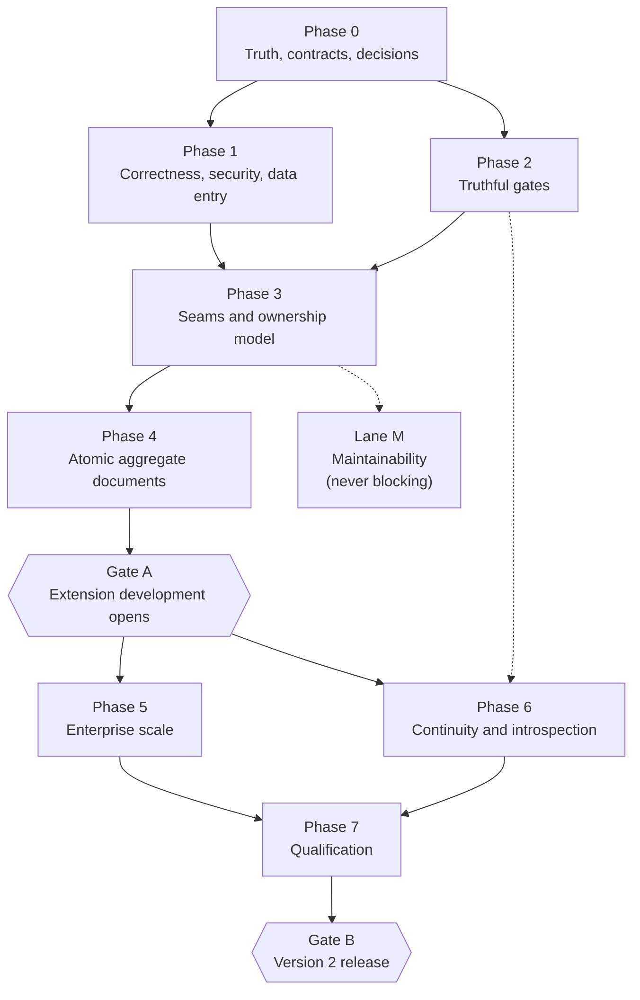

# Kumwe CMS consolidated roadmap

**Verified against** `26a7b3963c255064754f541dc8286e75dd566b1f`
**Machine-readable companions** [`findings.json`](findings.json), [`capacity-contract.json`](capacity-contract.json)
**Current position** [`STATUS.md`](STATUS.md)

---

## 1. Authority and what this supersedes

This directory is the single source of truth for programme sequencing. An agent that reads this document
and the repository has everything it needs to know what to build next, what not to touch, how to prove the
work, and when the work is finished.

It consolidates and supersedes, for sequencing purposes:

- the independent enterprise stabilization and scale review, pinned to `309db888`;
- the earlier independent runtime review and its validation follow-up;
- the seven-session runtime-readiness blueprint and its individual session contracts; and
- every scattered plan, progress note and next-steps list elsewhere in the repository.

It does **not** supersede [`docs/qualification/gap-matrix.md`](../qualification/gap-matrix.md), which is
retained unchanged as the executed evidence of the eight-wave production-qualification programme. Its
closed entries are proof of work already done, not a forward plan. Every one of them is carried into
[`findings.json`](findings.json) with its closure commit so one ledger answers both questions.

Nor does it supersede the normative rules. [`AGENTS.md`](../../AGENTS.md) and
[`docs/coding-standard.md`](../coding-standard.md) still govern how code is written; this document governs
what is written and in what order.

Where this roadmap and any historical document disagree about what is currently shipped, the runtime plus
executable evidence at the current revision wins. The mismatch is then corrected in the documentation and
in the ledger; it is never worked around silently.

---

## 2. Decisions already taken

These are settled. An agent implements them; it does not re-litigate them. Each carries an identifier so a
pull request can cite it.

### D1 — Scale target is 5,000,000 business documents per day

Five million logical business transactions per day, with the peak multipliers, latency objectives and
workload mix recorded in [`capacity-contract.json`](capacity-contract.json), is the Version 2 release
claim. Staging the release claim down to one million was proposed and rejected. The one-million profile
survives only as an early characterisation step and may never be published as the supported envelope.

Where the architecture prevents the target, the architecture changes. Where a legally constrained
mechanism — a single gapless statutory sequence, for instance — genuinely cannot reach it, the supported
envelope states that limit explicitly rather than weakening the guarantee.

### D2 — Two gates, not one

The programme has two release-shaped moments, and conflating them was the sequencing error in every
earlier plan.

**Gate A — extension development opens.** The extension contract is frozen, the atomic multi-line document
command exists, and data-entry integrity is fixed. After Gate A, extension authors build against a stable,
capable core while the remaining programme proceeds behind contracts that do not move under them.

**Gate B — Version 2 enterprise release.** Everything, including qualification at the five-million
envelope under load, contention, failure, restart, backup and restore, and extension lifecycle.

Gate A is not a release. Nothing is published at Gate A. It is the point at which building an extension
stops being a bet on unfinished contracts.

### D3 — Point-in-time recovery is adopted as platform-supported, operator-configured

The shipped position — recorded in `docs/operations/backup-restore.md` and closed as gap-matrix entry
`GM-BAK-01` — is that point-in-time recovery is a database-layer responsibility this repository does not
own. That position is reversed.

Kumwe owns: capture of the backup coordinate on every supported engine, restore-with-replay tooling,
per-engine operator documentation, the executed drill, and the media-versus-database ordering rule. The
operator and their database administrator own the archive destination and its retention.

**Restic is the documented reference off-site transport** — a single static binary, client-side
authenticated encryption, content-addressed deduplication, and an append-only repository mode that gives
ransomware resistance. Kumwe takes **no dependency** on it. It is named in the operator documentation as a
transport that satisfies the requirements, alongside the requirements themselves, so an operator using
something else knows what their choice must provide.

### D4 — The backup artifact is reshaped for deduplication

`tools/backup.sh` currently emits four gzip-compressed tarballs. Compression randomises the byte stream, so
a content-defined chunker sees almost entirely new chunks after any change, and an hourly off-site snapshot
re-stores nearly the whole payload every hour. Media, private, extension and extension-asset payloads
become plain directory trees; the PostgreSQL dump — currently `pg_dump --format=custom`, which compresses
by default — is taken uncompressed. The MySQL and MariaDB dumps are already plain SQL and need no change.
Compression and deduplication become the transport's job.

The same work fixes the coordinate problem: `--set-gtid-purged=OFF` on the MySQL leg strips the position
marker replay needs, and the MariaDB leg records no coordinate at all.

### D5 — The `BusinessRecordService` decomposition leaves the critical path

Only the seams the aggregate command and the scale work actually require are extracted, in phase 3. The
rest of the decomposition runs in a parallel maintainability lane, during or after the scale work, and
blocks no gate. It is maintainability, not correctness and not capacity, and the programme stopped
pretending otherwise.

### D6 — Runtime operational introspection is a distinct deliverable

Wave 7 shipped monitoring: is it up, is it slow, is it erroring, is a queue deep. What operators
additionally need is diagnostics: *where* is the system struggling. Lock waits and contention hotspots.
Queue depth and age by queue. Slow definitions and policies. Backlog build-up and its drain slope. Whether
retention is keeping pace. This is a separate deliverable from monitoring, bounded by the same cardinality
discipline wave 7 established.

### D7 — A business-group installation is supported, through ownership scopes

Several related businesses — on the order of four — run on one installation, sharing staff, clients,
products and payroll master data by explicit choice, with accounting isolated per business and reportable
in consolidated form. Multi-tenant service to unrelated tenants is **explicitly out of scope for Version
2** and sits at version 3 or 4.

The model is fixed and recorded in [ADR 0001](decisions/0001-resource-ownership-scope.md): every resource
keeps exactly one owner, and the owner may be a site, a named group of sites, or the installation. This is
a widening of the existing `resource_site_ownership` registry, not a parallel mechanism. Sharing is never
modelled as a per-row resource-to-site list; the ADR records why. Each resource category declares the
scopes it may be owned at, and accounting documents, ledgers and pay runs are site-owned only. Consolidated
reporting is a group-scoped read served by projections, never a hole in write isolation.

This is Gate A scope because it shapes the data model extension authors build against. Retrofitting it
after extensions exist would mean migrating live business records.

### D8 — The atomic aggregate contract is designed before it is built

The aggregate command's public shape is settled as an architecture decision record in phase 0, long before
the implementation lands in phase 4, so extension authors building after Gate A are building against the
real shape rather than a placeholder.

### D9 — Competing products are never named in repository documentation

Capability requirements are described in their own terms. This applies to every document this programme
produces.

---

## 3. Reconciliation with the independent review

The independent review was pinned to `309db888`. This roadmap is verified at `26a7b39`. Seven commits
separate them:

| Commit | Subject |
|---|---|
| `0aeca85` | composer: take PHPUnit 13 and PHP_CodeSniffer 4 |
| `15f48cf` | npm: take vite 8.2.1 and the @types/node 26.2 typings |
| `05fe279` | actions: repin every workflow action to a verified release commit |
| `687707c` | Make the restore drill prove the system works, not that the bytes came back |
| `3fdb4e9` | Hand the shared fixture database back on a key the next process still holds |
| `1726ee1` | Move the poison drill's delivery helper off a name PHPUnit 13 made final |
| `26a7b39` | Let the deployment drills load their own classes in the production image |

**Not one of them touches `src/`.** `git diff --stat 309db888..HEAD -- src/` is empty. Every runtime
finding in the review therefore holds verbatim at the current revision, and each has been re-resolved to a
live symbol in [`findings.json`](findings.json) rather than copied forward on trust.

Four things the review says nevertheless need correcting, because the world moved or because the review
was imprecise.

### 3.1 Recovery findings are further along than the review states

The review lists `V2-DR-001` and `V2-DR-002` — point-in-time recovery, recovery objectives, key
restoration order and post-restore proofs — as incomplete. Wave 8 landed in `687707c`, after the review's
pinned revision, and closed most of it: declared recovery objectives as numbers, a documented
key-restoration order with the consequence of each wrong key, an end-to-end envelope decryption through
the production cipher so a restore booted with the wrong `APP_SECRET` now fails the drill, sixteen
fail-closed tamper refusals, the signed-backup path exercised in CI, and the restored installation actually
executing work.

Two residuals remain, both named in the ledger: approval spent state, which needs an approval-rule
administration surface that does not exist yet, and an HTTP replay of one login and one idempotent mutation
against the restored container.

What wave 8 did *not* do is build point-in-time recovery; it declared PITR out of scope. Decision D3
reverses that declaration. `GM-BAK-01` remains correctly closed as executed — the objectives were declared
— and is marked superseded by `V2-DR-001`.

### 3.2 The mutation fence already has the seam the review asks for

The review describes `DoctrineBusinessRecordMutationFence` as taking an exclusive `FOR UPDATE` lock for the
full record transaction, which is exactly right for writes. It does not mention that a **shared** fence
already exists on the same class — `LOCK IN SHARE MODE` on MySQL and MariaDB, `FOR SHARE` on PostgreSQL —
and is already used by every read path. The generation-aware shared-and-exclusive protocol phase 5 has to
build is therefore an extension of an existing mechanism rather than a new one. This makes the work
smaller than the review implies and should be planned accordingly.

### 3.3 The data-entry defect is narrower and differently shaped than first stated

The pre-work brief for this roadmap claimed that a validation failure discards everything the operator
typed on the generated business surfaces, evidenced by a grep showing that `business-form.twig` contains no
reference to submitted input. That grep is accurate about the file and wrong about the behaviour.
Retention lives in the shared field macro `_business-fields.twig`, which binds `field.input_value`, and
`BusinessSurfaceService::form()` populates it from a `$retained` argument that
`GeneratedBusinessBrowserController::write()` supplies when it catches `BusinessRecordValidationFailed`.

What is actually broken, verified at the current revision:

- **A stale-version conflict discards everything, on every browser surface.**
  `GeneratedBusinessBrowserController::write()` catches `BusinessRecordValidationFailed` and nothing else.
  `BusinessRecordVersionConflict` is mapped only in `BusinessRecordApiResponder` for REST and
  `BusinessConsoleFailureMapper` for the console. On the administrator and portal surfaces it escapes as an
  unhandled exception.
- **The CMS content editor discards everything on both failure classes.**
  `AdministratorUpdateContentHandler::handle()` catches neither `InvalidContentData` nor `VersionConflict`
  — both are declared as escaping. `AdministratorContentEditorHandler` builds its field values from
  `$entry['data']` and has no retained-input parameter at all. `content-form.twig` binds
  `value="{{ entry.title|default('') }}"` and `value="{{ entry.slug|default('') }}"` — the persisted entry,
  never the submitted body.

The severity stands. On a hundred-line document, losing the work to a conflict the operator could not have
predicted is disqualifying for enterprise data entry, and because these are the generated surfaces, every
extension inherits it. Only the shape of the fix changes: extend an existing retention mechanism to the
conflict path, and give the CMS content editor the mechanism it never had.

### 3.4 The review's finding IDs are preserved, and the ledger is larger

[`findings.json`](findings.json) carries 114 entries: 27 from the review, 62 from the executed gap matrix,
and 25 discovered while verifying this roadmap, during the qualification programme, or from the
business-group decision. Review identifiers are unchanged so a reference to `V2-SCL-003` resolves the same
way in both documents.

---

## 4. Verified current state

Everything in this section was resolved against the repository at `26a7b39`. Nothing is inherited on
trust.

### 4.1 What runs green today

`composer docs:api`, `composer architecture:policy`, `composer interface:programme`, `composer cs` and
`composer analyse` all pass. The unit suite is 1,534 tests and 22,160 assertions; the architecture suite is
106 tests and 6,918 assertions. Documentation-block completeness is 100% across 1,158 classes, 6,315
methods, 424 enum cases, 336 properties and 297 class constants. PHPStan reports no errors at level `max`.

### 4.2 Shape

1,186 PHP files under `src/`, 418 under `tests/`, 47 migrations, 47 console commands, 76 MCP tools, 26
built-in field types, 18 extension contribution registries. `ContainerFactory` is 5,409 lines and remains
the sole composition root. `BusinessRecordService` is 3,673 lines, unchanged since the review.

### 4.3 Controls that exist and must be preserved

Eight qualification waves are executed and evidenced. Tamper-evident audit with a digest chain, monotonic
positions, an anchor ledger, a verification command and job, a protected export, and append-only triggers
where the server grants the privilege. A record-encryption key ring with retired keys, dedicated key
material independent of `APP_SECRET`, an audited re-encryption pass and a key-provider port. A credential
lifecycle: password change and administrative reset, step-up revocation and recovery-code reissue, a
security epoch that retires tokens, portal sessions, administrator sessions and outstanding step-up proofs
in one advance, and a break-glass console path. A gapless-on-commit document number allocator. Contention
proven on real engines rather than in memory — outbox and inbox claims, competing approvers, deadlocks
built across two operating-system processes, scheduler occurrence races, idempotency first-claim races.
Real failure drills: Redis killed at the network path so reconnection is refused, a worker `SIGKILL`ed
mid-job with nothing unwound, database connection loss and session termination, hung-endpoint deadlines,
unwritable storage. Extension supply chain: production refusal of unsigned local packages, package bills of
material and provenance, an upstream revocation feed, admission-time code conformance. Structured
observability: one loaded contract, JSON logging with nested redaction, correlation and causation and W3C
trace context, a protected metrics endpoint with bounded labels, machine-readable alert rules with runbook
references. Backup and restore: quiesced signed backups, sixteen fail-closed refusals, an envelope
decrypted through the production cipher, a restored operator authenticated and denied, a restored TOTP
credential passing a live challenge and refused on replay, and the restored installation dispatching a
schedule and draining a job.

No phase may reopen or duplicate this work. Later phases load-test it, matrix-test it, and harden its named
residuals.

### 4.4 The blockers, verified

| Finding | Verified anchor | What is true at `26a7b39` |
|---|---|---|
| `V2-COR-001` | `BusinessRecordService::history()` 1813–1829 | The generation-uniqueness check runs over the returned page, not the full scope. `historyByIdentityDigest()` receives `limit + 1` and the cursor, then `array_unique()` over that page decides ambiguity. A second generation outside the page is not observed. |
| `V2-COR-002` | `GeneratedBusinessBrowserController::write()` 1150, 1183–1184; `AdministratorUpdateContentHandler::handle()`; `content-form.twig` 39–40 | Validation failure is retained on the generated surfaces. A version conflict is retained nowhere on a browser surface. The CMS content editor retains nothing on either failure. |
| `V2-SEC-001` | `McpCapabilityCatalog` 518, 535, 552, 2057; `KumweMcpHandlers` 1439–1576 | `currentPassword` is in three published extension-lifecycle input schemas and thirteen handler positions. `writeOnly` is set, which describes an output property and prevents nothing inbound. |
| `V2-ARC-001`, `V2-QA-002` | `tools/verify-policy.sh` | The architecture gate is four grep predicates: product-name spelling, forbidden direct dependencies, forbidden framework imports, two static-locator symbols. It evaluates no dependency edge and prints "Kumwe architecture policy verified." |
| `V2-ARC-003` | `BusinessRecordService` 73 and three peers; `src/Application/Automation/Job/Doctrine*` | Application imports `Kumwe\CMS\Infrastructure\Persistence\TransactionManager`. Three Doctrine adapters live under `src/Application`. |
| `V2-SCL-001` | `DoctrineBusinessRecordMutationFence::lock()` 76; eight call sites in the service | Every write path takes the installation row `FOR UPDATE` for the whole transaction. A shared fence exists at line 110 and is used by reads only. |
| `V2-SCL-002` | `DoctrineOutboxStore` 140–181 | A locking read of `business_projection_event_head` `singleton_id = 1` and a guarded update of `last_sequence`, both inside the caller's authoritative transaction. |
| `V2-SCL-003` | `RelationshipKind::OwnedLineCollection`; the single-line relation commands | The relational owned-line primitive exists. The one-command, one-transaction, one-version commit over it does not. |
| `V2-SCL-004` | `BusinessRecordIdempotencyRetentionMigration` 60, 65 | Seeded `43 * * * *` with `{"batch_size": 500, "maximum_batches": 10}`: 5,000 rows per hour, 120,000 per day, against an enterprise ingress of at least five million. |
| `V2-SCL-005` | `RuntimeMetricCollector` 208, 227, 270, 289 | Exact `COUNT(*)`, `MIN()` and `MAX()` on the primary at scrape time. The statement count is bounded; the work of an exact count is not bounded by it. |
| `V2-SCL-006` | `RuntimeIntegrationEventTransport::publish()` 91, 106, 132 | Consumers and webhooks iterate serially in the publishing path. |
| `V2-SCL-007` | `DoctrineJobQueue` 968, 985, 990 | A contributed queue with a declared ceiling locks its policy row `FOR UPDATE` and counts live leases before claiming. The ordinary claim at line 270 already uses `FOR UPDATE SKIP LOCKED`. |
| `V2-QA-001` | 148 `#[CoversNothing]` across 74 files; `ci.yml` 271, 433 | 36 of those files are integration tests exercising real behaviour. Coverage is collected on the PostgreSQL leg only and the workflow itself says "No threshold is enforced yet". |
| `V2-DB-001` | `ci.yml` 63–167 | Browser journeys run against one PostgreSQL service, Chromium only, while MariaDB is the canonical engine. |
| `V2-DB-002` | `DoctrineScheduler::dispatch()` 140–141; `ApplicationAuthorizationMigration` 94 | The ownership join compares two textual columns. `resource_site_ownership.site_identifier` is a bare `STRING(191)` with no charset or collation copied from `sites.identifier`, while `BusinessSecurityPortalMigration::siteIdentifierOptions()` introspects and reproduces them for exactly this reason. MariaDB raises 1267. |
| `V2-DB-003` | `ApplicationAuthorizationMigration` 106; `ApplicationAuthorizationMigrationRecovery` 443 | The primary migration names the constraint literally `fk_resource_site`; the recovery path already derives a hashed unique name. Foreign-key names are schema-global on MySQL and MariaDB. |
| `V2-DR-003` | `tools/backup.sh` 149, 161, 198–202 | Four gzip tarballs; `pg_dump --format=custom` compresses by default; `--set-gtid-purged=OFF` on MySQL; no coordinate at all on MariaDB. |
| `V2-ERP-001` | `Expression::OPERATORS` 58–80; `RecordRuleValidator` 167 | Twenty-one scalar operators, none of them an aggregation. Invariants evaluate over `RecordExpressionValues::from($values)`, the record's own fields. `RecordInvariantDefinition`'s docblock offers "a total agreeing with its lines" as an example the vocabulary cannot express. |
| `V2-GRP-001` | `ResourceSiteOwnership::siteFor()` 31; `SiteContext` | The port returns a `SiteContext`, a value object over one identifier string. There is no scope type, and a grep across the authorization and site modules finds no group concept of any kind. |
| `V2-GRP-002` | `ApplicationAuthorizationMigration` 91–107; `DoctrineResourceSiteOwnership::lookup()` 95–109 | The registry stores a bare `site_identifier`. Its primary key is `(resource_type, resource_id)`, so **one owner per resource is already structurally enforced** — the property the scope design rests on. The lookup's inner join on `sites.enabled` is what makes a withdrawn site fail closed. |
| `V2-GRP-003` | `DenyByDefaultAuthorizationGateway::evaluate()` 240–243 | Cross-site isolation is one string equality between the owning site identifier and the caller's. `ResourcePolicyDefinition::$installationGlobal` (line 69) already expresses installation-wide-ness, but as a property of a resource *type* rather than a scope of a resource *instance*. |
| `V2-GRP-004` | `ResourcePolicyDefinitionRegistry` | A resource category declares its capability bindings and its global flag. Nothing declares which ownership scopes it may be held at, because until now there was only one. |
| Fence partitioning (positive) | `DoctrineBusinessRecordMutationFence::acquire()`; `BusinessTransactionalRuntimeMigration::installations()` 122–147 | The fence selects with `WHERE h.site_identifier = ?` on the site-scoped `business_definitions` table joined to `business_schema_installations`, and re-checks the installation's own site on the joined row. Four businesses running the same logical definition hold four definition rows and four installation rows, so a group **partitions** the `V2-SCL-001` hot spot rather than concentrating it. |

---

## 5. Product objective

Kumwe core is a **lean, vertical-neutral platform** that can be extended, with no core edits, into
demanding business systems. The most demanding of them is a full enterprise resource planning system:
client management, products and services, stock and inventory, purchasing, sales and invoicing, general
ledger, payroll and staff loans, point of sale, manufacturing, projects, assets, service and job cards, and
role-specific dashboards.

The division of labour is fixed:

**Core supplies the primitives.** Typed definitions, exact-value fields, relationships, atomic aggregate
documents, numbering, workflows, approvals, policy, identity and organisation, generated surfaces, jobs and
events and reports and exports, and extension lifecycle and trust.

**Extensions supply the business rules.** Core contains no invoice, ledger, payroll, stock-costing,
enrolment, job-card or commerce rule, and never gains a switch for one.

The test of the boundary is simple. If a new vertical requires a core edit, either the primitive is missing
or the boundary was drawn wrong. Both are findings.

**The installation shape Version 2 supports is a business group.** Several related businesses — on the
order of four — on one installation, selling different things, sharing staff, clients, products and payroll
master data by explicit choice, with accounting isolated per business and reportable in consolidated form.
Decision D7 and [ADR 0001](decisions/0001-resource-ownership-scope.md) fix the model: one owner per
resource, held at a site, a named group of sites, or the installation; sharing expressed as group
membership and never as a per-row list; site-owned-only categories for anything that is a legal entity's
books; and consolidated reporting as a group-scoped read rather than a relaxation of write isolation.

**Multi-tenant service to unrelated tenants is not in Version 2.** It sits at version 3 or 4. Nothing in
this programme is designed as a step toward it, and no figure in the capacity contract is sized for it.

### 5.1 Capability primitives an enterprise resource planning system requires

Verified against the code at `26a7b39`. **Provided** means it exists and is proven. **Partial** means it
exists with a stated limitation. **Must add** means core has to build it. **Decision required** means the
core-versus-extension boundary has not been settled and must be, before extension authors depend on either
answer.

#### Data and modelling

| Primitive | Verdict | Evidence or finding |
|---|---|---|
| Typed entity definitions, versioned and immutable once published | Provided | `EntityTypeDefinition`, `DefinitionStatus`, `CanonicalDefinitionJson` checksum |
| Exact arbitrary-precision decimals | Provided | `core.decimal` with declared precision and scale; `ExactDecimal` |
| Money as an exact amount paired with a currency | Provided | `core.money`; `MoneyValue` |
| Quantity as an exact amount paired with a unit | Provided | `core.quantity`; `QuantityValue` |
| Unit-of-measure conversion | Decision required | `V2-ERP-004` — the type carries the unit; nothing converts, and there is no rate or factor table |
| Currency conversion and rate history | Decision required | `V2-ERP-004` — same shape as above |
| Relationships: one-to-one, many-to-one, one-to-many, many-to-many | Provided | `RelationshipKind` |
| Owned line collections stored relationally | Provided | `RelationshipKind::OwnedLineCollection`; relational storage mode is the only storage mode |
| Atomic multi-line document commit | **Must add** | `V2-SCL-003` — the Gate A blocker |
| Cross-field record invariants | Partial | `RecordInvariantDefinition` over a bounded typed expression, but scalar-only over the header — `V2-ERP-001` |
| Aggregate invariants over owned lines ("total equals the sum of its lines") | Decision required | `V2-ERP-001` — the single most fundamental document invariant is currently inexpressible |
| Server-computed derived values | Provided | `core.computed`; `ComputationMode`; `Expression` |
| Encrypted secret fields with key rotation | Provided | `core.secret`; `SecretKeyRing`; `business-record-rekey` |
| Attachments and media on records | Provided | `core.media_reference` and the media module |
| Portable relational schema with planned, recoverable migration | Provided | `BusinessSchema`, schema plan and apply and recovery, three engines |
| Bounded escape hatch for irregular data | Provided | `core.bounded_json` with a declared byte ceiling |

#### Document lifecycle

| Primitive | Verdict | Evidence or finding |
|---|---|---|
| Server-allocated document numbering | Provided | `core.sequence`; `BusinessNumberSequenceAllocator`; gapless-on-commit per counter |
| Numbering scoped by document type or legal entity; fiscal-period reset | Decision required | `V2-ERP-002` — scope is site or organization only; reset is never, yearly or monthly only |
| Per-record workflow state machine with capability-gated transitions | Provided | `WorkflowBinding`; transitions run only through an action whose capability the actor holds |
| Approvals, maker-checker and separation of duty | Provided | `BusinessSecurity` approvals, payload-digest-bound step-up purposes, single-use proof consumption |
| Step-up re-authentication on high-impact actions | Provided | RFC 6238 TOTP, recovery codes, five-minute single-use nonce proofs bound to purpose, site, organization, session and epoch |
| Optimistic concurrency on every mutation | Provided | expected version on every write path; `BusinessRecordVersionConflict` |
| Idempotent command replay | Provided | `BusinessRecordIdempotency` with `key_reused`, `in_progress` and `corrupt` outcomes |
| Point-in-time record history and revisions | Partial | `BusinessRecordRevision` and `history()`, but see `V2-COR-001` |
| Immutable correction by linked reversal | Decision required | `V2-ERP-005` — an approved document is corrected by mutating it |
| Period close and posting lock | Decision required | `V2-ERP-003` — the workflow binding is per-record; there is no cross-record temporal lock |

#### Access, identity and organisation

| Primitive | Verdict | Evidence or finding |
|---|---|---|
| Identity, roles, capabilities and grants with fresh revocation | Provided | grants re-read on every session resolve and token verify; security epoch |
| Multi-site and multi-organisation scoping | Provided | `SiteContext`, `RecordScope`, `ScopeMode`, resource site ownership |
| Business-group installation: several related businesses sharing selected master data | **Must add** | `V2-GRP-001`–`V2-GRP-006`; ADR 0001. One owner per resource is already structurally enforced by the `(resource_type, resource_id)` primary key; what is missing is the scope the owner may be held at |
| Accounting isolated per legal entity by construction | **Must add** | `V2-GRP-004` — no per-category ownership-scope policy exists, so isolation is currently a matter of how an installation is configured rather than what the registry refuses |
| Consolidated cross-business reporting without relaxing write isolation | **Must add** | `V2-GRP-006` — the projection machinery exists; the group-scoped read capability does not |
| Row, field and action policy applied before results, counts and aggregates | Provided | `BusinessRecordAccessController`, `FieldDisclosurePlan`, policy compiled into SQL |
| External and customer self-service portal identity | Provided | portal sessions, membership-derived principals, opt-in per definition |
| Delegated access and membership directory | Provided | `MembershipDirectory`; delegation preauthorizers re-run under lock |

#### Surfaces

| Primitive | Verdict | Evidence or finding |
|---|---|---|
| Generated administrator surfaces from a definition | Provided | list, detail, form, history, relation and document view kinds |
| Generated opt-in portal surfaces | Provided | `PortalOperation`; the same controller drives both |
| Document-shaped presentation for invoice-like output | Provided | `DocumentViewDefinition` and the `document` view kind |
| Public purpose-built read models | Provided | published views with no generic public mutation |
| REST with generated OpenAPI | Provided | `composer openapi:check` guards drift |
| Console | Provided | 47 commands with stable JSON and exit codes |
| Model-context tooling | Partial | 76 tools, but `V2-SEC-001` and `V2-SEC-002` are open |
| Data-entry integrity across a failed submission | Partial | `V2-COR-002` — conflicts discard input on every browser surface |
| Role-specific dashboards | Partial | `V2-ERP-006` — workspaces are navigation groups, and the dashboard handler is one fixed capability-filtered page |
| Offline-tolerant capture for point of sale | Decision required | `V2-ERP-007` — operation identifiers and idempotency are the foundation; nothing above them exists |

#### Processing and integration

| Primitive | Verdict | Evidence or finding |
|---|---|---|
| Durable events written in the business transaction | Provided | outbox with source events and a sequenced journal |
| Consumer receipts and at-least-once delivery without duplicate effect | Partial | inbox and checkpoints exist; fan-out is serial — `V2-SCL-006` |
| Jobs, queues, schedules and processes with fenced leases | Provided | `DoctrineJobQueue`, `DoctrineScheduler`, runtime-generation fencing |
| Reports and read projections with bound authorization | Provided | `BusinessReporting`, `ProjectionRuntime`, policy snapshots |
| Exports as queued, stored, checksummed artifacts | Provided | `ExportGenerationService`, `StoredExportArtifact` |
| Out-of-process adapters for untrusted or third-party logic | Partial | the contract is documented; no adapter host ships — `GM-SUP-05`, `V2-SEC-003` |

#### Platform and operations

| Primitive | Verdict | Evidence or finding |
|---|---|---|
| Extension lifecycle with data preservation | Provided | install, activate, upgrade, disable, reactivate, uninstall; purge is separate and explicit |
| Extension signing, admission and revocation | Provided | signature gate, admission scanning, bill of materials, provenance, upstream revocation feed |
| Extension SDK, scaffolder and conformance runner | Provided | `ScaffoldExtensionCommand`, `RunExtensionConformanceCommand` |
| A frozen public contract an author can build against | **Must add** | `V2-EXT-001` — the Gate A blocker |
| Tamper-evident audit | Provided | digest chain, positions, anchors, verification, export, retention |
| Backup and verified restore | Provided | eight closed gap-matrix entries and two named residuals |
| Point-in-time recovery | **Must add** | `V2-DR-001` under decision D3 |
| Monitoring: structured logs, metrics, alerts | Provided | wave 7 |
| Operational diagnostics: where the system is struggling | **Must add** | `V2-OPS-001` under decision D6 |
| Proven capacity at the enterprise envelope | **Must add** | phase 5 and phase 7 |

**Summary.** Of the 60 primitives above: **38 provided, 7 partial, 8 must add, 7 decision required.**

The eight that core must add are the atomic multi-line document, a frozen public contract, the
business-group ownership model with its per-category isolation and its consolidated read, point-in-time
recovery, operational diagnostics, and proven capacity at the enterprise envelope. Two of the seven
partials — record history and data-entry integrity — are phase 1 corrections rather than missing
capability. The seven decisions are all boundary questions, not gaps: for each, the answer may legitimately
be "an extension builds this on existing primitives", provided the answer is recorded and an author can
find it.

The platform is materially complete for the modelling, lifecycle, access and surface work a demanding
business system needs. What it lacks is the atomic document, the frozen contract, the recovery capability,
the operational insight, and the proof at scale. That is what this programme builds.

---

## 6. Non-negotiable preservation covenant

Every phase preserves these unless a separately approved architecture decision proves a required change.

**Platform and stack.** PHP 8.5. Joomla dependency injection and Joomla Event. Mezzio and PSR-15 with
Laminas PSR-7. Doctrine DBAL with portable MariaDB, MySQL and PostgreSQL behaviour. Twig server rendering
with focused Lit, TypeScript and CSS enhancement. Monolog and the shipped observability contract. The
official model-context SDK. Vite, Playwright, and accessibility, responsive and visual evidence.

**Architecture and discipline.** `ContainerFactory` as the sole composition root. Constructor injection
throughout — **no static containers and no service location, anywhere, for any reason**. Inward dependency
direction. Single-responsibility collaborators with explicit typed inputs and outputs; a class that merely
forwards is not a seam. CMS content and business records as separate first-class models. Relational
authoritative business storage rather than entity-attribute-value or universal JSON. Bounded typed
expression trees rather than stored executable code. One configured relational database owning an atomic
business transaction. Durable events for external coordination, with no distributed-ACID claim.

**Security and correctness.** Authorization before query results, counts, joins, aggregates, reports or
exports. Mutations that are authenticated, authorized, audited, transactionally consistent and
concurrency-safe. Idempotency wherever a command may be retried. Explicit public, portal, administrator,
machine and recovery boundaries. Data preservation on disable and uninstall unless an explicitly
authorized purge is performed. Redis as disposable coordination and performance state, never authoritative
business state. **Exactly one owner per resource**, enforced by the ownership registry's primary key —
sharing is expressed by widening the scope that owner is held at, never by a per-row list of participants,
so "who owns this" always has one answer for the audit trail and for every denial reason. **No transaction
spans sites**, so an inter-business document is two transactions coordinated by a durable event.

**Documentation and output.** Every documentable member carries a documentation block ending in `@since`;
existing narrow PHPDoc types are load-bearing and are never widened or deleted. **No competing product is
named in repository documentation.** **No generated output is committed without review** — a generator's
result is read before it is merged, and a hand-maintained list that a generator should own is a defect, not
a convenience.

**Prohibited.** No Laravel. No Symfony as an application framework. No entity-attribute-value business
storage. No raw stored SQL or PHP as data. No ORM entity manager at a delivery boundary. No second
composition root. No auto-discovered service providers. No core edit for a new business vertical. No
per-row resource-to-site sharing list. No group hierarchy or inheritance. No group scope on an accounting
document, a ledger or a pay run. No multi-tenant service to unrelated tenants in Version 2.

---

## 7. The enterprise capacity contract

[`capacity-contract.json`](capacity-contract.json) is authoritative. The essentials:

Five million logical business transactions per day at an eight-times peak — about 463 logical writes per
second — sustained for fifteen minutes, with a documented five-minute spike absorbed by bounded
backpressure. At least ten million authorized reads per day and a thousand read requests per second at
peak. Two hundred simultaneously authenticated staff. A hundred thousand client identities, ten thousand
live sessions and two thousand concurrently active portal or public clients. A hundred thousand documents
per day averaging 150 lines — about fifteen million line rows daily — with a burst of ten document commits
and fifteen hundred line rows per second for fifteen minutes while ordinary traffic continues. Ten million
record headers, a hundred million owned and relation rows, a hundred million retained ledger rows.

A hundred-line document commits atomically at p95 two seconds and p99 five seconds. A thousand-line
document at p95 eight seconds and p99 fifteen. Bounded reads at p95 250 milliseconds. Zero lost
acknowledged commits, zero duplicate externally visible effects, zero unauthorized disclosures, zero silent
partial document commits, zero audit omissions, zero exact-value drift.

Three rules govern how the number is reported. A thousand-line document is **one** logical business
transaction, never one thousand and one. Every capacity report publishes all applicable units, so passing a
transaction target while hiding row amplification, lock waits, ledger growth or background backlog is a
failed qualification. And no document this programme produces uses an unqualified throughput figure — every
result is bound to hardware, engine version and configuration, dataset, image digest, commit, warm-up,
sample count and variance.

---

## 8. The two gates

### Gate A — extension development opens

**Purpose.** Make it safe and productive to build an extension. Nothing is published; nothing is released.

**Entry conditions.** Phases 0 through 4 complete, each at its own exit gate.

**Exit criteria.** All must hold, each with executable evidence at one commit.

1. **The extension contract is frozen.** Public versus internal classification exists as machine-readable
   data, and every supported manifest and SPI generation still promised has a signed compatibility fixture
   that installs, activates, upgrades, disables, reactivates and uninstalls according to its declared
   contract. `V2-EXT-001` closed.
2. **The atomic aggregate command exists and is stable.** One vertical-neutral command commits a
   hundred-line and a thousand-line aggregate with one authorization decision, one idempotent outcome, one
   transaction, one version increment, one revision, one audit action and one bounded event. The
   single-line relation APIs are unchanged. The public shape matches the phase 0 architecture decision.
   `V2-SCL-003` closed.
3. **Data-entry integrity holds.** A validation failure and a stale-version conflict both re-render with
   the operator's submitted values on the generated administrator surface, the generated portal surface
   and the CMS content editor, proven by browser tests on all three, including a hundred-line document.
   `V2-COR-002` closed.
4. **Correctness and security contradictions are fixed.** `V2-COR-001`, `V2-SEC-001`, `V2-SEC-002`,
   `V2-DB-002` and `V2-DB-003` closed. `V2-SEC-003` resolved to an honest, consistently worded posture.
5. **The gates are truthful.** Coverage attribution is real and ratcheted, semantic dependency checking
   fails new violations, the browser and coverage matrix covers the primary engines, and one manifest
   defines what local, CI, nightly and release runs execute.
6. **The seams the aggregate command needs are clean.** The transaction abstraction is inward, automation
   Doctrine adapters sit in Infrastructure behind ports, and delivery and presentation leakage is removed.
   `V2-ARC-003` closed.
7. **The business-group ownership model is in place.** Resource ownership resolves at site, group and
   installation scope with the fail-closed contract unchanged; every existing isolation test passes
   unmodified; site-owned-only categories refuse a group scope; consolidated reporting is a group-scoped
   read; and a four-business group installation is exercised end to end on all three engines. The
   per-category scope table and the non-atomic inter-business rule are both in the frozen contract.
   `V2-GRP-001` through `V2-GRP-006` closed.
8. **Nothing regressed.** The full suite is green on MariaDB, MySQL and PostgreSQL. No supported
   compatibility fixture is broken except the approved model-context security correction, which ships with
   migration guidance and a stable error.

**What Gate A does not assert.** Not enterprise capacity. Not point-in-time recovery. Not operational
diagnostics. Not the human interface acceptance. Not a release. An extension author after Gate A is
building against contracts that will not move; they are not building against a qualified product.

### Gate B — Version 2 enterprise release

**Entry conditions.** Gate A passed. Phases 5 through 7 complete.

**Exit criteria.**

1. No repository-owned critical or high finding is open. Conditional and external risks each have an
   owner, a detection method, a compensating control, a remediation path and a review date.
2. The five-million envelope is proven on the declared topology: a 24-hour rated run and a 72-hour soak at
   70% load with zero integrity violations, stable resources, bounded growth and at least 30% headroom.
   MariaDB and MySQL both meet every objective; PostgreSQL meets the declared portable profile and every
   correctness gate.
3. Unrelated record writes no longer serialize on one definition row. Event-producing commits no longer
   lock one installation-wide head. Fan-out and queue claims scale through independent batched workers with
   no duplicate effect. Every hot ledger has a retention policy with at least twice its expiry drain
   capacity. Monitoring runs no unbudgeted table-scale exact count on the production primary.
4. Point-in-time recovery is proven: coordinate capture on every engine, restore with replay to a point
   before and after a chosen transaction, the ordering rule enforced, and the drill executed inside the
   deployed image.
5. Operational diagnostics answer where the system is struggling, within the established cardinality
   discipline.
6. The exact built application image, web image, Composer package and archive — not rebuilt lookalikes —
   pass the complete qualification contract, and a signed manifest contains every published digest.
7. Human interface acceptance is complete with named accountable reviewers.
8. The vertical-neutral proof portfolio installs, runs and uninstalls on all three engines with no core
   edit.
9. An independent review at the release candidate finds no repository-owned critical or high
   contradiction.
10. The published envelope states exact units, topology, hardware, versions, dataset, variance and
    limitations. Never "millions per day".

---

## 9. Phases

Every phase below is executable by an agent that reads only this document and the repository. Each work
package names its findings, its entry condition, its exit gate and its non-goals.

Dotted edges are permissions, not dependencies: phase 6 may begin once phase 2 has given it gates, and lane
M may begin once phase 3 has settled the seams it must not disturb.

---

### Phase 0 — Truth, contracts and decisions

**Objective.** Turn this roadmap into an executable control plane before any behaviour changes, and settle
every decision phases 1 through 5 depend on.

**Entry conditions.** Master is at `26a7b39` or a later recorded successor with a clean tree. This document
and its companions are merged.

**P0-A — Reproducible baseline.** Record the exact commit and protected-branch status; PHP, Composer, Node,
npm, database, browser, container, operating-system and action versions; lockfile checksums; the test
inventory by category; current attributed coverage and what is deliberately excluded; the live inventory of
routes, OpenAPI operations, console commands, model-context tools, scheduled jobs, event consumers, public
and administrator and portal pages, recovery entry points and contribution types; build artifacts and
checksums; workflow run identifiers; and every skip, retry, quarantine, exception, environment limitation
and unexecuted human gate. The generator is deterministic: run twice at one commit it produces the same
semantic result.

**P0-B — Claim ledger.** One row for every normative statement in the root documents, the architecture and
extension and machine-surface and security and operations and release documentation, the historical
readiness material, and any interface text that represents a security, compatibility, data-preservation or
qualification promise. Each row carries its current wording and source, its state, its runtime owner, the
command or test that verifies it, the workflow and cadence that runs it, the artifact it produces, its
evidence expiry, and its residual limitation. A claim with no executable evidence is reworded as
conditional or planned in the same change. Documentation never describes a target as a current capability.

**P0-C — Public contract classification and compatibility fixtures.** Findings: `V2-EXT-001`. Classify
every extension-visible surface as public or internal: manifest schemas and SPI versions; the PHP
interfaces, DTOs, exceptions, lifecycle events and application ports intentionally exposed; contribution
schemas and namespacing rules; route, asset, template, field-renderer and interface-standard contracts;
migrations and applied-byte immutability; generated REST schemas and stable problem codes; console command
names, options, JSON fields, exit codes and safe secret input; model-context tool names, closed schemas,
stable errors and intentional exclusions; and the full lifecycle with its data-preservation behaviour. Ship
a representative signed compatibility package for every generation still promised. Internal code may be
decomposed freely thereafter; public contracts require semantic versioning, a compatibility window,
migration guidance and a passing fixture.

**P0-D — Capacity contract.** Already delivered as [`capacity-contract.json`](capacity-contract.json). This
work package extends it with the deterministic dataset generator seeds and age distribution, and the exact
per-topology hardware figures, once the reference hardware is procured.

**P0-E — Architecture and security decisions.** Approve, as recorded decisions, before implementation.
Decisions live in [`decisions/`](decisions/) one per file, numbered, each stating its context, the decision,
the alternative rejected and why, its consequences and its non-goals.
[ADR 0001](decisions/0001-resource-ownership-scope.md) is written and accepted; it is the pattern the rest
follow.

1. **Layer graph and shared-kernel policy.** Domain, Application, Infrastructure, Delivery, Presentation
   and Composition dependencies; the inward transaction port; and the narrowly justified extension-migration
   exceptions, encoded as exact interfaces rather than a blanket allowance.
2. **Aggregate transaction boundary.** Decision D8. The public shape of the aggregate command: one logical
   document commit, maximum line and byte limits, revision and audit and event semantics, late number
   allocation, and retry behaviour. This is the contract extension authors build against from Gate A, so it
   is settled here even though it is implemented in phase 4.
3. **Record identity generations.** Public identity reuse after hard deletion, tombstones, history
   ambiguity and fail-closed behaviour. Resolves `V2-COR-001`'s long-term model.
4. **Concurrency and event ordering.** Schema-generation fencing, per-record concurrency, event sequencing,
   aggregate ordering and projection checkpoint semantics.
5. **Extension trust posture.** Core, trusted in-process and untrusted out-of-process tiers, and the exact
   language every surface uses for each.
6. **Machine-surface risk and human-proof protocol.** What may be read, planned, requested, executed or
   never received; and the opaque operation-bound proof semantics.
7. **Database support and isolation.** MariaDB LTS canonical, MySQL 8.4 co-primary, PostgreSQL 17 fully
   supported, and the isolation and locking guarantees required on each. Isolation is pinned explicitly;
   engine defaults are not a portable contract.
8. **Release qualification authority.** The build-once artifact chain and the signed manifest as the
   release source of truth.
9. **Enterprise resource planning primitive ownership.** Findings: `V2-ERP-002` through `V2-ERP-007`. For
   each of unit and currency conversion, sequence scoping and fiscal reset, period close, immutable
   correction, dashboards and offline capture: does core own the primitive, or does an extension build it on
   existing primitives? Record the answer and, where the answer is "extension", state what an extension uses
   instead. An extension author must not have to guess.
10. **Resource ownership scope.** Already accepted as
    [ADR 0001](decisions/0001-resource-ownership-scope.md) under decision D7. What remains for this work
    package is the per-category scope table: for **every** resource category the installation carries, not
    just the seven the ADR names, declare which of site, group and installation it may be owned at. That
    table is part of the frozen contract in `P0-C`, because an extension contributing a resource category
    declares its permitted scopes the same way it declares everything else.

**Exit gate.** Every current feature, surface and contribution has an owner and at least one behavioural
evidence path. Every critical and high finding has an identifier, severity, owner, acceptance test and
target phase. Every normative claim is executable or explicitly conditional. The public contract is frozen
with passing fixtures, and it includes the per-category ownership-scope table. All ten decisions are
recorded. The repository is green on all three engines. No runtime feature was removed, renamed or
narrowed.

**Non-goals.** Do not refactor `BusinessRecordService`, `ContainerFactory` or the machine-surface handlers.
Do not implement a vertical module. Do not declare throughput from existing unit or chaos tests. Do not
lower a claim by deleting a feature; correct only claims that were already inaccurate. Do not create a
second state database beside `findings.json`.

---

### Phase 1 — Correctness, security and data-entry integrity

**Objective.** Fix the proven contradictions through narrow, behaviour-first changes, before anything moves
or scales. Every legitimate use case keeps a supported safe path.

**Entry conditions.** Phase 0 decisions 3, 5 and 6 recorded. May run in parallel with phase 2.

**P1-A — Record history generation ambiguity.** Findings: `V2-COR-001`. Reproduce first on all three
engines: create under a public identity, produce multiple revision pages, hard-delete through the
authorized lifecycle, reuse the identity, then request history with page sizes and cursors that return one
generation, and demonstrate that the page-local check selects or pages the wrong subject. Then implement a
fail-closed contract that resolves generation ambiguity **before** applying the page limit — a full-scope
distinct record-key query bounded to two results, followed by history retrieval only when exactly one
generation is valid. The query must be portable and indexed on all three engines. Tests: page size one,
middle and last pages, reverse order, empty page, one and several internal keys under one digest,
cross-site and cross-organization isolation, forbidden records with no existence leak, hard-delete racing
identity reuse, stable errors on every surface exposing history, and a query-count assertion.

**P1-B — Remove raw credential transport from the machine surface.** Findings: `V2-SEC-001`. Remove
`currentPassword` from every input schema, handler signature, example, generated description, fixture and
documentation path. Add a recursive scan of the serialized catalog that fails on any password, secret,
private-key, recovery-code, token-value or raw path field, wired as a test. Low-risk lifecycle operations
that need no re-proof continue under their existing application authorization. Operations that require
step-up fail closed without a valid protected proof. The browser, the protected console and the protected
REST path remain the human step-up route. `writeOnly` is not a control: it describes an output property and
prevents nothing on the way in.

**P1-C — Capability risk taxonomy and catalog validator.** Findings: `V2-SEC-002`. Review all 76 tools and
every destructive, trust, credential or installation-global capability. For each: confirm catalog and
handler binding; record its risk class; confirm capability and scope and context refresh; require an
operation identifier and idempotency for retriable mutations; require version inputs where state can be
stale; confirm bounded closed schemas; prove secrets cannot appear in schemas, examples, results, errors,
logs or audit diffs; decide execute versus plan-and-status only; and document the safe alternative. Add a
validator that rejects duplicate names, missing handlers, wrong annotations, unclosed schemas, mutation
tools without operation identifiers, and risk-versus-surface violations.

**P1-D — Data-entry integrity.** Findings: `V2-COR-002`. Three pieces of work, in order.

1. **Preserve unsaved work across a stale-version conflict.** `GeneratedBusinessBrowserController::write()`
   catches `BusinessRecordVersionConflict` and re-renders the form with the submitted values, the field
   errors, the current version and an explanation of what changed underneath — not an error page. The
   existing `$retained` path already carries the values; this extends it to a second failure class.
2. **Give the CMS content editor the mechanism it never had.** `AdministratorCreateContentHandler` and
   `AdministratorUpdateContentHandler` catch `InvalidContentData` and `VersionConflict`.
   `AdministratorContentEditorHandler` and `ContentFormPresenter` accept retained values and field errors.
   `content-form.twig` binds submitted values where they exist and persisted values otherwise.
3. **Cover it by browser tests on both generated surfaces and the content editor.** Validation failure and
   version conflict, each asserting no typed value is lost, including on a document with a hundred owned
   lines.

Because these are the generated surfaces, closing this closes it for every extension that will ever be
built on them. That is why it is a Gate A criterion rather than an interface-polish item.

**P1-E — Portability defects on a freshly created database.** Findings: `V2-DB-002`, `V2-DB-003`. Give
`resource_site_ownership.site_identifier` the canonical site-identifier character definition through the
same introspection `BusinessSecurityPortalMigration::siteIdentifierOptions()` already performs, and derive
the foreign-key constraint name the way `ApplicationAuthorizationMigrationRecovery` already derives it. Add
migration integration tests that install into a freshly created MariaDB database whose default collation
differs, run a scheduler dispatch pass, and install two prefixed installations into one schema.

**P1-F — Extension trust posture.** Findings: `V2-SEC-003`, cross-referencing `GM-SUP-05`. Change every
document, prompt and operator message to say "trusted in-process extension code". Require an explicit
operator trust decision bound to publisher, key and package digest. Prove that disable, quarantine, trust
revocation, stale generation and recovery each remove executable routes, templates, assets, jobs, listeners
and tools immediately while preserving data. Prove recovery composition executes no extension PHP and reads
no extension template or asset. Inventory the ambient filesystem, network, environment, database and
process authority and document the deployment controls that bound it. Do not weaken
`RestrictedExtensionContainer`; retain it as the supported application API boundary and never call it a
sandbox.

**Exit gate.** Identity-reuse history behaviour is defined and proven on three engines, and paging cannot
silently cross a generation. No credential-bearing field exists anywhere in the serialized machine
contract. Every machine mutation carries validated risk, capability, operation, version and bounded-schema
metadata. Submitted input survives both failure classes on all three browser surfaces. A fresh MariaDB
database dispatches schedules, and two installations coexist in one schema. Trust posture is consistent in
runtime, interface, operator and extension documentation. All affected unit, three-engine integration,
cross-surface, security, browser and documentation tests are green.

**Non-goals.** Do not split the machine-surface handlers or catalog for size alone. Do not decompose
`BusinessRecordService`. Do not build a sandbox. Do not expose dangerous operations everywhere in the name
of parity. Do not transmit a raw credential through a differently named field or a token-shaped wrapper.

---

### Phase 2 — Truthful engineering, database and release gates

**Objective.** Make the documented quality contract exactly equal to what local runs, CI, nightly and
release execute, and make the gates strong enough to protect every later phase.

**Entry conditions.** Phase 0 decisions 1, 7 and 8 recorded. May run in parallel with phase 1 where file
ownership is disjoint.

**P2-A — One canonical quality contract.** Findings: `V2-QA-003`. One data-driven manifest defines the PHP
contract — locked dependency and platform validation, architecture policy and semantic dependency checks,
documentation-block completeness, interface-programme coherence, OpenAPI generation and drift, coding
standards, static analysis, the four suites, and generated-artifact clean-tree checks — and the frontend
contract. `composer qa` may stay the human entry point, but it reads the manifest rather than restating it,
and CI, nightly and release consume the same manifest. Every command has one owner, purpose, expected
artifact and cadence.

**P2-B — Truthful coverage attribution and ratchets.** Findings: `V2-QA-001`. Audit all 148
`#[CoversNothing]` occurrences. Architecture and source-shape tests keep it on a reasoned allowlist;
application-service, repository, integration, functional and cross-surface behaviour tests attribute the
classes they exercise. Collect the canonical full result on MariaDB, the primary engine, and merge focused
driver attribution from MySQL and PostgreSQL without double-counting. Publish a commit-bound attribution
report distinguishing attributed, executed-but-unattributed, generated, adapter and deliberately excluded
code. Then ratchet: no global decrease beyond 0.25 percentage point, at least 90% line coverage on changed
executable PHP, at least 80% branch coverage on changed Domain and Application logic, positive plus denial
and conflict and replay and rollback paths on public behaviour, and enumerated transitions on high-risk
state machines regardless of percentage.

**P2-C — Semantic architecture fitness.** Findings: `V2-ARC-001`, `V2-QA-002`. Add an AST- or type-aware
dependency checker implementing phase 0's layer graph, alongside the existing textual predicates rather
than replacing them. Record existing violations with owner, justification and expiry; fail every new one
immediately. Keep source-string tests only where the source text itself is the contract — a prohibited
symbol, a generated-file checksum. Replace routing, wiring and class-shape string assertions with live
container, router, metadata and behaviour checks **before** the structures they describe move.

**P2-D — Three-engine catalogue and primary-engine policy.** Findings: `V2-DB-001`. Express database tests
by invariant and run the same portable contract on all three engines. Every merge candidate proves: clean
install and migration from an empty database; install beneath a parent schema where supported; repeated
migration and no-op upgrade; the current supported upgrade fixture; record, version, idempotency, audit,
outbox and concurrency invariants; history generation behaviour; schema plan, apply and recovery; backup
and restore smoke with a post-restore probe; and zero unexplained driver skip. Driver-specific coverage:
next-key and gap locks, implicit DDL commits, metadata locks, collation and index-prefix limits, deadlock
and lock timeout, undo and purge lag, binary-log behaviour on the MySQL family; transactional DDL limits,
`SKIP LOCKED`, serialization and deadlock cases, autovacuum and freeze, dead tuples and index bloat,
write-ahead-log and checkpoint behaviour on PostgreSQL. Pin exact image digests for release.

**P2-E — Browser, accessibility and visual matrix.** Findings: `V2-DB-001`. At merge: critical
administrator, portal, generated-business, owned-line, maker-checker, step-up, policy-denial,
no-JavaScript and website journeys, desktop and mobile Chromium, on MariaDB and MySQL and PostgreSQL,
sharded and fixture-isolated, with first-attempt results reported separately from retry results. Nightly
adds Firefox and WebKit, accessibility, keyboard and focus, touch, high contrast, zoom and reflow, print
where relevant, and visual regression. Convert screenshots claimed as regression baselines into real
comparison assertions or label them evidence-only. Acceptance: zero serious or critical accessibility
violations, zero horizontal overflow, zero inaccessible critical control, critical journeys passing first
attempt, overall first-attempt pass rate at or above 99%, zero quarantined critical journey, and evidence
identifying commit, engine, browser, viewport, locale and fixture.

**P2-F — Live surface and contract fitness.** Compare generated declarations against live registrations:
runtime route method and path against OpenAPI operation, security, middleware, capability, idempotency and
version metadata; the real console application against the command index; the serialized machine catalog
against callable handlers, risk, capability, schema and mutation guard; interface navigation and action
metadata against authorized use cases; and worker, scheduler and event registries against declared
contributions. An explicit allowlist records intentionally uncontracted health, asset and recovery routes.
A hard-coded partial route list is not sufficient proof.

**P2-G — Suite idempotency and the deployed-artifact lane.** Findings: `V2-QA-004`, `V2-QA-005`,
`GM-SUP-09`. Two related problems with one cause: cheap jobs do not resemble the environment where defects
appear.

- **Idempotency.** The integration suite runs twice against one database with identical results, and in a
  different class order with identical results, as an executed CI step. Any class mutating
  installation-global state declares and executes its own rollback, as `RecordSecretRotationIntegrationTest`
  now does.
- **The deployed-artifact lane.** A lane that exercises the deployed artifact — production autoloader,
  `--no-dev` dependency set, read-only container, the real console binary — early enough to fail before a
  full deployment is stood up. Four defects in the last programme were found **only** in production
  deployment acceptance: the package-admission memory ceiling, the missing production autoloader path, the
  stranded record-encryption keys, and a drill leg that had never executed inside the deployed image. Each
  becomes a regression case in this lane. That four defects reached that far is the argument for the lane;
  it is not a criticism of the drills that caught them.

**P2-H — Build-once exact-artifact release chain.** Findings: `V2-REL-001`. Prove the candidate belongs to
the protected branch and that required workflows passed. Build the application image, web image, Composer
package and archive exactly once. Record immutable digests, bill of materials, provenance, build logs and
toolchain versions. Scan those exact artifacts, never rebuilt lookalikes. Install each non-image artifact
into an empty directory. Run the same REST, console, machine-surface, idempotency, extension, worker,
scheduler, browser, backup, restore and recovery probe on all three engines. Run the images together in the
tested topology. Promote the tested digests without rebuilding. Emit a signed manifest containing every
published digest, with published digests equal to tested digests.

**P2-I — Performance harness and deterministic budgets.** Build the dataset generator, workload driver,
query-plan capture, metric collection and result schema. Characterize current master and record its
breakpoints — as a baseline fact, never marketed as capability. Enforce the deterministic per-change
budgets from the capacity contract. Absolute latency and throughput come from dedicated runners.

**Exit gate.** One manifest defines local, CI, nightly and release semantics. Documentation claims match
the executed gate or are clearly conditional. Behavioural tests contribute truthful attribution and the
ratchets are live. Every new dependency violation fails automatically and existing ones have owners and
expiry. Live route, OpenAPI, console, machine-surface and registry contracts are checked. The full suite is
green on all three engines. MariaDB and MySQL receive primary-depth browser and deployment treatment while
PostgreSQL stays release-blocking. The integration suite is idempotent. The deployed-artifact lane
reproduces all four production-only defects as regression cases. Exact built artifacts are installed,
scanned and probed. The harness reproduces a stable breakpoint report.

**Non-goals.** Do not chase a coverage percentage with low-value assertions. Do not replace real database
or cross-surface tests with mocks. Do not make PostgreSQL optional. Do not begin class extraction before
the semantic and behavioural gates are active. Do not publish breakpoint measurements as capacity claims.

---

### Phase 3 — Boundary seams and the ownership model

**Objective.** Two things, both prerequisites for Gate A and neither of them a general refactor. Extract
exactly the seams the aggregate command and the scale work require — decision D5 governs that: the rest of
the decomposition is lane M. And widen the resource-ownership model that the extension contract depends on
— decision D7 and [ADR 0001](decisions/0001-resource-ownership-scope.md) govern that. Nothing else moves in
this phase.

**Entry conditions.** Phase 2 can detect behavioural, database, surface, compatibility and dependency
regressions. Phase 1 is merged.

**P3-A — Move the transaction boundary inward.** Findings: `V2-ARC-003`. Define the minimal transaction
abstraction in Application or a framework-free shared kernel, with explicit begin, commit, rollback and
retry-policy semantics. Adapt Doctrine DBAL in Infrastructure. Preserve nested and ambient transaction
behaviour and exception mapping. Update consumers mechanically in small groups. Prohibit Application from
receiving a raw Doctrine connection or query builder through the abstraction. Prove one database still owns
the complete authoritative mutation. Tests on all three engines: commit, rollback, exception translation,
retryable deadlock and serialization failure, non-retryable domain failure, nested call semantics, and
audit and outbox atomicity.

**P3-B — Automation application and SQL separation.** Move `DoctrineJobQueue`, `DoctrineScheduler` and
`DoctrineQueueRuntimeOperations` out of `src/Application` into Infrastructure behind application ports.
Separate application command and query policy from queue and schedule contracts, from Doctrine SQL and
lease claiming and engine branches, and from delivery commands and workers. **Characterize and preserve
existing behaviour; change no concurrency semantics here.** The queue-slot redesign is phase 5, after this
boundary is clean.

**P3-C — Delivery and presentation leakage.** Idempotency middleware asks an Application idempotency port
rather than writing Doctrine state directly. Business surface Application uses rendering contracts or
receives fully typed view models. Theme and package validation depends on a template-validation port rather
than importing Twig inward. HTTP, machine-surface and console input models stay delivery concerns
translated into typed application commands. Preserve error codes, headers, replay semantics, HTML and JSON
output and audit attribution; cross-surface parity is the acceptance authority.

**P3-D — Domain and Application reconciliation.** For each Domain import of an Application type: move a
genuine domain value or contract inward; invert the dependency or pass a domain result where it is an
application concern; move the implementation outward where only an adapter uses it; and encode any genuine
extension-migration exception as an exact interface in the recorded decision and the dependency checker.
Avoid a shared dumping ground: every shared-kernel type needs a stable semantic owner, no framework import
and at least two legitimate inward consumers.

**P3-E — Only the record seams the aggregate needs.** `BusinessRecordService` remains the stable public
facade and the single owner of the use-case transaction boundary. Extract, in this order and no further:

1. **Relationship and owned-line coordination.** Typed relation and owned-line validation and mutation
   intent, centralized, with single-line public behaviour unchanged. This is the seam the aggregate command
   is built on.
2. **Atomic publication.** Coordination of authoritative record changes with revision, audit and durable
   event creation under the one existing transaction. This is the seam the aggregate's one-revision,
   one-audit, one-event contract needs.

Each extraction: confirm outcome characterization across real adapters first; introduce a typed
collaborator interface only where a testable responsibility exists; move one vertical use case; keep
facade signatures, errors, audit and event behaviour stable; run the full three-engine and cross-surface
gates; delete obsolete private code only after equivalence is proven. A collaborator that merely forwards
is not a seam and is rejected in review.

**P3-F — Widen resource ownership from a site to a scope.** Findings: `V2-GRP-001` through `V2-GRP-006`.
Decision D7, [ADR 0001](decisions/0001-resource-ownership-scope.md). Implements the business-group
installation. It is here rather than in phase 0 because it changes a core port, the authorization gateway
and a migration, and it needs phase 2's gates to prove no isolation regression. It must merge before Gate A
because the frozen contract describes it.

Five changes, in this order, each its own pull request.

1. **The scope type and the group registry.** `V2-GRP-001`. Introduce an ownership-scope value type with
   three levels — site, named group, installation — from which a site scope is constructible from a
   `SiteContext`, so every existing caller has a mechanical translation. Add the declared-group registry:
   a group is a named set of sites, groups may overlap, and membership is administrative state with its own
   capability and audit action rather than transactional state. Do not touch the gateway yet.
2. **Widen the registry.** `V2-GRP-002`. `resource_site_ownership` carries a scope rather than a bare site
   identifier. **The primary key `(resource_type, resource_id)` does not change** — one owner per resource
   stays structurally enforced, which is the property the whole design rests on.
   `DoctrineResourceSiteOwnership` keeps its fail-closed contract exactly: no row means unowned, and a
   scope whose sites are all disabled resolves to nothing rather than to the caller. The existing inner
   join on `sites.enabled` becomes a membership-and-enabled resolution with the same meaning. Migration is
   forward-only and every existing row becomes a site scope, so an installation that never declares a group
   is byte-for-byte equivalent in behaviour.
3. **Widen the gateway.** `V2-GRP-003`. `DenyByDefaultAuthorizationGateway`'s single equality at lines
   240–243 becomes a single containment test: is the caller's site inside the resource's owning scope. **For
   a site scope the containment test must reduce to exactly that equality**, and the existing isolation
   tests are the proof — they are not rewritten, and if one needs rewriting the widening is wrong. Reconcile
   with `ResourcePolicyDefinition::$installationGlobal`, which today expresses installation-wide-ness as a
   property of a resource *type*; the instance-level installation scope and the type-level flag must have
   one documented relationship, not two overlapping mechanisms. Keep the containment test off any per-call
   join: the scope resolves to a bounded, cacheable membership set, because group membership changes are
   administrative events.
4. **Per-category ownership policy.** `V2-GRP-004`. Each resource category declares which scopes it may be
   owned at, alongside its existing resource-policy declaration. Clients, products and services, price
   lists and staff or person master may be site- or group-owned. **Accounting documents, ledgers and pay
   runs are site-owned only** — a group-scoped ownership row for any of them is refused by the registry, so
   a legal entity's books cannot be jointly owned by construction rather than by discipline. An extension
   contributing a category declares its permitted scopes the same way it declares everything else.
5. **Scope change operations.** `V2-GRP-005`. Widening — site to group, group to installation — is an
   ownership change plus an audit entry: no migration, no data movement. Narrowing is guarded: it first
   proves no other member site's records reference the resource and refuses with the referencing sites
   named when they do. Both operations are capability-gated and audited. The asymmetry is stated in the
   operator documentation, because an operator who widens casually and expects to narrow casually will be
   surprised at the worst possible moment.

Then the read half. `V2-GRP-006`. Consolidated group reporting is a **group-scoped read capability served
through the existing projection machinery** — authorized, audited and policy-filtered like any other read.
It is never a relaxation of write isolation and never a transaction spanning sites. A group report reads
across a group's sites because the reading capability is owned at group scope, not because the write path
gave way.

Required tests, on all three engines: two sites in one group both see a group-owned client while a third
site does not; overlapping groups resolve independently; a site-owned resource behaves exactly as it does
today, asserted by the unchanged existing isolation tests; a group-scoped ownership row for a ledger is
refused; disabling one member site removes its access without affecting the others; widening is audited and
reversible; narrowing is refused while another member site references the resource and succeeds once it
does not; a group report returns exactly the union of what its member sites may each see, and no more; and
the authorization hot path issues no additional query per call.

**Worked example to include in the extension documentation.** Payroll. The person is group-owned;
employment, cost allocation and pay run are site-owned. One employee works across several businesses of the
group without their pay becoming ambiguous: one person, several employments, each belonging to exactly one
legal entity, each paid from that entity's own pay run and posted to that entity's own books.

**State in the Gate A extension contract, not in a covenant footnote.** A transfer between two businesses of
a group is **two transactions coordinated by a durable event**, never one. No transaction spans sites. An
author designing an inter-company transfer needs this before they design it.

**Exit gate.** Semantic dependency tooling reports zero unapproved or expired violations. Application
imports no Doctrine or delivery implementation and no Infrastructure-owned transaction port. Delivery
persistence and presentation leakage is behind typed ports. The two named record seams are coherent and
independently testable. One authoritative transaction still encloses record, revision, audit, idempotency
and durable event effects. `ContainerFactory` remains the sole composition root. Every supported
compatibility fixture still passes. Route, tool, command, schema, audit and error snapshots show no
unintended change. Resource ownership resolves at three scopes with the fail-closed contract unchanged;
every existing isolation test passes **unmodified**; a site-only installation behaves identically to today;
site-owned-only categories refuse a group scope; and a four-business group installation is exercised
end to end on all three engines.

**Non-goals.** Do not decompose beyond the two named seams — that is lane M. Do not rewrite working
functionality into a new framework. Do not recreate collaborators that already exist. Do not perform a
big-bang split. Do not mix a layer relocation with a scale-algorithm change in one change. Do not expose
internal registrars or repositories as new extension APIs. Do not weaken transaction, policy, idempotency,
audit or event guarantees for a cleaner graph. **Do not model sharing as a per-row resource-to-site list**
— ADR 0001 records why, and re-opening it needs a new decision record, not a pull request. **Do not build
multi-tenant service to unrelated tenants**; that is version 3 or 4 and nothing here is a step toward it.
**Do not introduce group hierarchy or inheritance** — groups are named sets that may overlap. **Do not let
a group scope reach an accounting document, a ledger or a pay run.** **Do not conflate ownership scope with
`ScopeMode`**, which partitions record storage and is a different concept with a different name.

---

### Phase 4 — Atomic aggregate documents

**Objective.** Deliver the missing primitive: one command that atomically commits a document header with up
to a thousand owned lines. This is the last Gate A criterion.

**Entry conditions.** Phase 3 exit gate passed. Phase 0 decision 2 recorded — the public shape is already
settled and this phase implements it rather than designing it.

**P4-A — The aggregate command.** Findings: `V2-SCL-003`. Add vertical-neutral commands behind the existing
facade, following the approved shape. They must serve invoices, purchase orders, attendance batches,
job-card parts and labour, commerce orders and any extension-defined aggregate without a single vertical
rule entering core. Contract requirements: one authorization decision and context; one idempotency outcome;
one database transaction; one aggregate version increment; one root plus up to a thousand validated lines
with an encoded-byte ceiling; typed exact decimal, money, quantity, date and relationship values; policy and
definition version pinned for the command; validation performed outside the hot lock where safe, then
version and generation and authority and uniqueness revalidated inside; deterministic line identities and
order and stable lock acquisition; set-based or chunked writes bounded below database parameter and packet
limits; one aggregate revision identity with relational line revision entries where needed; one audit
action with a bounded summary and accessible detailed revision evidence; one bounded aggregate event
describing identity, version and change summary rather than embedding a thousand-line payload; full
rollback on any invalid or conflicting line; and exact replay returning the original result without
rewriting lines, revisions, audit entries or events. The single-line relation APIs remain supported.
Generated interfaces, REST, console, machine surface, SDK and workers may call it; none reimplements its
transaction loop.

**P4-B — Bulk persistence mechanics.** Precompile field and relationship metadata once per command.
Validate in bounded batches. Use bulk insert or upsert only where the SQL is portable and
invariant-preserving; otherwise bounded prepared batches inside the one transaction. Replace per-line
reorder updates with set-based or chunked deterministic updates. Do not read each inserted line back
individually. Cap statement parameter count, SQL bytes, payload bytes, memory and transaction time. Acquire
record, sequence, unique-key and relationship locks in one stable order. Expose validation, lock-wait,
write, revision, audit, event and total commit durations. Statement growth must be sublinear in network
round trips: a thousand-line document cannot issue a thousand application transactions or a thousand
avoidable round trips.

**P4-C — Numbering and hot counters.** Allocate gapless or legally constrained numbers at the final
approved transition and as late as possible in the transaction, after expensive validation and line
preparation. Never reserve a final number during draft construction. Where the domain permits, scope
independent sequences by the partitions decision 9 approved. Never change the meaning of an existing
sequence for throughput alone. Tests: concurrency and uniqueness; the rollback and gap semantics the
declared policy requires; replay and stale posting; period rollover; multi-site independence; lock duration
on a thousand-line posting; and one hot-sequence stress profile representing a legitimate worst case.

**P4-D — Aggregate invariants.** Findings: `V2-ERP-001`. Implement whatever decision 9 approved. If core
supplies bounded aggregation over owned lines, it is evaluated once per aggregate command rather than once
per line, preserves exact decimal semantics, and rejects a violating thousand-line document atomically with
no partial commit. If it does not, correct `RecordInvariantDefinition`'s docblock, which currently offers
"a total agreeing with its lines" as an example the vocabulary cannot express, and document what an
extension uses instead.

**Exit gate.** A hundred-line and a thousand-line aggregate commit atomically with one idempotent outcome,
one version, one revision, one audit action and one bounded event. Single-line compatibility is intact.
Query and statement counts meet the declared budget. Replay is exact. Rollback is complete. All three
engines pass. **Gate A is then assessed against section 8.**

**Non-goals.** Do not embed an invoice, ledger, enrolment, job-card or commerce rule in core. Do not count a
thousand-line document as a thousand and one successful transactions. Do not begin the scale work here —
the fence and the sequencer are phase 5. Do not use a feature flag as a substitute for a finished contract.

---

### Phase 5 — Enterprise scale engineering

**Objective.** Remove the deliberate global serialization points, make background and retention throughput
scale horizontally, and prove that ledger growth stays operable at five million transactions a day.

**Entry conditions.** Gate A passed. The performance harness from phase 2 reproduces a stable breakpoint
report.

**Non-negotiable scale invariants.** At every load level: one logical document is fully committed or fully
rolled back; an acknowledged idempotency key has one stable outcome; optimistic concurrency selects one
legitimate winner; different records and organizations progress concurrently unless they share a genuine
invariant; constrained numbers stay unique and are allocated only at the approved point; revisions and
audit entries and durable events correspond exactly to the committed aggregate version; delivery is at
least once without duplicate business effect; denied records and fields never become visible through a
performance shortcut; extension disable and revocation and generation change remain immediate and fenced;
and overload creates bounded backpressure, never silent partial work or unbounded growth.

**P5-A — Remove the definition-wide mutation mutex.** Findings: `V2-SCL-001`. Instrument contention first
and prove the current serialization of two unrelated records under one definition on all three engines.

One architectural positive to measure rather than assume, verified at `26a7b39`: the fence is taken per
**site and definition installation**. `DoctrineBusinessRecordMutationFence::acquire()` selects with
`WHERE h.site_identifier = ?` on the site-scoped `business_definitions` table, joined to
`business_schema_installations`, and re-checks the installation's own site on the joined row. Four
businesses of a group running the same logical definition therefore hold four distinct definition rows and
four distinct installation rows, so **a group installation partitions this write hot spot naturally into
four independent fences** rather than concentrating it. A group installation contends less than a single
business at the same total volume. The characterisation runs must measure a group installation as well as a
single one, so the improvement is reported as measured rather than claimed.
Then replace the exclusive full-transaction installation lock with a generation-aware protocol built on the
shared fence that already exists: normal mutations take a shared lease for the exact active generation;
multiple writers on unrelated records hold it concurrently; schema apply, definition lifecycle transition,
disable, trust revocation and incompatible generation take an exclusive transition lock that waits for
active writers and prevents new writers entering the old generation; the writer revalidates generation and
authority inside the transaction before commit; record versions, unique constraints, sequence rows,
relationship constraints and policy state continue to protect their own narrower invariants; and leases
have observable age, owner and recovery without Redis holding authority. Success is measured as reduced
lock-wait and transaction time at target load, not as different SQL text.

**P5-B — Move global event sequencing out of business commits.** Findings: `V2-SCL-002`. The authoritative
transaction writes a committed, unsequenced source-event row carrying aggregate identity and version, event
identity, owner and site and organization, schema version, occurrence metadata and a bounded payload or
reference. A sequencer claims only committed unsequenced rows in batches using portable leasing. One short
sequencer transaction locks the head once, allocates a contiguous range, writes ordered journal rows and
marks the claimed source rows sequenced. Dispatchers and projections consume only sequenced rows.
Per-aggregate versions and checkpoints preserve aggregate order across concurrent commits. Do not replace
the singleton lock with naive auto-increment ordering inside concurrent transactions: allocation order can
differ from commit visibility, and a checkpoint would skip a late commit.

**P5-C — Asynchronous fan-out with independent receipts.** Findings: `V2-SCL-006`. One short transaction
materializes independent consumer-and-event receipt rows from the sequenced event and the active runtime
generation. Worker pools claim receipts in batches. A slow, failing or rate-limited consumer does not delay
unrelated consumers. Each consumer has bounded concurrency, timeout, retry and backoff, circuit breaking
and dead-lettering. Checkpoints preserve only the ordering actually required. Generation and trust
revocation prevent stale consumer execution. Idempotency keeps at-least-once delivery from creating
duplicate effects. External effects stay outside the authoritative transaction.

**P5-D — Horizontally scalable queue claiming.** Findings: `V2-SCL-007`. Replace the policy-row mutex and
per-claim exact live counts with a fenced slot or counted-permit design. Workers claim slots with portable
leasing. One claim transaction may lease a compatible batch where ordering permits. Completion, expiry,
cancellation and recovery release or reclaim safely. Priority and schedule order stay deterministic within
the declared fairness policy. No site or organization can monopolise worker capacity. Policy changes and
generation transitions fence stale claims. The database holds lease authority; Redis may accelerate wake-up
only. Prove no over-claim beyond declared tolerance, no starvation, and bounded recovery after `SIGKILL`.

**P5-E — Retention and hot-ledger capacity.** Findings: `V2-SCL-004`, `V2-SCL-008`, forward from
`GM-AUD-07` and `GM-CON-01`. Every hot store declares its authoritative purpose and minimum retention,
whether it is immutable or deletable, its expiry index or partition strategy, its hot and warm and archived
states, its batch and time and lock and replication budgets, its six retention metrics, its backup and
restore and legal-hold behaviour, and its failure and reconciliation procedure. Maintenance sustains at
least twice the peak expiry rate while the ordinary workload continues; the seeded 120,000 deletions a day
is replaced by adaptive time-budgeted batches or safe partitions sized from the capacity contract. Audit
data is pruned only after a verifiable anchor is committed and the off-host archive is proven restorable,
in bounded incremental ranges. Readiness warns or fails when a required setting is absent or the drain
slope predicts exhaustion.

**P5-F — Scalable metrics.** Findings: `V2-SCL-005`. Benchmark every durable gauge query at representative
table size. Keep indexed oldest-row and existence probes where bounded plans are proven. Replace hot-path
exact counts with sharded incremental counters or asynchronously reconciled snapshots where the scan
exceeds budget, exposed as approximate while durable rows stay authoritative, with an operator-only exact
diagnostic carrying an explicit cost and timeout. Add low-cardinality operation-class, transaction and lock
and deadlock and retry, document line and byte and commit, sequencing and dispatch, queue claim and
settlement, idempotency, retention, connection saturation, replica lag and backlog-age metrics. Never label
by site, user, record, event or document identifier, or raw route.

**P5-G — Query, index and reporting scalability.** Bounded cursor pagination rather than deep offset. Row
and field policy compiled into the SQL before joins, counts, pagination and aggregation. Indexes matching
scope, definition, status, identity, version, sort and relationship predicates. Examined rows within a small
declared multiple of returned page size. Rejection of unbounded filters, sorts, includes, projections,
report dimensions, exports and relationship expansion. Caps on join depth, expression nodes, parameters,
result bytes and execution time. Expensive reports and exports moved to asynchronous projections or
replica-safe snapshots with bound authorization context. Query-count growth detected in generated
interfaces and every machine adapter. Replicas serve explicitly eventual reporting only; authorization,
generation checks, stale-sensitive workflows and read-after-write responses stay on an authoritative
freshness path.

**P5-H — Horizontal runtime and fairness.** Qualify a stateless application tier with multiple replicas and
the six worker pool classes from the capacity contract. Bounded connection pools, graceful drain, readiness
tied to generation and schema state, and backpressure when the database or a downstream is saturated.
Long-lived workers lease an exact runtime generation and drain when stale. Fairness so one site cannot
consume every queue slot, report worker, export byte budget or connection. Rate limits supplement
authorization and never replace it.

**P5-I — Storage forecast and guardrails.** Measure per-engine table, index, log, undo, backup and replica
amplification and publish everything the capacity contract requires. Reserve at least 30% free operating
space and enough temporary capacity for the largest supported index rebuild.

**Exit gate.** Unrelated record writes do not serialize on one definition row. Event-producing commits do
not lock one installation-wide head. Fan-out and queue claims scale through independent batched workers
with no duplicate effect. Every hot ledger has a retention policy with at least twice its expiry drain
capacity. Monitoring runs no unbudgeted table-scale exact count on the primary. Generated queries meet
plan, query, memory and result bounds at aged volume. The horizontal topology preserves policy, generation
and transaction semantics. MariaDB and MySQL meet every objective; PostgreSQL meets the declared portable
profile and every correctness gate.

**Non-goals.** Do not make Redis authoritative for transactions, locks, versions, queues or idempotency. Do
not weaken durability, audit, authorization, exact values or event guarantees to win a benchmark. Do not
add unbounded caching or stale replica reads to a security-sensitive path. Do not shard before measured
evidence justifies the operational cost. Do not embed a vertical rule in core.

---

### Phase 6 — Continuity, recovery and operational introspection

**Objective.** Deliver the two capabilities the owner added to the programme: real point-in-time recovery
that Kumwe supports, and diagnostics that tell an operator where the system is struggling.

**Entry conditions.** Phase 2 gates exist. May run in parallel with phases 3 through 5; it shares no files
with them. Its drill must run inside the deployed image, so it depends on phase 2's deployed-artifact lane.

**P6-A — Point-in-time recovery.** Findings: `V2-DR-001`, `V2-DR-004`, superseding `GM-BAK-01`. Decision D3.

- **Coordinate capture.** On MariaDB and MySQL, record the binary-log file and position and the GTID set at
  the snapshot instant; `--set-gtid-purged=OFF` is removed or its consequence explicitly compensated. On
  PostgreSQL, take a physical base backup with its write-ahead-log location and timeline, since a logical
  dump can never be a replay base. Every coordinate lands in the backup manifest.
- **Restore with replay.** Tooling that restores the base and replays an operator-configured archive to a
  chosen point, refusing a target it cannot reach and saying why.
- **The ordering rule.** No log covers the filesystem payloads, so a database replayed past the payload
  snapshot instant references media and export objects that do not exist. The tooling refuses or loudly
  records such a target; the rule is stated once, identically, in the tool and the operator documentation.
- **Per-engine documentation.** What the operator configures, where the archive lives, how retention
  works, how to verify the archive is usable, and what each recovery objective actually costs.
- **The drill.** Restore to a point before and after a selected transaction, executed inside the deployed
  image on all three engines, with the recovered state asserted rather than compared.
- **The reference transport.** Restic documented as the reference off-site transport, with its properties
  stated — single static binary, client-side authenticated encryption, content-addressed deduplication,
  append-only repository mode — alongside the requirements themselves so an operator choosing differently
  knows what to look for. No dependency is taken.

**P6-B — Reshape the backup artifact.** Findings: `V2-DR-003`, forward from `GM-BAK-05` and `GM-BAK-08`.
Decision D4. Media, private, extension and extension-asset payloads become plain directory trees; the
PostgreSQL dump is taken uncompressed. All sixteen fail-closed refusals in `tests/Support/backup-tamper-drill.sh`
still pass, unchanged in meaning. `tools/restore.sh` follows, keeping its completion manifest and partial
claim. The reference schedule and off-host step in the operator documentation are restated for the new
shape. A measured demonstration shows the stored delta of a second hourly snapshot is proportional to the
change, not to the payload.

**P6-C — Close the recovery residuals.** Findings: `V2-DR-002`, `GM-BAK-04`, `GM-BAK-08`. Approval spent
state after restore, once an approval-rule administration surface exists. An HTTP replay of one login and
one idempotent mutation against the restored container. Whole-table row-count parity if the phase concludes
it is worth more than the signed dump checksum already provides.

**P6-D — Runtime operational introspection.** Findings: `V2-OPS-001`. Decision D6. A diagnostic surface,
distinct from monitoring and stated as such, that answers:

- **Where is contention?** Lock waits and hotspots by table and statement class, with the engine's own view
  where it is available and bounded.
- **What is queued and how old?** Depth and oldest age by queue, by outbox and inbox stream, and by
  consumer.
- **What is slow?** Definitions and policies ranked by measured cost class, so an operator can find the
  definition whose generated query is expensive without reading a log stream.
- **What is building up?** Backlog by stream with its drain slope and its forecast.
- **Is retention keeping pace?** Ingest against drain for every hot ledger, with the date the current slope
  exhausts capacity.

Bounded by wave 7's cardinality discipline: never labelled by site, user, record, event or document
identifier, or raw route. Every diagnostic states its cost and carries a timeout. Diagnostics are operator
surfaces, not dashboards for everyone: they sit behind an explicit capability.

**Exit gate.** Point-in-time recovery is proven end to end on all three engines inside the deployed image,
including the ordering rule and both a reachable and an unreachable target. The reshaped artifact
deduplicates measurably and every tamper refusal still fires. The named recovery residuals are closed or
explicitly re-owned. Diagnostics answer all five questions within their cardinality and cost bounds.
Operator documentation states what is configured, what is measured, what is approximate and what each
objective costs.

**Non-goals.** Do not take a dependency on any particular transport. Do not build an application-level
imitation of engine archiving. Do not turn diagnostics into a second metrics system — it reuses the wave 7
contract. Do not expose a diagnostic that can be run without a stated cost.

---

### Phase 7 — Production qualification and vertical-neutral proof

**Objective.** Prove that the exact release artifacts satisfy every contract, and close every
repository-owned critical and high finding.

**Entry conditions.** Phases 5 and 6 exit gates passed.

**P7-A — Enterprise benchmark, stress and soak.** Run the weekly and release programme from the capacity
contract on versioned dedicated hardware: a 24-hour rated run, a 72-hour soak at 70% load, peak and spike
and stress and breakpoint profiles, worker outage and backlog recovery, primary failover and replica lag,
Redis loss, worker `SIGKILL`, network delay, downstream timeout, disk pressure, storage outage, generation
transition during traffic, retention during load, fan-out at three and ten with slow and poison consumers,
idempotency duplicates and conflicts, one hot constrained sequence, a noisy-neighbour tenant, and report and
export and projection load alongside interactive traffic. Every structural pass condition in the contract
must hold alongside the timing.

**P7-B — Scaled chaos and backlog recovery.** Extend the preserved drills to the exact release artifacts,
all three engines, a representative dataset and target concurrency. Every drill defines its expected client
error, retryability, audit evidence, metric and alert, operator runbook, data invariant, recovery action
and maximum recovery time.

**P7-C — Security and privacy qualification.** An independent threat-led review plus automated and manual
evidence across authentication and session handling, request-forgery and content-policy and upload and
traversal and server-side-request boundaries, query and identifier and pagination and exhaustion inputs,
row and field and action and report and export and event and log non-disclosure, maker-checker and
separation of duty and step-up and human proof and confused-deputy cases, idempotency conflict and
operation ownership, extension signature and trust rotation and revocation and generation fencing, ambient
authority and out-of-process controls, secret sources and rotation and redaction across every channel,
audit tamper evidence and archival, and tenant isolation under concurrency and noisy-neighbour load.
Includes the open identity residuals: `GM-IDN-04` login request forgery, `GM-IDN-05` cookie and idle
posture, `GM-IDN-06` middleware and cookie-attribute coverage, `GM-IDN-07` self-service reach, and
`GM-AUD-08` write-time metadata redaction. Scanners supplement application authorization tests; they never
substitute for them.

**P7-D — Observability and operational readiness.** Qualify the wave 7 contract and the phase 6
diagnostics in the real deployment: structured redacted logs across web, console, worker, scheduler,
sequencer, retention, backup and restore paths; correlation and causation and trace context across
asynchronous boundaries; the protected endpoint with bounded labels and scalable gauges; alert syntax,
thresholds, inhibition and runbook links; alerts for availability, latency, error, saturation, lock and
deadlock and retry, queue and outbox and inbox age, retention drain, backup age, restore failure, replica
lag, disk forecast, extension trust and security events; synthetic probes; dashboards separating business
operations from transport retries; and operator drills confirming each critical alert is actionable and
clears after recovery. Closes `GM-OBS-05` by decision or by implementation, never by silence.

**P7-E — Accountable human interface acceptance.** Findings: `V2-UX-001`. Named accountable reviewers
complete five archetype task journeys with task-based evidence: content authoring and media and navigation
and workflow and publication; an exact-value thousand-line document drafted, reviewed, approved, posted,
inspected in history and exported; a relationship and self-service portal flow; a mobile assignment flow
with parts and labour and measurements and media; and a public catalogue to authenticated order and
fulfilment flow with out-of-process payment status. Evaluate discoverability, task completion, terminology,
error recovery, confirmation, policy denial, concurrency and stale state, long-form navigation, mobile
ergonomics and assistive technology. Fix the known generic debt: detached required markers, raw technical
labels and defaults, extremely long ungrouped mobile forms, insufficient progressive disclosure, and raw
platform terminology presented as a business-user workflow.

**P7-F — Vertical-neutral signed proof portfolio.** Conformance fixtures built as separately signed
extensions from the released SDK. They are not products; they prove that products need no core edit.

| Fixture | Primitives proven |
|---|---|
| Exact-value approved document | A thousand owned lines, decimal and money and quantity, late sequence allocation, maker-checker, step-up, atomic revision and audit and event, report and export, replay and stale conflict |
| People, relationship and enrolment | A person and guardian and group and enrolment graph, temporal policy, organization scope, delegated portal identity, row and field non-disclosure |
| Mobile assignment and job card | Assignment, ordered parts and labour and measurements and media, scheduling, error-recovery posture, workflow, mobile and essential no-JavaScript controls |
| Catalogue, order and payment | Public purpose-built read model, customer portal, atomic order lines, stock and fulfilment events, out-of-process authenticated idempotent payment adapter |
| Existing content-managed website | Content, media, navigation, workflow, theme and public presentation, unchanged and separate from business-record storage |

Each fixture generates, builds and signs from a clean released SDK; installs disabled, is inspected,
activated, upgraded, disabled, reactivated and uninstalled with data preserved; publishes immutable
definitions and portable schema on all three engines; uses no core switch and no core source edit; passes
its allowed surfaces with stable policy and version and audit and idempotency outcomes; proves denied
fields and records and actions do not leak; and survives a generation restart, a backup and restore cycle,
and a compatible platform upgrade.

**P7-G — Exact release and deployment qualification.** Use phase 2's build-once chain. The protected tag
resolves to the qualified commit. Required evidence is fresh for that commit and those workflow
definitions. The application image, web image, Composer package and archive are the exact previously tested
subjects. Images are scanned and run together. Non-image artifacts install into empty directories and take
the same probe. Deployment completes from empty and supported upgrade states on all three engines.
Rollback and forward-recovery behaviour is proven for code and schema plans. The bill of materials,
provenance, signatures, checksums, licences, API documentation, operations documentation, migration guide
and known residuals ship. The signed manifest contains every published digest. No release job rebuilds a
supposedly equivalent artifact after qualification. An emergency override is a signed, auditable, expiring
risk acceptance and can never silently turn a failed gate green.

**P7-H — Documentation closure.** Generate or verify from runtime sources: the extension manifest and SPI
and migration reference; the capability, surface and risk index; the OpenAPI and route-security comparison;
the console command index; the machine-surface tool and risk and exclusion index; the interface pattern
reference; event and job and schedule and process and report and export and adapter contracts; the database
support, isolation, capacity, retention, upgrade, backup, point-in-time, restore, failover and monitoring
guides; the security, trust, secret, human-proof and operator procedures; the SDK examples and
compatibility fixtures; and the supported envelope with its exact topology and limitations. CI fails when
generated documentation drifts from shipped routes, commands, tools, schemas, capabilities or evidence.

**P7-I — Independent final review.** Commission a fresh independent runtime review at the release
candidate. Give the reviewer source, tests, artifacts, the manifest, the capacity report, the decisions and
the documentation, and ask them to verify rather than trust. Any repository-owned critical or high finding
reopens the programme. Medium and low findings enter a versioned post-release ledger with owner and target
and may not contradict a release claim.

**Exit gate.** Section 8, Gate B.

**Non-goals.** Do not build products in the proof portfolio. Do not self-attest the human gate. Do not
accept a green source test as proof of an untested artifact. Do not hide an infrastructure prerequisite or
a conditional risk. Do not call trusted in-process code sandboxed. Do not resume vertical work before
section 12.

---

### Lane M — Maintainability decomposition

**Status.** Parallel. Blocks no gate. Decision D5.

**Entry conditions.** Phase 3 has settled the two record seams the aggregate command needs, and phase 2's
gates can detect regression.

**Scope.** The remainder of the `BusinessRecordService` decomposition — history and read coordination,
lifecycle coordination, and the idempotent executor last, only after every use case has characterization
and transaction ownership is unambiguous. Machine-surface handler modularization, if measured change and
coupling justify it, keeping one thin dispatcher for caller binding, canonical execution context, context
refresh, preauthorization and the single mutation guard, and never using dynamic dispatch, reflection
discovery, service location, independent delegate policy stacks or a second guard. Composition-root
registrars, if change-frequency data shows benefit, in one fixed reviewed order with no auto-discovery, no
second root, no domain rules inside a registrar, and recovery composition still incapable of executing
extension code. Other hotspots only after measuring coupling, churn, reasons to change, test isolation,
query complexity and incident risk.

**Rules.** No hotspot is refactored because it exceeds a line count. Every candidate records its concrete
maintenance or correctness problem, its public and internal contract, its proposed seam and invariant
owner, its characterization coverage, its migration and rollback plan, and why it cannot wait for a normal
feature change. A collaborator that merely forwards lines is rejected.

---

## 10. Governance and change discipline

### 10.1 The ledger is the state

[`findings.json`](findings.json) is the programme's state. A change that alters a finding's state updates
the ledger in the same change. Allowed states are `open`, `reproduced`, `decision_required`,
`accepted_for_implementation`, `in_progress`, `verified`, `closed`, `conditional` and `external`. Every
non-closed state requires a named owner, a next action, a detection method and a review date. **A finding
that describes runtime behaviour cannot be closed by documentation alone.**

[`STATUS.md`](STATUS.md) is the short view an agent reads first. It is updated whenever a phase or gate
moves, and it is mechanically derivable from the ledger.

### 10.2 Every change cites its findings

A change that does not cite at least one finding identifier is either unnecessary or is missing a finding.
Both are caught in review.

### 10.3 Stop conditions

An agent stops, records the blocker and requests a decision when: runtime behaviour conflicts with an
unclassified public compatibility promise; the only apparent fix weakens authorization, atomicity,
idempotency, audit, exact values, event durability, recovery or portability; an engine requires behaviour
materially different from the approved contract; a supposedly internal type is used by a supported
extension; a migration cannot be made forward-only and recoverable; a performance change requires unbounded
or stale policy-sensitive caching; a test must be deleted or disabled without a stronger replacement;
credentials or private keys or recovery material would enter source, logs, fixtures, prompts, machine
surfaces or artifacts; or scope expands beyond the named findings.

### 10.4 Exceptions expire

Every exception is machine-readable and carries a unique identifier, the affected contract, its exact scope
and reason and the alternative considered, its risk and compensating control, its owner and approver, its
creation commit and expiry date or condition, its detection method, its remediation reference, and its
release visibility. An expired architecture, coverage, mutation, security, database or qualification
exception fails CI. There is no permanent temporary allowlist.

### 10.5 Parallel work

Two agents never edit the same orchestration or composition file concurrently. Parallel lanes have explicit
file and contract ownership and one integration owner. Merge order, not elapsed time, defines completion.

---

## 11. Definition of done for every pull request

A change is not complete until it contains all of the following.

1. **Finding identifiers** it addresses, and the recorded decision it implements where one applies.
2. **Explicit scope and non-goals**, compatibility impact, and a migration and rollback plan.
3. **A before-state failing reproduction or characterization**, added before the behaviour changed.
4. **Implementation with typed boundaries** and no placeholder or unfinished path.
5. **Tests for the positive path plus the relevant denial, conflict, replay and rollback paths.**
6. **Real-database coverage on every affected engine** — never a mock standing in for an engine.
7. **Cross-surface and browser evidence** where public behaviour is affected.
8. **Coverage, architecture and performance evidence** appropriate to the change.
9. **Generated contracts and documentation updated in the same change**, with the generated output read
   before it is merged.
10. **Clean install, upgrade, deployment and recovery evidence** when persistence or composition changes.
11. **A release note, security notice or migration guide** where the change is externally visible.
12. **A clean working tree** after every generator and build has run.
13. **The ledger updated**: `findings.json`, and `STATUS.md` if a phase or gate moved.
14. **Reviewer sign-off from the owner of the affected invariant.**

And the standing prohibitions: never weaken, skip, retry away or delete a legitimate test to make a change
pass; never combine an unrelated cleanup with a substantive change; never introduce service location or a
second composition root; never name a competing product; and never commit generated output nobody read.

---

## 12. Resume conditions for vertical work

Vertical feature expansion — the enterprise resource planning modules, the school administration system,
the job-card system, the commerce system, and any other real product — resumes when a versioned Version 2
release, installed from its published artifacts into a clean environment, demonstrates all ten of the
following.

1. **An extension is created without a core edit.** Generate, build, sign, install disabled, inspect,
   activate, upgrade, disable, reactivate and uninstall a current typed package, with no placeholder and no
   hand-edited generated output.
2. **Portable definitions and schema are published.** Immutable owned definitions compiled; schema
   authorized, planned, executed, recovered and verified on all three engines.
3. **Allowed surfaces are at parity.** Administrator, opt-in portal, REST, console, bounded machine surface
   and background handlers deliver equivalent data, version, authorization, audit, idempotency and stable
   errors wherever each surface is allowed.
4. **Security and non-disclosure hold.** Row, field, action and query isolation; site and organization
   separation; maker-checker; step-up and human proof; request-forgery protection; and no raw secret in any
   schema, log, error, trace, audit entry, process list or artifact.
   Plus, on a four-business group installation: a group-owned resource is visible to exactly its group's
   members; a site-owned-only category refuses a group scope; disabling one member site withdraws its
   access without affecting the others; and a consolidated group report returns exactly the union of what
   its member sites may each see and no more.
5. **Enterprise aggregates commit.** A thousand-line exact-value document created and posted atomically as
   one logical transaction with one version, revision, audit action and durable event; replay and stale
   conflicts behave correctly.
6. **Asynchronous correctness holds.** Events, consumers, jobs, schedules, processes, projections, reports,
   exports and external adapters survive retry, reorder, crash, downstream outage and generation change
   with no duplicate business effect.
7. **Lifecycle and trust hold.** Disable, revoke, quarantine, reactivate and uninstall with no executable
   leakage and no data loss; purge stays separate and recoverable; trusted in-process and untrusted
   out-of-process boundaries are described honestly.
8. **Human interface acceptance passes**, with automated desktop, mobile, cross-browser, accessibility,
   visual and no-JavaScript evidence for the five archetype journeys.
9. **Enterprise operations pass.** The declared capacity objectives are met with headroom; growth and
   retention are bounded; observability, alerting, diagnostics, chaos, failover, point-in-time recovery,
   signed backup, key ordering, encrypted restore and post-restore application behaviour are all proven.
10. **One truthful release ships.** Documentation, compatibility fixtures, the capability matrix, OpenAPI,
    the command and tool indexes, the capacity report and the qualification manifest all match the exact
    published artifact digests, and an independent review reports no repository-owned critical or high
    contradiction.

After that, vertical teams work on business rules and experience rather than compensating for uncertain
core behaviour, under the same executable compatibility, security, database, capacity and release controls.

---

## 13. Method and limitations

This roadmap was written against the repository at `26a7b39`. Every source anchor, line reference, count
and current-state claim in it and in `findings.json` was resolved against that revision. Every closure
commit was resolved with `git log` at that revision. The independent review's findings were re-verified
rather than copied; where the review is now wrong, section 3 says so and says why.

`composer docs:api`, `composer architecture:policy`, `composer interface:programme`, `composer cs`,
`composer analyse`, the unit suite and the architecture suite were all executed and are green at this
revision.

What was **not** done: the integration, functional and browser suites were not executed here, because they
need live database and browser services this environment does not provide. Absolute performance figures
were not measured; every capacity number in `capacity-contract.json` is a target, not an observation, and
phase 2 produces the first honest measurement of current master. The reference hardware for phase 5 and
phase 7 does not exist yet, so the topology entries in the capacity contract carry requirements rather than
figures.
